# Messaging Apps Analytics

This section will cover the analytics for Messaging Apps which will feature a dashboard, reports and logs covering all Messaging Apps usage.

## Dashboard

The **Dashboard** shows at a glance the current performance of your Messaging Apps. All charts in the Dashboard can be filtered by:

* **Subaccount:** Filter by the 8x8 Subaccount used.
* **Messaging Apps Channel:** Filter by the Messaging Channel (WhatsApp, Viber, etc.).
* **Date Range:** Filter by a date range such as today, last 7 days, last 14 days, last 30 days.

### Message Delivered

This chart will show how many messages were delivered during the time range. This features a per day breakdown of the traffic on each day.

### Message Delivered vs Undelivered

This chart shows how many messages were delivered versus undelivered on each day. Useful in identifying spikes in traffic that were related to undelivered messages.

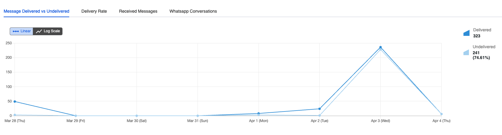

### Delivery Rate

This chart shows how the messages that have a "delivered" status on each day.

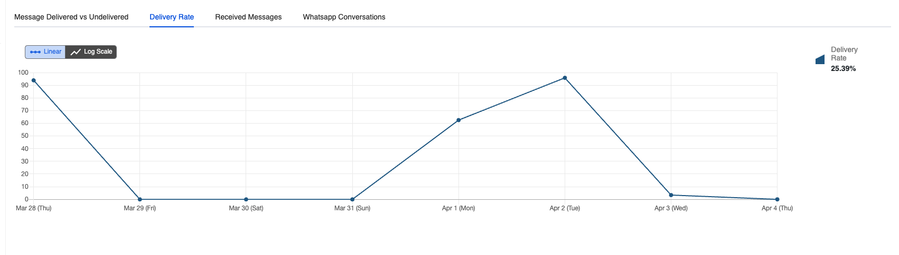

### Received Messages

Shows the incoming messages that were received across all channels.

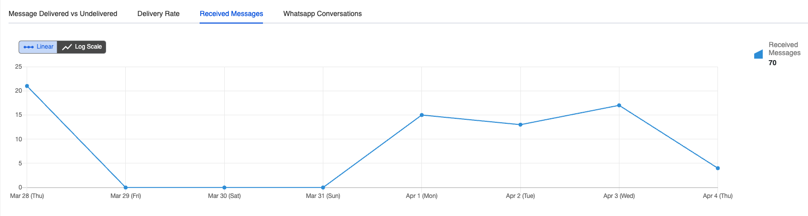

### WhatsApp Conversations

Shows the type of messages that were sent across WhatsApp including:

* **Authentication** (2FA OTPs)
* **Utility** (Account Updates, Information)
* **Service** (User-Initiated)
* **Marketing** (Special Offers, Sales, etc.)

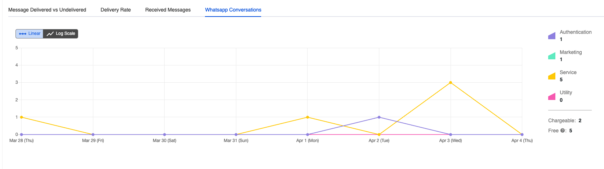

## Reports

The **Reports** page for Messaging Apps will show a further breakdown as compared to the dashboard and allow you to further filter the data. You will also be able to export the information as csv file from the page to import the data into your own analytics systems.

### Reports Chart

This chart shows how many messages were sent across each channel, with the additional filters available:

**Report Type:**

* **WhatsApp Conversations:** Authentication, Utility, Service, Marketing
* **By Channel:** Shows the individual channels (WhatsApp, Viber, LINE, etc.)

The following sections will show how the report page differs based on the **Report Type**.

#### By Channel

This report will show traffic by the type of channel (WhatsApp, Viber, LINE, etc.) that is being used. If you are using multiple channels this will allow you to filter out the volume of each channel.

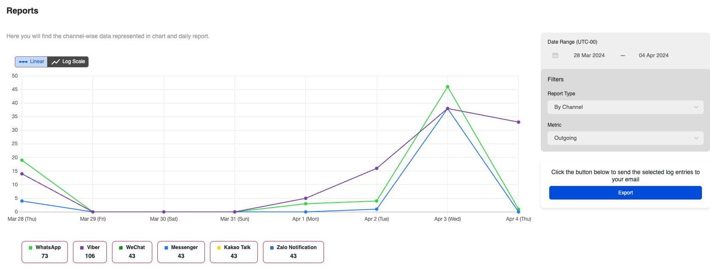

**Daily Report:**

This section shows the type of messages per channel type and date. The available information is:

* **Date:** The date the messages were sent/received.
* **Total:** Total messages across all channels
* **Messaging Apps (Viber, WeChat, Messenger, Kakao Talk, Zalo Notification):** Each column represents the number sent across the respective messaging app.
* **Read Rate:** The percentage of messages with a read receipt on each platform
* **Delivery Rate:** The percentage of messages with a delivery receipt on each platform.

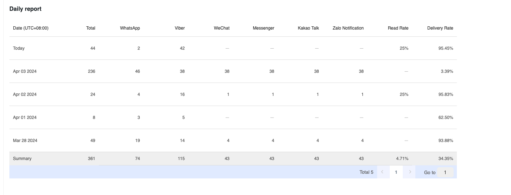

#### WhatsApp Conversations

The WhatsApp Conversations Report will show the type of conversations you are having on WhatsApp.

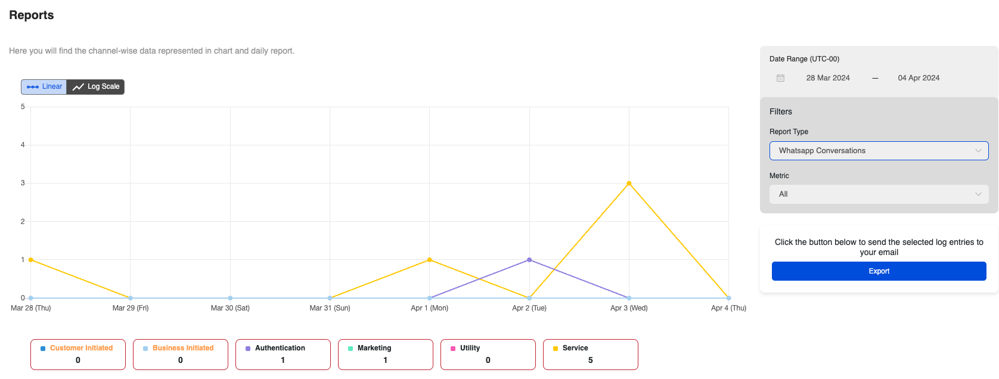

**Daily Report:**

This gives insights into the following information for WhatsApp messages.

* **Total:** This is the total messages sent.
* **Chargeable:** The conversations that are chargeable
* **Free:** This applies to the messages WhatsApp gives 1000 free Service conversations each month. They are refreshed at the beginning of each month. Please note that a free tier applies only to Service conversations.
* **Customer Initiated:** Messages that are sent from the customer at the beginning of a 24-hour window.
* **Business Initiated Messages:** Messages that are sent from the business at the beginning of a 24-hour window.
* **Message Category:** As covered earlier, this is the official message categories from WhatsApp
  * Authentication (2FA OTPs)
  * Utility (Account Updates, Information)
  * Service (User-Initiated)
  * Marketing (Special Offers, Sales, etc.)

### Export

The export feature gives the ability to export the information as a **CSV** file, then send the file as a link to your email.

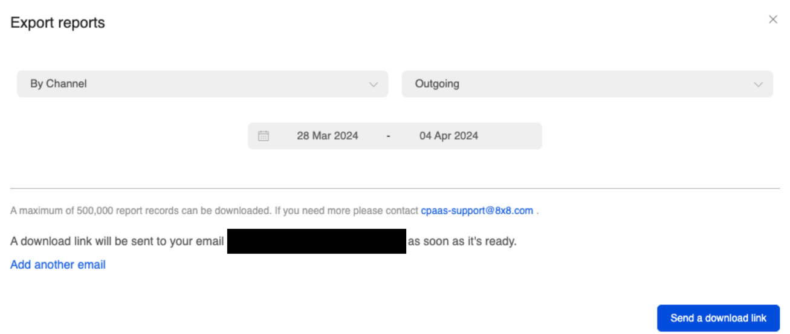

By default the report is sent to the logged in connect user, however you can specify additional emails.

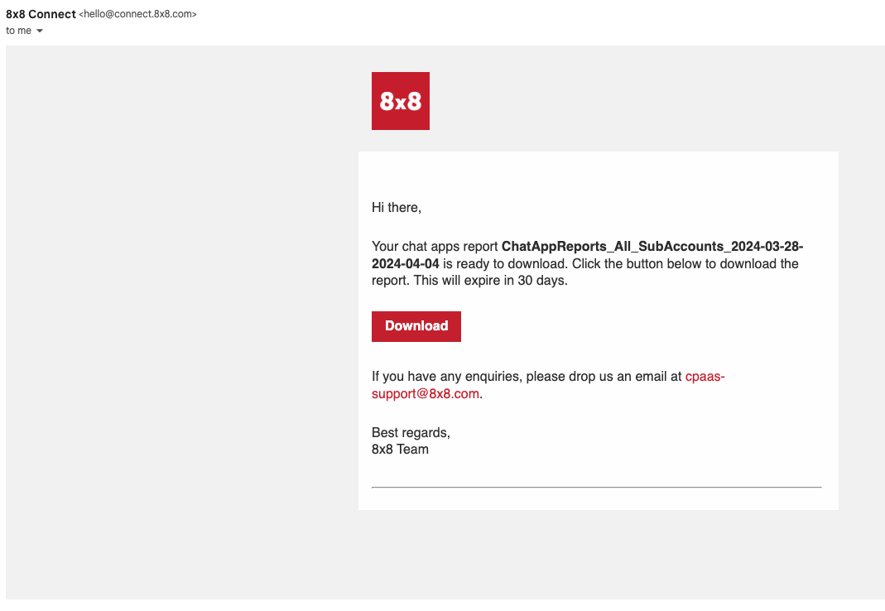

The resulting file will be a **CSV** file with the following format.

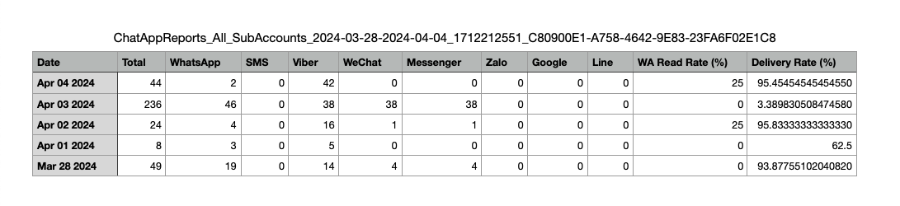

## Logs

The **messaging logs** section will allow you to see information about individual messages. By default this will cover all of the messages across all channels, however you can use the following filters to specify messages.

* **Subaccount:** The 8x8 subaccount attached to the messages.
* **Channel:** Which Messaging Apps channel (Viber, WhatsApp, LINE, etc.) is used to send/receive the message.
* **Direction:** Incoming or Outgoing Message
* **Status:** Current Status of the Message
  * **Delivered:** This means the message has been "delivered to the handset". If the status is not available from the operators, this means that 8x8 has received the confirmation from the carrier that the message has been "delivered to the carrier".
  * **Read:** This means the message has been read by the recipient (supported by certain Chat Apps channels only)
  * **Received:** The message has been received by our platform and it is currently being processed before being sent to the carrier.
  * **Rejected:** The message has not been accepted by our platform. This can be due to some errors such as incorrect mobile numbers or insufficient credit. You will not be charged for rejected messages.
  * **Sent:** The message has been sent to the operator and 8x8 has not received an acknowledgment yet from the operator.
  * **Undelivered:** We have received confirmation that the message was not delivered. This can be due to various reasons such as:
    * Mobile handset is unavailable (e.g. mobile is switched off or on roaming mode)
    * Filtered out by the operator
* **Country:** The destination country of the message.
* **UMID:** Filter by a specific Unique Message ID.

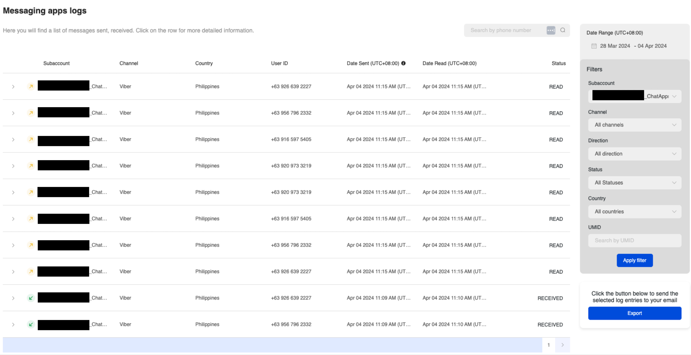

### Export

Similar to the reports section, the messaging logs can be sent to an email address as a **CSV** file.

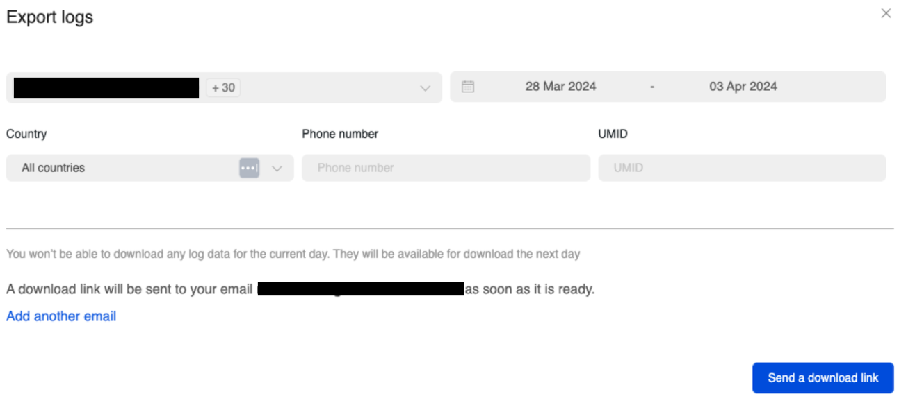

The email will contain logs for each of the subAccounts that are associated with this account.

Below is an example of a exported for WhatsApp and the information that is available.

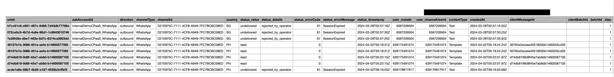

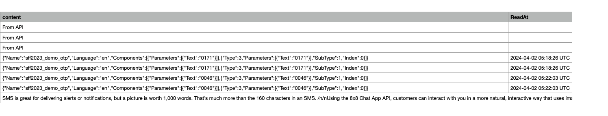
