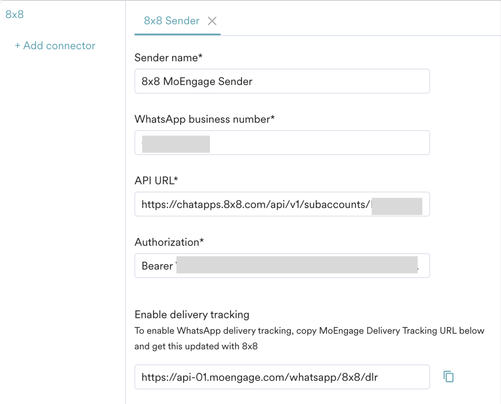
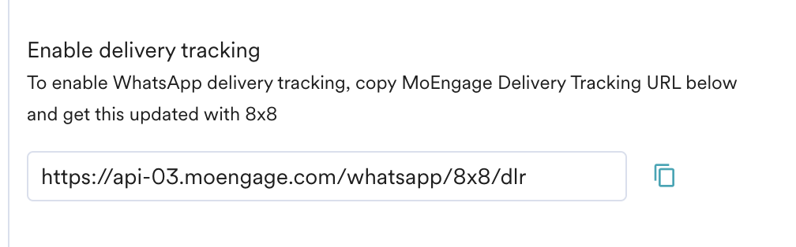

# MoEngage - WhatsApp Integration

[MoEngage](https://www.moengage.com/) allows you to launch, measure, and automate campaigns on WhatsApp, harmonizing all of your marketing channels. With the help of MoEngage, you can bring customer data from different systems, devices, and channels into a single profile. Then, deliver timely and relevant campaigns that meet your customers in the right places and right ways along their customer journey.

With 8x8 cloud communication platform, businesses and developers alike can incorporate WhatsApp functionality into one of their communications channels.

## Demo Video

Please see the companion video guide below to see a demonstration on how to setup MoEngage to send WhatsApp messages.

<iframe
  src="https://www.youtube.com/embed/qN3cvj75SPw?si=tXps9toD_9fGp6by"
  height="500px"
  width="100%"
  allow="picture-in-picture; web-share"
  allowFullScreen>
</iframe>

## Sample use cases

* **Promotional Offers**You can send coupons, discounts or sale alerts to customers via WhatsApp using MoEngage's segmentation and messaging tools.
* **Order Updates**Keep customers informed by sending WhatsApp notifications when an order is shipped, out for delivery, delivered and other status changes.
* **Reminders**Remind customers about upcoming appointments, events, or flight bookings via WhatsApp reminder messages sent through MoEngage.
* **Alerts and Notifications**Use MoEngage to send timely WhatsApp alerts about new products, service changes, maintenance notices, and other important notifications.

## Product Scope

* MoEngage

## What you'll need

* Paid 8x8 Connect account with Whatsapp channel configured
* Paid MoEngage subscription

## Setup

The setup guide consists of 2 steps:

1. Sender configuration(once-off)
2. Delivery tracking configuration (once-off)
3. Whatsapp template configuration (to be done every time you have a new Whatsapp template)

### Sender Configuration

To configure a Sender from 8x8 on the MoEngage Dashboard, go to Settings->WhatsApp->Sender Configuration. Choose 8x8 from the left list menu and click on `+ Sender`, and configure details.

Whatsapp Sender Configuration on MoEngage

1. Sender Name (*Mandatory*): The Sender Name is a name you want to provide to the Sender profile so that you can recognize this easily while using it to create a campaign inside MoEngage. The Sender Name should be between 5-50 characters.
2. WhatsApp business number (*Mandatory*): It is the phone number registered with WhatsApp Business Platform via 8x8, using which you want to send out WhatsApp Messages to your users. On [8x8 Connect](https://connect.8x8.com/chat/channels), you can find your Whatsapp business numbers on the Left Menu -> Chat Apps -> Channels.
3. API URL (*Mandatory*): Log in to the [8x8 Connect](https://connect.8x8.com/messaging/api-keys) portal. From the left menu, go to "API keys" section. Under instructions, click on the subaccount of your choice to copy it. Then, replace "Your_Chosen_Subaccount" with the copied subaccount in the URL below  

[https://chatapps.8x8.com/api/v1/subaccounts/Your_Chosen_Subaccount/partners/moengage/wa](https://chatapps.8x8.com/api/v1/subaccounts/Your_Chosen_Subaccount/partners/moengage/wa)

4. Authorization (*Mandatory*): From the same "API keys" page, scroll down and you can select an existing API key or create an API key specifically for MoEngage integration.

### Delivery Tracking

To track the delivery of your WhatsApp Messages inside MoEngage, you would need to copy MoEngage Delivery Tracking URL and share it with [our support team](mailto:cpaas-support@8x8.com) for us to configure it for you. You should be able to see the URL as shown below:

  
### Configuring Whatsapp templates

As of October 2023, MoEngage does not retrieve your Whatsapp templates automatically. You will need to set up the approved Whatsapp templates verbatim in MoEngage.

1. Log in to the [8x8 Connect](https://connect.8x8.com/messaging/api-keys) portal.
2. Navigate to Chat Apps -> Whatsapp Templates.
3. Click on the template that you'd like to use on MoEngage to preview the contents of the template. If you don't have any already, you will need to create them.
4. Follow this [MoEngage guide](https://help.moengage.com/hc/en-us/articles/4951072814100-WhatsApp-Templates) on how to copy the Whatsapp template from 8x8 Connect to MoEngage.
5. Repeat steps 3 and 4 for other **approved** Whatsapp templates you'd like to use on MoEngage.
