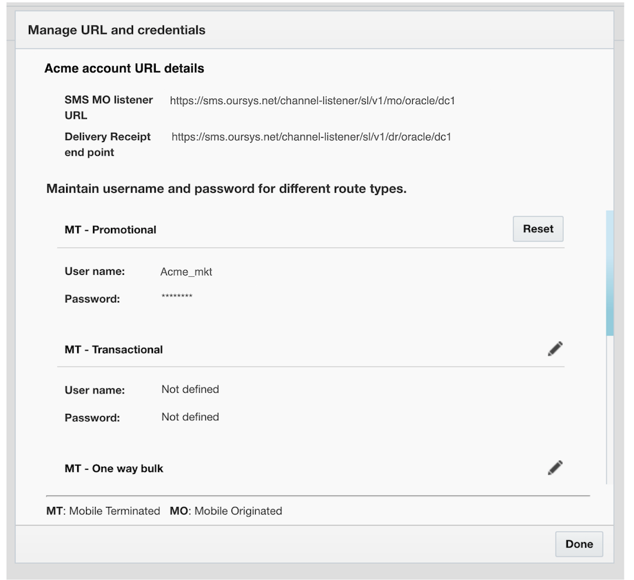

# Oracle Responsys

[Oracle Responsys](https://www.oracle.com/sg/marketingcloud/products/cross-channel-orchestration/#:~:text=Oracle%20Responsys&text=Oracle%20Responsys%20helps%20you%20manage,Oracle%20Responsys%20can%20help%20you.) helps you manage, personalize, and orchestrate interactions across all channels to deliver timely, helpful messages in the moments that matter—all without code, complex technical training, or reliance on other experts.

With 8x8’s cloud communications platform, businesses and developers alike can incorporate SMS functionality into one of their communications channels.

## Choosing 8x8 for your Oracle Responsys SMS

1. Search for SMS code in SPAN marketplace by inputing a country
2. Select Wavecell from list aggregators offerings SMS codes in the country you will be sending your message.
3. This will trigger an order for a code where we get the order and change your DR format to Responsys.
4. Wavecell will configure your credentials in SPAN configuration for the order, which will allow your requests to be accepted by Wavecell's platform. (Please see the image below)

