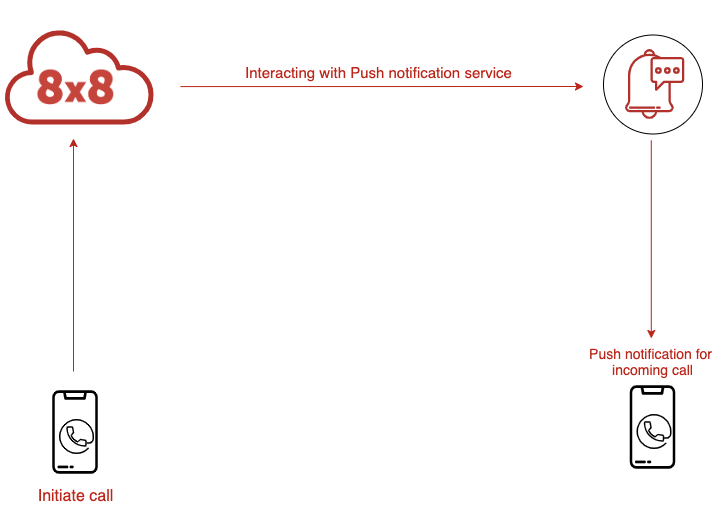
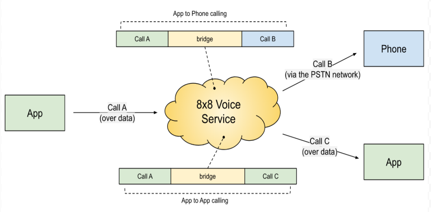

# Overview

The 8x8 Voice SDK helps you build engaging and dependable voice calling experiences into your mobile app by enabling the ability to make and receive calls. The Voice SDK provides management of anonymous in-app voice calls without the complexities of building and managing voice solutions.

The Voice SDK uses the 8x8 Voice Service, a cloud telephony switch which enables your app to receive incoming and set up outgoing phone calls and then bridge them both.

The incoming call comes from a mobile application (over data). The outgoing call can be placed to another mobile application (over data) or to a phone number (via PSTN network). The 8x8 Voice Service supports both app to app calling and app to phone calling.

The Voice SDK can be used for customer service and support calls that are carried out in-app. Ridesharing and delivery platforms can create apps that facilitate calls between users and drivers while protecting their personal information.

## Account setup

In order to use the Voice SDK you must have an 8x8 account. Your 8x8 account enables you to interface with the Voice SDK.

The [8x8 Connect portal](https://connect.8x8.com/) is the starting point for your Voice SDK settings including:

* Getting an account ID
* Authentication setup (JWT token)
* Setting push notifications (you need a key/certificate for each mobile app)
