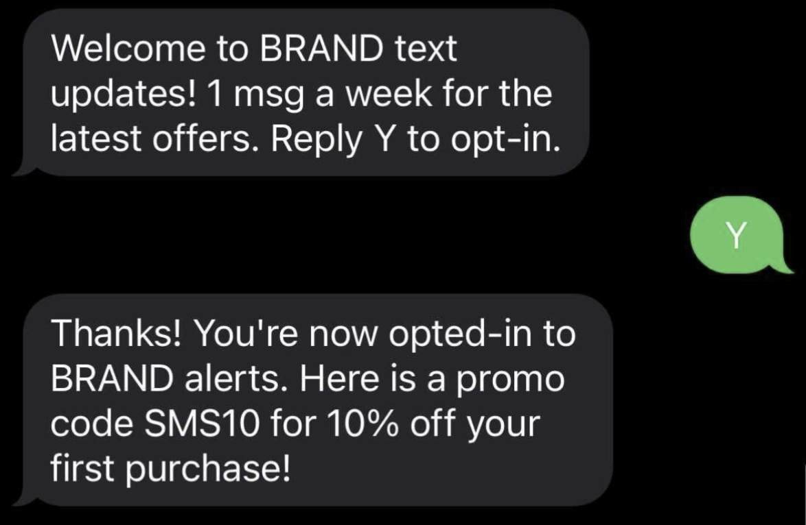
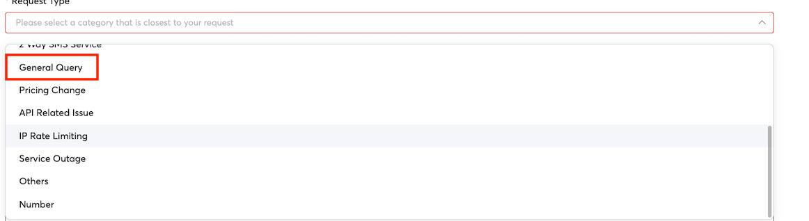

# Recommendations for Securing your Traffic

This page will cover both general recommendations to secure your 8x8 traffic from fraud as well as other types of security threats. Specifically for fraud attacks, we believe in a shared responsibility model between 8x8 and you as a customer. You may consider the following measures that can be leveraged to mitigate such attacks

**General Best Practices**

* **API Keys:** 8x8 API Keys enable backend servers to access the 8x8 API using your account's resources. It is crucial to take steps to ensure their security.

  * **Prevent Unauthorized Access:**  Sharing API keys publicly increases the risk of unauthorized access to your APIs and the sensitive data they protect. If API keys are exposed or leaked, malicious actors can potentially abuse them to access resources, manipulate data, or launch attacks against your systems.
  * **Use Environment Variables:** Store API keys and other sensitive information as environment variables rather than hardcoding them directly into your code. This practice helps prevent accidental exposure through version control or code sharing.
  * **Rotate API Keys:** Periodically rotate API keys to mitigate potential damage in the event of a data breach. This can be done from the 8x8 Connect Dashboard by deleting old API Keys and creating new ones.
  * **Secure Key Distribution:** When distributing API keys to authorized users or applications, ensure secure transmission and storage practices to prevent interception, tampering, or unauthorized access. Use encrypted channels, secure protocols, and best practices for key management to protect API keys throughout their lifecycle.
* **IP Whitelisting:** 8x8 is able to whitelist specific IP Addresses that we expect your API calls to originate from. If an API call for your account originals from outside those IP addresses it will be rejected.  

The Connect Portal allows you to specify IP addresses to whitelist. Please see the **IP Whitelisting section** on [this](/connect/docs/developer-tools#ip-whitelisting) page for further detais.

* **Collect User Opt In / Opt Out:** Enable customers to opt-in/opt-out of receiving messaging content.

  * Optionally, you can consider implementing double opt in where the user must first input their phone number in your registration form, then they will receive an SMS to that phone number which they must respond to in order to complete the opt-in process.
  * 
* **Reconfirm number:** Customer phone numbers may change, making it important to verify their current contact information periodically (example: reconfirm SMS phone number every 3/6/12 months).
* **2FA For 8x8 Connect Dashboard:** The 8x8 Connect Dashboard allows you to create/retrieve your API keys as well as send SMS directly from the Dashboard. We would recommend to use the 2FA feature of the Connect Dashboard to prevent fraudulent user access.

**AIT Fraud Prevention Practices**

* **Captcha:** A CAPTCHA is a type of challenge-response test used in computing to determine whether or not the user is human. We recommend our customers implement such features on their applications.
* **Web Application Firewall (WAF):** Firewalls that protect web applications by filtering and monitoring HTTP traffic between a web application and the Internet. We recommend our customers deploy WAF(s) on their networks.
* **Rate Limiting:** Rate limiting is a strategy for limiting network traffic. It puts a cap on how often someone can repeat an action within a certain timeframe. You can enforce rate-limiting in your service to prevent excessive traffic volume.

  * **IP Rate Limiting:** 8x8 offers the ability to limit how many API calls a single IP address can send with some endpoints in the 8x8 Embeddable Communications and APIs platform out of the box. You can leverage this feature to add a quick security defense in place. For more details, please see this [section] ([/connect/docs/security-1#client-ip-rate-limiting](/connect/docs/security-1#client-ip-rate-limiting))
  * **MSISDN Rate Limiting:** 8x8 also offers rate limiting by the destination MSISDN. This means you can set a limit on the number of SMS messages a single MSISDN can receive in a given timeframe, such as per minute/hour/day. For instance, you can set a limit so that no MSISDN can receive more than 10 SMS messages in any 30-minute window. Importantly, this rate limiting applies universally to all MSISDNs, without the need for specifying each one.
  
  To enable this for your account:
  
    1. Use the **Support** tab from the **Connect** Dashboard to Raise a Request.
    2. Select **"General Query"** for the Request Type
    3. Ask for "MSISDN Rate Limiting" in **Subject** and specify the details such as how many SMS messages to allow in what time period in the **Additional Comments** section.
* **Exponential Delays:** Implement exponential delays between failed OTP requests for the same phone number.

  * By Implementing an exponential delay, it makes it more difficult to exploit a user registration page for example to send a mass amount of fraudulent SMS OTPs from that page.
