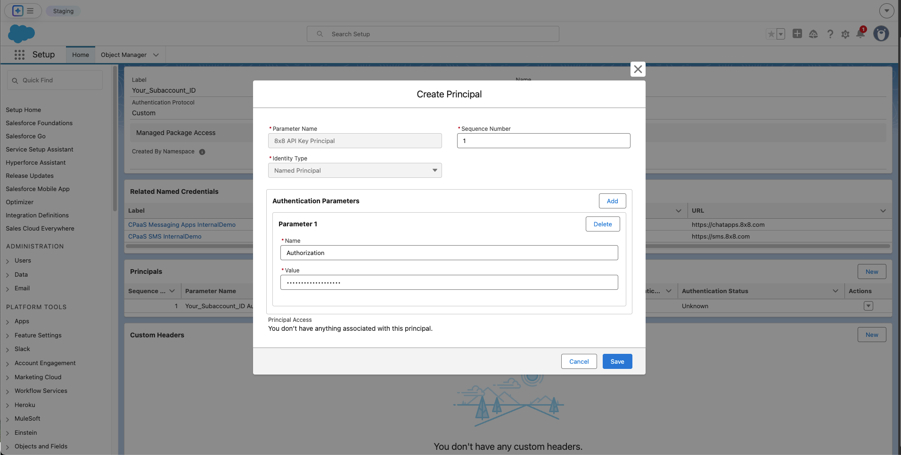
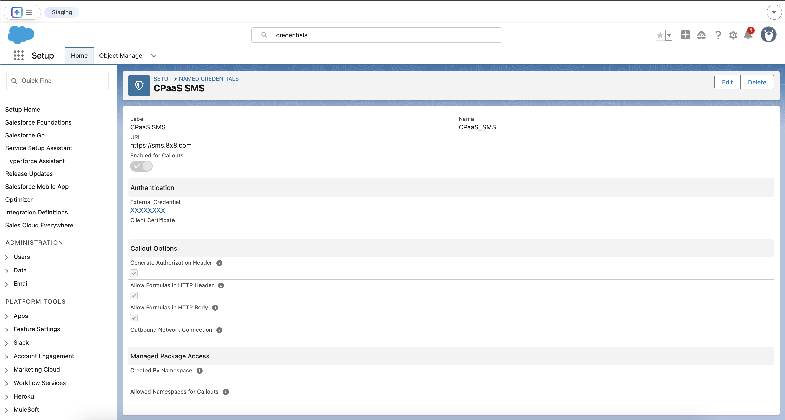
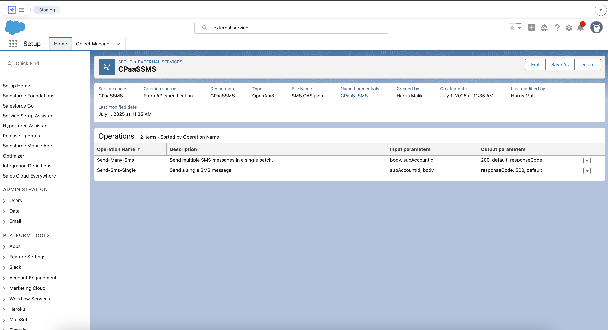
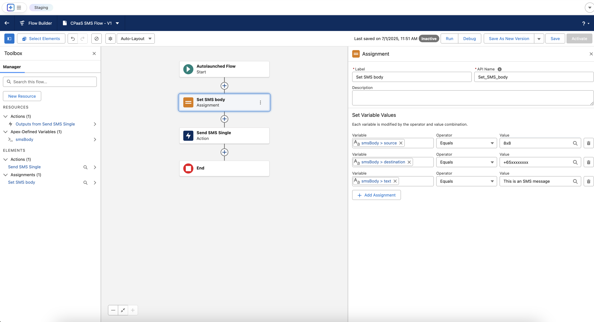
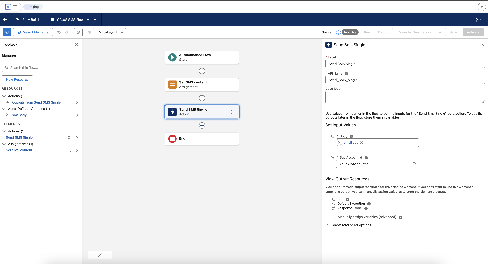

# Sending SMS in Salesforce Flow Builder

This guide will walk you through the entire process of connecting Salesforce to the 8x8 SMS API to send messages directly from your Salesforce environment from Flow Builder, by utilizing [External Services](https://help.salesforce.com/s/articleView?id=platform.external_services.htm). You can also follow the same invocable actions in Orchestrator, Einstein bots, or OmniStudio Assets.  

We will accomplish this using Salesforce's declarative tools, which allow you to build robust integrations without writing complex code.

## Prerequisites and Requirements

Before you begin, ensure your Salesforce environment and 8x8 account meet the following requirements.

### **Salesforce Platform Requirements**

This guide utilizes Salesforce External Services. According to the official Salesforce documentation, the compatibility and permissions for this feature are as follows:

* **Salesforce Experience:** Available in **Lightning Experience**.
* **Required Editions:** Available in **Enterprise**, **Performance**, **Unlimited**, and **Developer** Editions.
* **Feature Integration**: The actions created from an External Service can be used in declarative tools like **Flow Builder**, Orchestrator, Einstein bots, or Omnistudio.
* **User Permissions Needed**:
  * To **define** an external service: The user needs **Modify All Data** OR **Modify Metadata Through Metadata API Functions** permissions.
  * To **invoke** an external service action from a flow: The user needs the **Run Flows** permission.

### **8x8 Account Requirements**

* **8x8 Connect Account:** An active account with SMS services enabled.
* **API Credentials:** Your 8x8 Subaccount ID and your API Key (Bearer Token), which you can generate from your 8x8 Connect customer portal.
* **OpenAPI Specification (OAS) File:** You will need the OAS file for the SMS API. You can find and download it from the **[Send SMS API Reference](https://8x8-enterprise-group.readme.io/connect/reference/getting-started-with-sms-api)** page.

---

## Part 1: The Foundation - Setting Up Authentication

First, we need to securely store your 8x8 API credentials in Salesforce.

### **Step 1.1: Create the External Credential**

The External Credential is a secure vault for your API key.

1. Navigate to **Setup** ⚙️. In the Quick Find box, type `External Credentials` and select it.
2. Click **New**.
3. Enter the following details:
  * **Label**: `8x8 CPaaS Authentication`
  * **Name**: `X8x8_CPaaS_Authentication`
  * **Authentication Protocol**: Select `Custom`.
4. Click **Save**.

### **Step 1.2: Create the Principal**

The Principal holds the actual secret Bearer Token.

1. On the External Credential page you just saved, scroll down to **Principals** and click **New**.
2. Enter the following details:
  * **Principal Name**: `8x8 API Key Principal`
  * **Sequence Number**: `1`
3. Under **Authentication Parameters**, click **Add Parameter**.
  * **Name**: `Authorization`
  * **Value**: `Bearer YOUR_API_TOKEN` (Replace with your actual API key).
4. Click **Save**.

Create Principal

### **Step 1.3: Create the Named Credential for SMS**

The Named Credential links the SMS API's specific address (URL) to the authentication secret.

1. Navigate to **Setup** ⚙️. In the Quick Find box, type `Named Credentials` and select it.
2. Click **New**.
3. Enter the following details:
  * **Label**: `8x8 SMS API`
  * **Name**: `X8x8_SMS_API`
  * **URL**: `https://sms.8x8.com`
  * **External Credential**: Select the `8x8 CPaaS Authentication` credential.
  * Ensure the **Generate Authorization Header** checkbox is checked.
4. Click **Save**.

Completed Named Credential and External Credential

---

## Part 2: Defining the SMS API Operations

Now, we will use your SMS OAS file to teach Salesforce about the specific API call to send an SMS.

1. Navigate to **Setup** ⚙️. In the Quick Find box, type `External Services` and select it.
2. Click **Add External Service**.
3. Select **From API Specification**.
4. Configure the service:
  * **Service Name**: `CPaaSSMS`
  * **Named Credential**: Select the **`8x8 SMS API`** Named Credential you just created.
  * **Service Schema**: Select **Complete JSON** and upload your SMS-specific [OAS](https://8x8-enterprise-group.readme.io/connect/reference/getting-started-with-sms-api) `.json` file.
  * **Service Schema**:
    * Select Upload from local and upload the complete [OAS](https://8x8-enterprise-group.readme.io/connect/reference/getting-started-with-sms-api) `.json` file **or**
    * Select "Complete Schema" and paste the schema below (contains only send single SMS and send batch SMS)
5.

```json
{
    "openapi": "3.0.1",
    "info": {
        "title": "SMS API",
        "description": "API to send SMS messages",
        "version": "1"
    },
    "servers": [
        {
            "url": "https://sms.8x8.com",
            "description": "Asia-Pacific region"
        },
        {
            "url": "https://sms.us.8x8.com",
            "description": "North America region"
        },
        {
            "url": "https://sms.8x8.uk",
            "description": "Europe region"
        },
        {
            "url": "https://sms.8x8.id",
            "description": "Indonesia region"
        }
    ],
    "paths": {
        "/api/v1/subaccounts/{subAccountId}/messages": {
            "post": {
                "summary": "Send SMS",
                "description": "Send a single SMS message.",
                "operationId": "Send-Sms-Single",
                "parameters": [
                    {
                        "name": "subAccountId",
                        "in": "path",
                        "required": true,
                        "schema": {
                            "type": "string"
                        }
                    }
                ],
                "requestBody": {
                    "required": true,
                    "content": {
                        "application/json": {
                            "schema": {
                                "$ref": "#/components/schemas/SmsRequest"
                            }
                        }
                    }
                },
                "responses": {
                    "200": {
                        "description": "SMS accepted and queued",
                        "content": {
                            "application/json": {
                                "schema": {
                                    "$ref": "#/components/schemas/SmsResponse"
                                }
                            }
                        }
                    }
                },
                "security": [
                    {
                        "apiKey": []
                    }
                ]
            }
        },
        "/api/v1/subaccounts/{subAccountId}/messages/batch": {
            "post": {
                "summary": "Send SMS Batch",
                "description": "Send multiple SMS messages in a single batch.",
                "operationId": "Send-Many-Sms",
                "parameters": [
                    {
                        "name": "subAccountId",
                        "in": "path",
                        "required": true,
                        "schema": {
                            "type": "string"
                        }
                    }
                ],
                "requestBody": {
                    "required": true,
                    "content": {
                        "application/json": {
                            "schema": {
                                "$ref": "#/components/schemas/BatchSmsRequest"
                            }
                        }
                    }
                },
                "responses": {
                    "200": {
                        "description": "Batch accepted and processed",
                        "content": {
                            "application/json": {
                                "schema": {
                                    "$ref": "#/components/schemas/BatchSmsResponse"
                                }
                            }
                        }
                    }
                },
                "security": [
                    {
                        "apiKey": []
                    }
                ]
            }
        }
    },
    "components": {
        "securitySchemes": {
            "apiKey": {
                "type": "http",
                "scheme": "bearer"
            }
        },
        "schemas": {
            "SmsRequest": {
                "type": "object",
                "required": [
                    "destination",
                    "text"
                ],
                "properties": {
                    "destination": {
                        "type": "string",
                        "description": "MSISDN destination number"
                    },
                    "text": {
                        "type": "string",
                        "description": "Message body"
                    },
                    "source": {
                        "type": "string"
                    },
                    "encoding": {
                        "type": "string",
                        "enum": [
                            "AUTO",
                            "GSM7",
                            "UCS2"
                        ]
                    },
                    "scheduled": {
                        "type": "string",
                        "format": "date-time"
                    },
                    "expiry": {
                        "type": "string",
                        "format": "date-time"
                    }
                }
            },
            "SmsStatus": {
                "type": "object",
                "properties": {
                    "code": {
                        "type": "string",
                        "enum": [
                            "QUEUED",
                            "REJECTED"
                        ]
                    },
                    "description": {
                        "type": "string"
                    }
                }
            },
            "SmsResponse": {
                "type": "object",
                "required": [
                    "umid",
                    "destination",
                    "status",
                    "encoding"
                ],
                "properties": {
                    "umid": {
                        "type": "string"
                    },
                    "destination": {
                        "type": "string"
                    },
                    "encoding": {
                        "type": "string",
                        "enum": [
                            "AUTO",
                            "GSM7",
                            "UCS2"
                        ]
                    },
                    "clientMessageId": {
                        "type": "string"
                    },
                    "status": {
                        "$ref": "#/components/schemas/SmsStatus"
                    }
                }
            },
            "BatchSmsRequest": {
                "type": "object",
                "required": [
                    "messages"
                ],
                "properties": {
                    "clientBatchId": {
                        "type": "string"
                    },
                    "messages": {
                        "type": "array",
                        "items": {
                            "$ref": "#/components/schemas/SmsRequest"
                        }
                    },
                    "destinations": {
                        "type": "array",
                        "items": {
                            "type": "string"
                        }
                    },
                    "template": {
                        "$ref": "#/components/schemas/SmsTemplateFull"
                    },
                    "includeMessagesInResponse": {
                        "type": "boolean"
                    }
                }
            },
            "BatchSmsResponse": {
                "type": "object",
                "required": [
                    "batchId",
                    "acceptedCount",
                    "rejectedCount"
                ],
                "properties": {
                    "batchId": {
                        "type": "string"
                    },
                    "clientBatchId": {
                        "type": "string"
                    },
                    "acceptedCount": {
                        "type": "integer"
                    },
                    "rejectedCount": {
                        "type": "integer"
                    },
                    "messages": {
                        "type": "array",
                        "items": {
                            "$ref": "#/components/schemas/SmsResponse"
                        }
                    }
                }
            },
            "SmsTemplateFull": {
                "type": "object",
                "properties": {
                    "source": {
                        "type": "string"
                    },
                    "text": {
                        "type": "string"
                    },
                    "encoding": {
                        "type": "string",
                        "enum": [
                            "AUTO",
                            "GSM7",
                            "UCS2"
                        ]
                    },
                    "scheduled": {
                        "type": "string",
                        "format": "date-time"
                    },
                    "expiry": {
                        "type": "string",
                        "format": "date-time"
                    }
                }
            }
        }
    }
}

```

6. Click **Save & Next**,
7. In **Select Operations** , select the Send-Many-Sms and Send-Sms-Single operations then **Next**, and **Finish**.

Salesforce will now parse the file and make the Send-Sms-Single and Send-Many-Sms operations available as **actions** in Flow Builder.


  
---

## Part 3: Building the SMS Flow

The body for an SMS message is much simpler than other channels, which makes the Flow easier to build.

### **Step 3.1: Create the Flow and Body Variable**

1. Navigate to **Setup** ⚙️ > **Flows** and click **New Flow**. Select **Autolaunched Flow**.
2. From the toolbox on the left, create one variable by clicking **New Resource**.
3. * **Variable: The SMS Body**
  * **Resource Type**: `Variable`
  * **API Name**: `smsBody`
  * **Data Type**: `Apex-Defined`
  * **Apex Class**: Search for and select the auto-generated class for the SMS request body. It will be named similar to `ExternalService__CPaaSSMS_SmsRequest`.

Configuring the first Variable **smsBody**

### **Step 3.2: Assignment - Set SMS Properties**

We only need one Assignment element to construct the SMS message.

1. On the flow canvas, click the `+` icon after the Start element and add an **Assignment** element.
2. **Label**: `Set SMS Body`
3. Configure the following assignments.
  * `{!smsBody.to}` | `Equals` | `+65xxxxxxxxxx` (The recipient's phone number)
  * `{!smsBody.from}` | `Equals` | `8x8` (Your 8x8-registered SMS Sender ID or phone number)
  * `{!smsBody.text}` | `Equals` | `This is an SMS message.`


  
### **Step 3.3: The Action - Make the API Call**

1. Click the final `+` and add an **Action** element.
2. Search for your `SmsApi` actions and select the action for sending an SMS.
3. **Label**: `Send SMS`
4. Configure the inputs:

* **subAccountId**: Enter your 8x8 Subaccount ID string here.
* **body**: Select your main variable, `{!smsBody}`.



---

## Part 4: Permissions and Testing

This final step ensures your user can run the flow and execute the callout.

### **Step 4.1: Assign Permissions**

1. Navigate to **Setup** ⚙️ > **Permission Sets** and create a **New** Permission Set.
2. **Label**: `CPaaS API Access`
3. In the new Permission Set, find and click on **External Credential Principal Access**.
4. Click **Edit**. Add the `8x8 CPaaS Authentication : 8x8 API Key Principal` from the available list to the enabled list. Click **Save**.
5. **Manage Assignments** for the Permission Set and assign it to your user.

### **Step 4.2: Debug the Flow**

1. Return to your saved Flow.
2. Click the **Debug** button.
3. Click **Run**.
4. Check the debug log on the right for a success message ("All done.") and check your test device for the SMS.

You have now successfully built a low-code integration to send SMS with the 8x8 SMS API from Salesforce.
