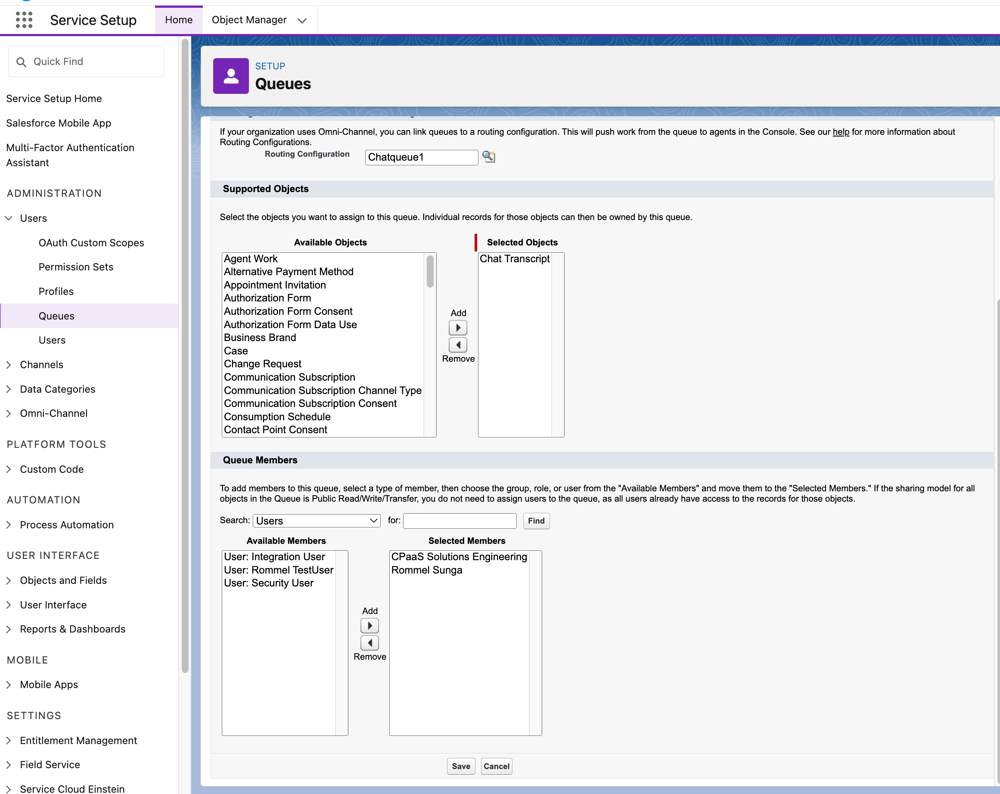
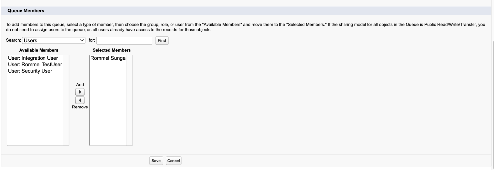
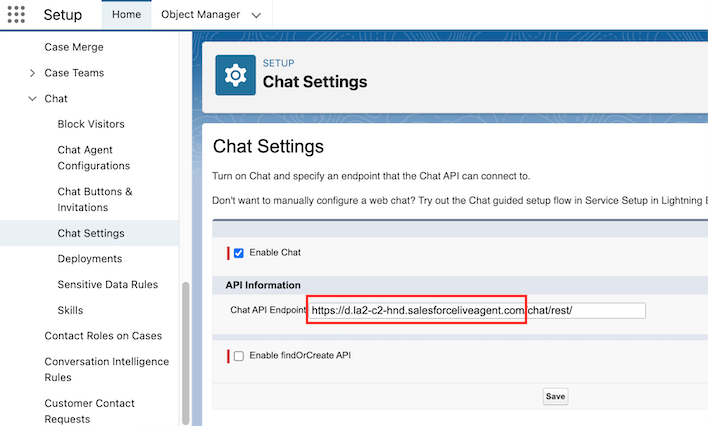
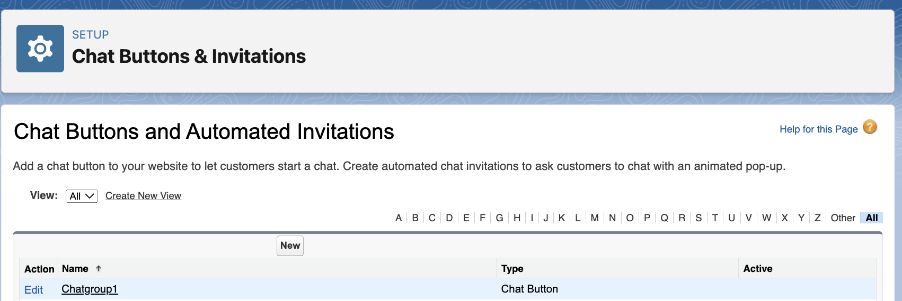
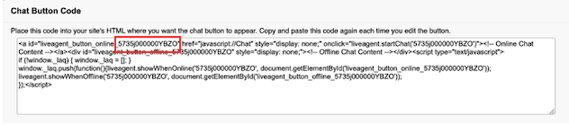
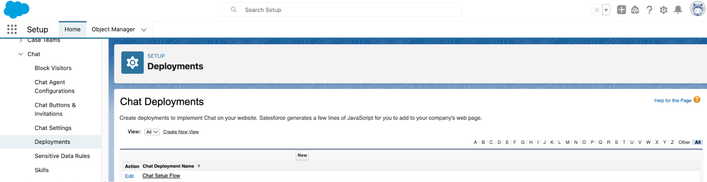
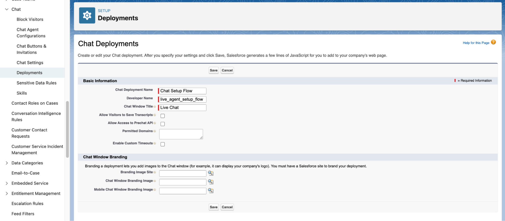
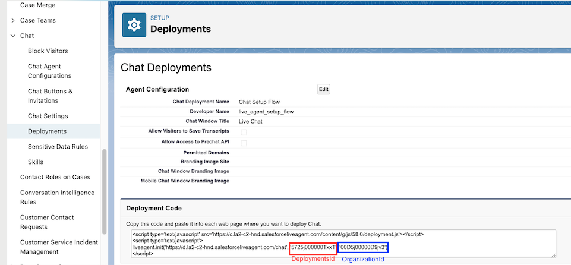
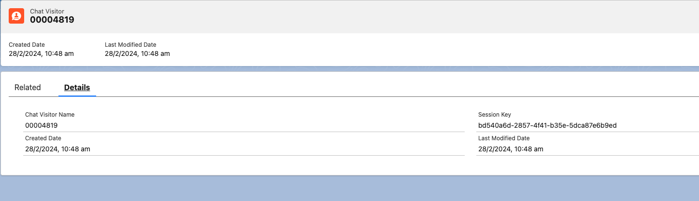
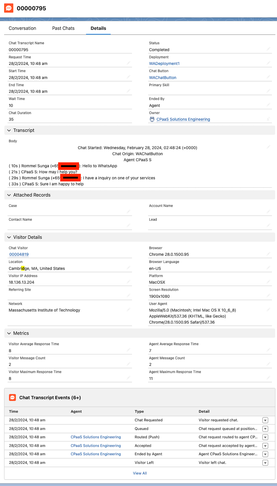

# Salesforce Chat Configuration Guide

> ❗️ **Salesforce Chat Deprecation**
>
> Salesforce has announced that Salesforce Chat will be retired on February 14, 2026. Read the announcement and affected Salesforce editions [here](https://help.salesforce.com/s/articleView?id=001790618&type=1).
>
>

## Introduction

This guide will take you through the necessary configurations on Salesforce and the information you need to send to 8x8 in order to get your Salesforce Chat integration working.

## Video Demo / Guide

### Viber Integration Video

This Viber Integration video shows only what the integration looks like with just the Viber channel active through Chatapps API. It is the simpler scenario that this guide walks you through.

<iframe
  src="https://www.youtube.com/embed/58sc3zwv7BM?si=bUnUiFJoQ5KtH_hl"
  height="500px"
  width="100%"
  allow="picture-in-picture; web-share"
  allowFullScreen>
</iframe>

### SMS + Viber Integration Video

This video shows two channels working, SMS and Viber and is a bit more complex than setting up just one channel. It also shows assigning one agent to one number, taking care of agency use cases where you always want to tie a specific agent to a phone number.

<iframe
  src="https://www.youtube.com/embed/WxiNq4iqpf4?si=cuaIYaH3jw5YNhxz"
  height="500px"
  width="100%"
  allow="picture-in-picture; web-share"
  allowFullScreen>
</iframe>

### WhatsApp Integration Video

This video shows the integration with Salesforce Chat and WhatsApp.

<iframe
  src="https://www.youtube.com/embed/BiRuvXWw4I8?si=K-aKFG8asTo-pAv4"
  height="500px"
  width="100%"
  allow="picture-in-picture; web-share"
  allowFullScreen>
</iframe>

### Prerequisites

* 8x8 Connect Account
* Salesforce Service Cloud Lightning account
* Salesforce license with Chat (formerly known as Live Agent)

## Salesforce Integration Steps

### Queues

In Salesforce Setup Home, navigate to **Administration > Users > Queues**. We will need to set up a queue for the incoming chats. These chats will be rotated between the agents associated with this queue.

Make sure to add the Salesforce users that you would like to be part of handling the queue here.

### Chat

In Salesforce Setup Home, navigate to **Service > Chat > Chat Settings** and check the **Enable Chat** box

Note down the **Chat API Endpoint** URL to send to 8x8’s Support Team. Our team only requires the domain, which is only the first portion of the URL highlighted in red below.

### Chat Buttons and Invitations

In the Chat Buttons and Invitations we want to create a new chat group

Below are the required settings. Settings outside of this are optional.

**Type:** Chat Button  

**Name:**

**Developer Name:**

**Queue:** Choose the queue you created previously

Note down the **ButtonId** in the **Chat Button Code** highlighted in red to send to 8x8’s Support Team.

### Chat Deployments

In Salesforce Setup Home, navigate to **Service > Chat > Deployments**, create a new deployment.

Below are the required settings. Settings outside of this are optional.

**Chat Deployment Name:**

**Developer Name:**

**Chat Window Title:**

Note down the **OrganizationId** and the **DeploymentId** in the **Deployment Code** highlighted in red/blue to send to 8x8’s Support Team.

## 8x8 Support Team Configuration

Once you have configured these settings, send an email to [cpaas-support@8x8.com](mailto:cpaas-support@8x8.com) with the following information that can be collected from the steps above:

**ButtonId** - (Example: 835j000000YBZO)  

**DeploymentsId** - (Example: 4725j000000TxxT)  

**OrganisationId** - (Example: 00D4j00000D9jv3)  

**Chat API Endpoint** - (Example: [https://c.la2-d2-hnd.salesforceliveagent.com](https://c.la2-d2-hnd.salesforceliveagent.com))  

**8x8 Subaccount** - (Can be found in 8x8 Connect Dashboard -> API Keys)

**Note:** Please ensure the ButtonId and DeploymentId are from the same deployments

**For Viber Support:** In addition to providing the above information, ask the support team to provision a new Viber account and assign it to your 8x8 sub account that you plan to use with this integration.

## FAQ and Known Limitations

This section is intended to answer frequently asked questions (FAQ) about the integration and also share any known limitations of the integration.

| Question                                                                                                                                                                                                                                                                                                                                                                                          | Answer                                                                                                                                                                                                                                                                                                                                                                                                                                                                                                                                                                                                                                                                                                                      |
|---------------------------------------------------------------------------------------------------------------------------------------------------------------------------------------------------------------------------------------------------------------------------------------------------------------------------------------------------------------------------------------------------|-----------------------------------------------------------------------------------------------------------------------------------------------------------------------------------------------------------------------------------------------------------------------------------------------------------------------------------------------------------------------------------------------------------------------------------------------------------------------------------------------------------------------------------------------------------------------------------------------------------------------------------------------------------------------------------------------------------------------------|
| What happens to the messages if all agents are offline?                                                                                                                                                                                                                                                                                                                                           | If all agents are offline, 8x8 will keep retrying every hour for 3 days to resend the message so it is assigned. Note that an agent will have to be online at the point in time 8x8 retries to send, it will not retry the moment an agent is online.   For example if a customer sends a message at 2:00PM but no agents are online then 8x8 retries at 3:00PM. If an agent is online only at 3:01PM then the chat transcript (object created in Salesforce) will not be assigned successfully and 8x8 will retry at 4:00PM. However If an agent is only from 2:59PM onwards, then the chat transcript should be successfully assigned. Note it is not always the top of the hour that 8x8 will retry.               |
| Can we include custom fields?                                                                                                                                                                                                                                                                                                                                                                     | No, currently the integration does not allow custom fields. We pass the same API request to Salesforce for all customers.                                                                                                                                                                                                                                                                                                                                                                                                                                                                                                                                                                                                   |
| What fields are included as part of the Chat Transcript Object & Chat Visitor that is created?                                                                                                                                                                                                                                                                                                    | For the Chat Transcript Object, which is the main Salesforce object associated with this integration, the following fields would be available that were passed through 8x8's API call.  **Deployment:** What Salesforce Deployment is Associated with the Chat Transcript **Chat Button:** What Button ID is Associated with the Chat Transcript   For the Chat Visitor **Session Key:** Session ID associated with this chat session    To see an example of each record, please view the section below that gives an example of each object.                                                                                                                                                      |
| Can the look of the integration be changed?                                                                                                                                                                                                                                                                                                                                                       | Our integrations feeds directly into Salesforce Chat and utiliizes their UI directly. Any changes would be subject to what can be done in the Salesforce UI, we would advise to consult with either your Salesforce administrator or Salesforce Support themselves.                                                                                                                                                                                                                                                                                                                                                                                                                                                         |
| Can we route via phone number?                                                                                                                                                                                                                                                                                                                                                                    | The integration does not include phone number information in the API call and it will not be available in the Chat Transcript object. The phone number is shown in the Chat Transcript, but it is not retrievable as per our last check with Salesforce via API or in a Salesforce field itself.   One potential way to route is to use multiple phone numbers for each group of agents. For example if you have a group of agents that should be reached with +65 1111 2222 and another group of agents that should be reached with +65 3333 4444, then customers can effectively be routed based on which store they have called. This will require you to create a new chat queue and associated objects per phone number. |

### Salesforce Chat Transcript Object & Chat Visitor Object Example

This section gives a view of the two main objects associated with each chat session and what the agent will see when viewing them.

Here is the Chat Transcript Object:

Here is the Chat Visitor Object:

### Useful References

[Salesforce Chat Setup Guide](https://help.salesforce.com/s/articleView?id=sf.live_agent_intro_lightning.htm&type=5)
