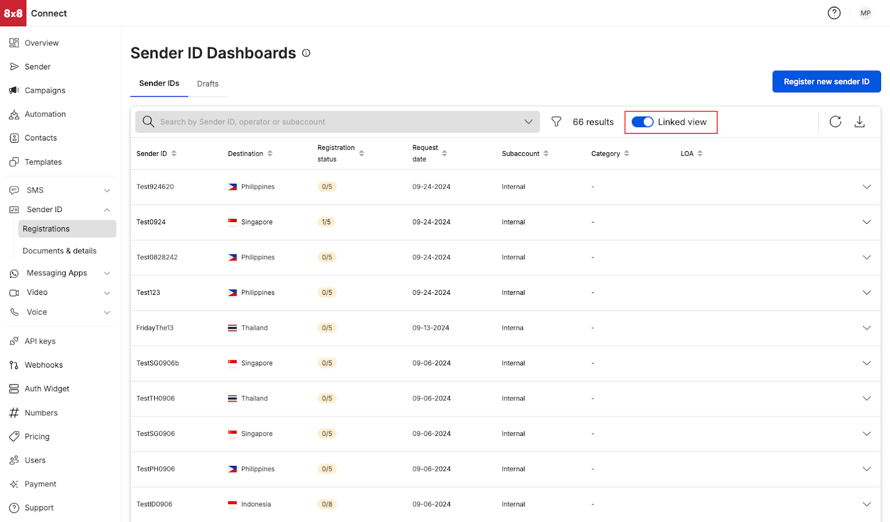
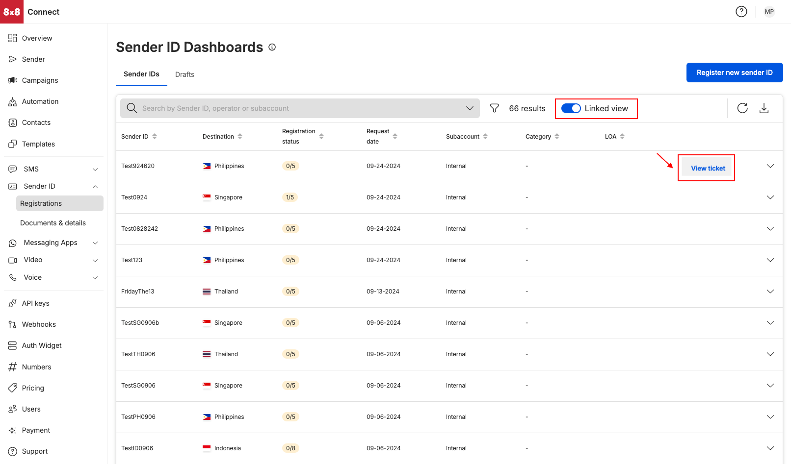
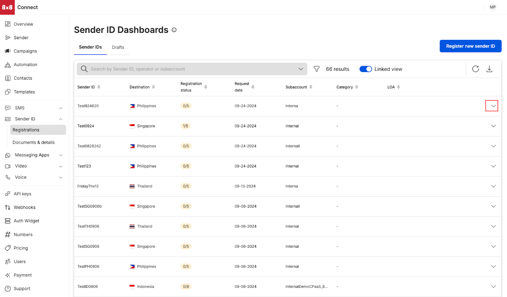
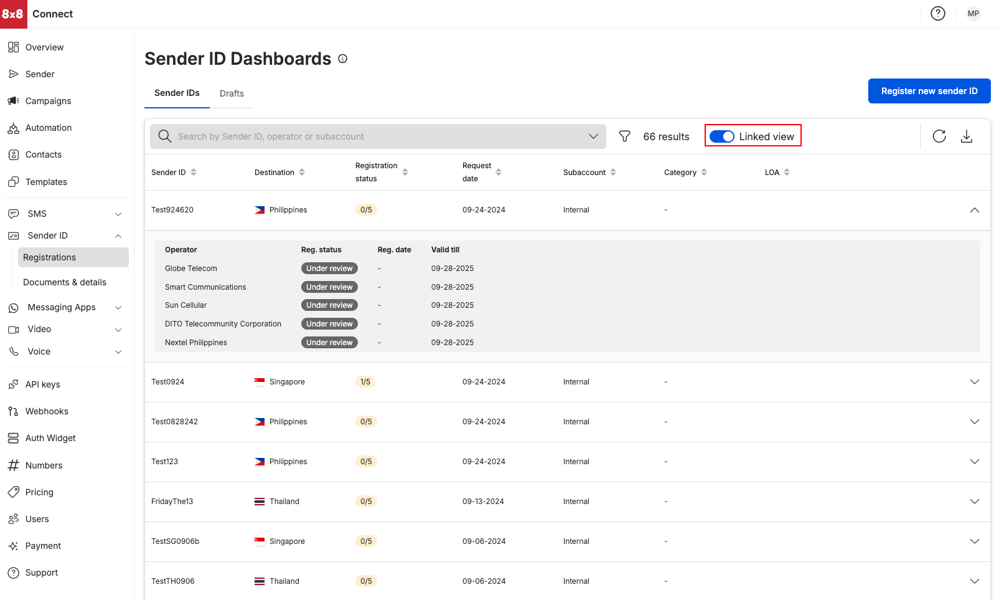

# Dashboard View

**Linked View**  

By default, Sender ID Dashboard presents a “Linked View” where we display the Sender ID registration by country (destination country that the sender ID wanted to be registered towards)

**Ticket View**  

Hovering over the column next to LOA would display “View ticket” which would allow accessing the support ticket that is associated with the particular Sender ID registration.

**Expanded Link View**  

Click on the arrow on the right side of the specific sender ID registration (as highlighted by the box in red). This allows user to track registration by mobile operator

Shows the registration status by a country’s operator. Track registration at the operator level

