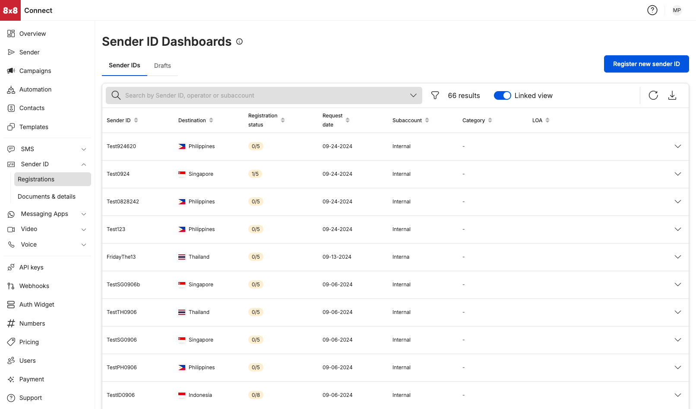

# Sender ID Dashboard

**Finding your Sender ID Dashboard**

* Select `Registrations` under the Sender ID module on your left hand side menu
* Alternatively, you can access the Sender ID Dashboard via URL: [https://connect.8x8.com/messaging/sender-id](https://connect.8x8.com/messaging/sender-id)

**Sender IDs Tab**  

View Sender ID registration by:

* Sender ID (name of sender ID that had been chosen to be registered)
* Country (destination where the sender ID needed to be registered at)
* Subaccount (the subaccount chosen for the Sender ID registration, this would most often be a subaccount that has the SMS product enabled)

**Sorting filters**

* Sender ID (sort in ascending order [a-z] or in descending order [z-a] of the Sender ID name)
* Destination (sort in ascending order [a-z] or in descending order [z-a] of the destination name)
* Registration Status (sort by the number of operators in the registration status)
* Request Date sort in ascending order [earliest date - latest date] or in descending order [latest date - earlier date]
* Category (sort in ascending order [a-z] or in descending order [z-a] of the category name)  

LOA (Sort by the registration status of the LOA)

