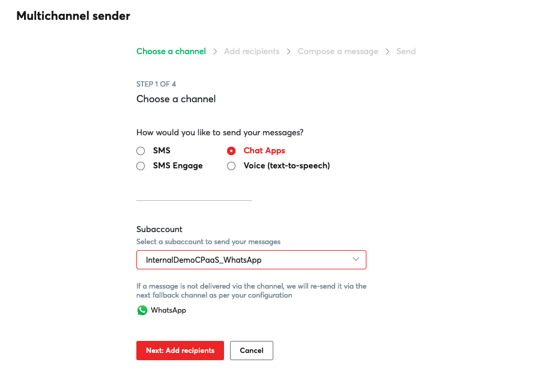
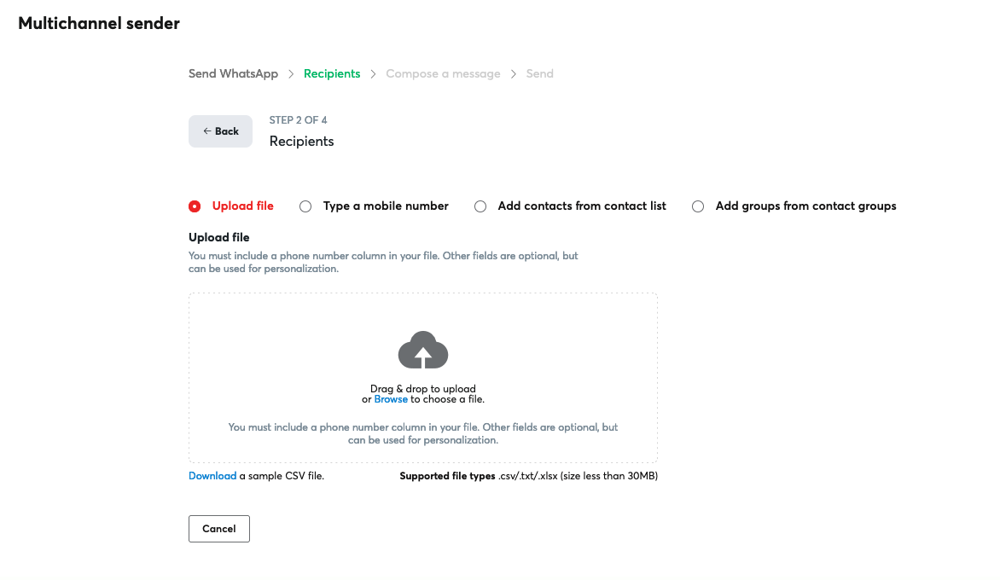
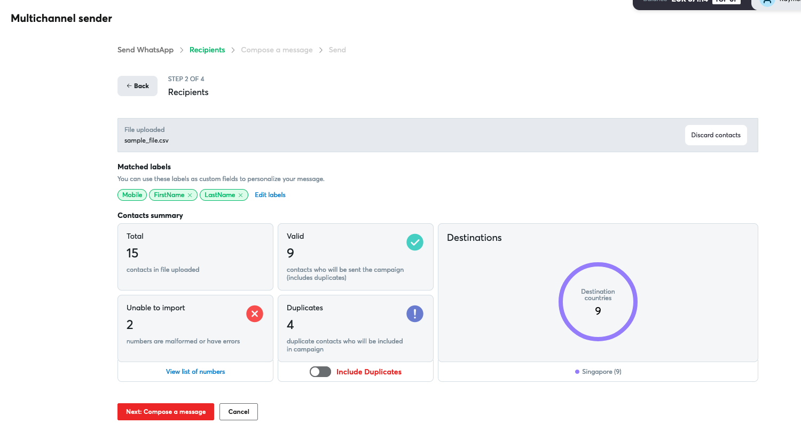
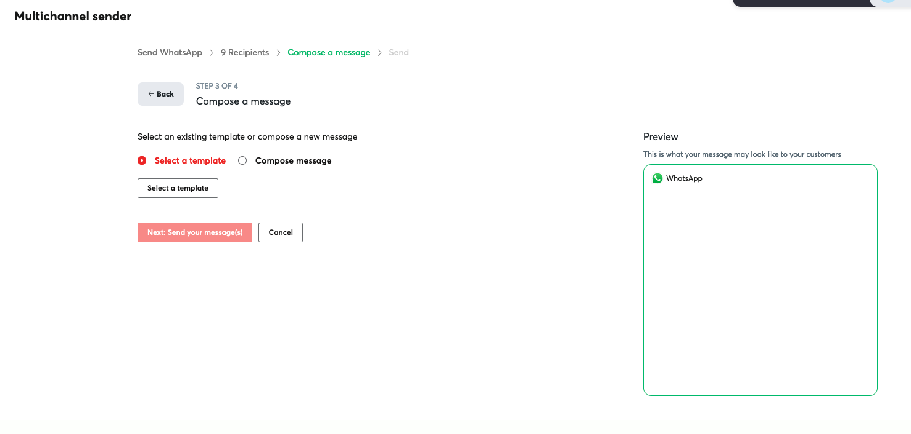
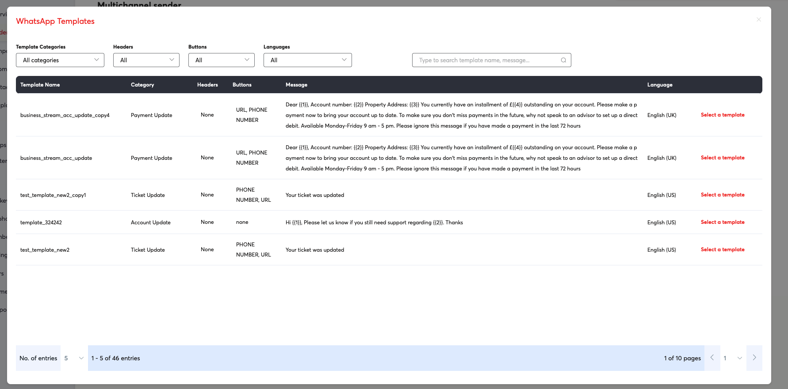
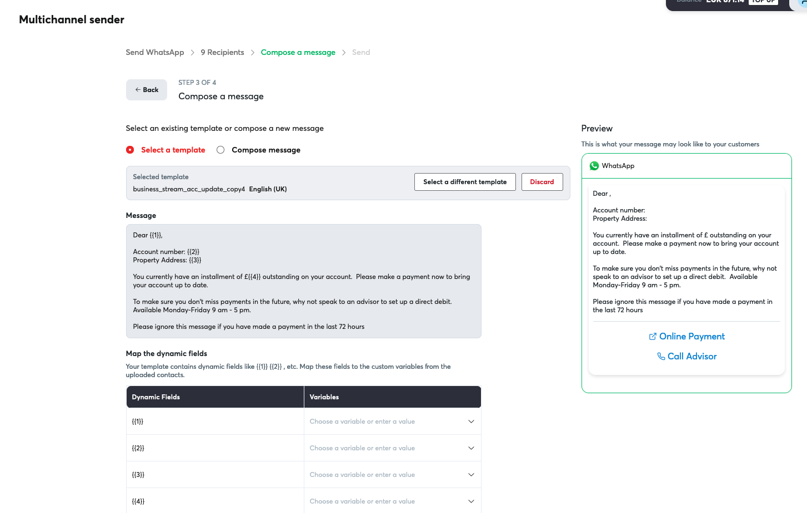
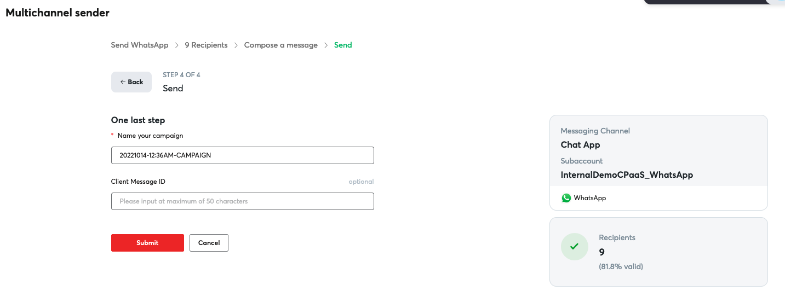

# Sending WhatsApp messages using MCS

## Sending a WhatsApp message

**Here are the steps**  

*(For this tutorial we will highlight the method for uploading a file since it is the most popular way to send messages)*

1. Select "WhatsApp" as your channel and select your subaccount.  

*(This tutorial assumes you already have WhatsApp configured under your account. If you don't have one please talk to your account manager or send a request to [cpaas-support@8x8.com](mailto:cpaas-support@8x8.com))*

2. Click "Add recipients and you will be redirected to Recipients page to enter your destination number(s).  

There are four(4) ways you can do this.  

a. Upload a file  

b. Type a mobile number  

c. Add contacts from your contact list  

d. Add group from your contact groups

3. You can upload a file by clicking the "Drag & drop to upload" icon or simply drag and drop your file. Use a .csv, .txt, or .xlsx file to upload your contacts in our default format *(you may refer to the sample file provided and we recommend that you use a .csv file format)*.
4. After you upload your contacts, you may manually amend the column labels. The default fields you can select from are Mobile, FirstName, LastName, and ClientmessageId. Alternatively, you can also add a custom field by typing the name and pressing enter. You can then select the field you just created.

5. Click "Process contacts" to review your contacts. Here, you'll be able to check all the fields you selected, country destinations, total valid numbers, or duplicates (if any). You can choose to "include duplicates" if you wish for selected contacts to receive the same message more than once.

6. Click "Compose a message". For WhatsApp, it is recommended that you use an approved WhatsApp template from your WhatsApp template list. (Please click here for WhatsApp templating).

7. Some WhatsApp templates require you to fill in some parameters as shown below.

8. Once everything is ready to go, click "Send your message" and the last step will be to name your campaign which is also optional.

9. Just click "Submit" and you are done! Congratulations, you just sent your first WhatsApp message.
