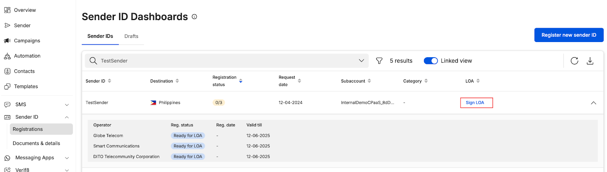
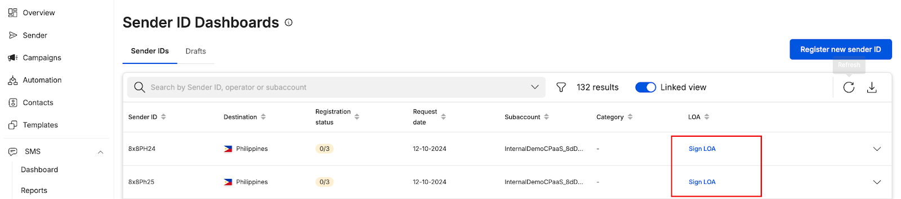
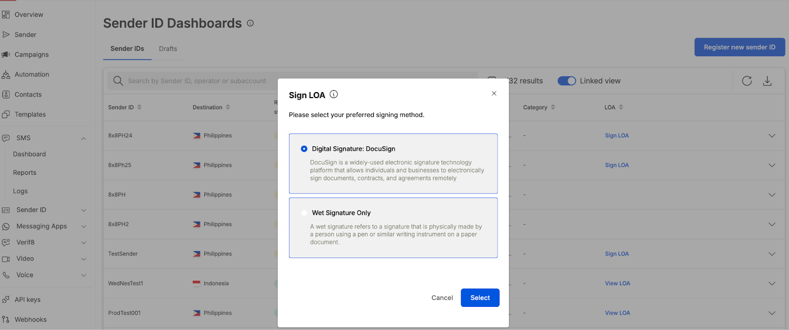
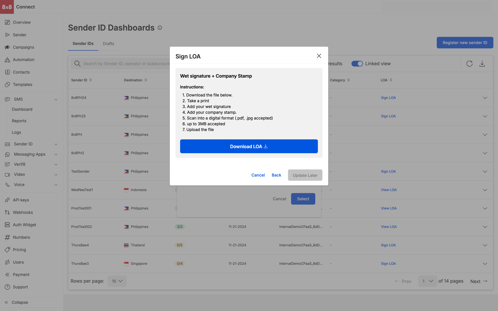
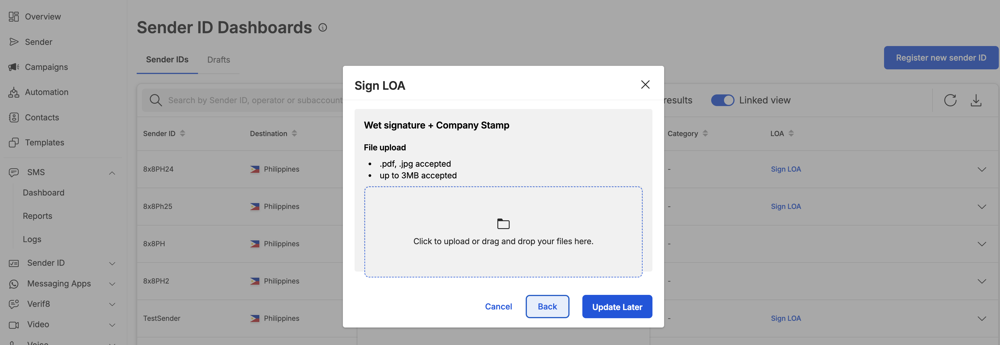

# Signing LOA

**LOA Signing**

* An email would be sent to your email address informing you that your ticket has been updated and that your LOA is ready for Signing
* View your LOA submission that is ready for signing by accessing your Sender ID dashboard - [https://connect.8x8.com/messaging/sender-id/registration](https://connect.8x8.com/messaging/sender-id/registration)
* Click on `Sign LOA` to trigger the signing process

  
* User has an option to sign via Docusign(where applicable) and Wet Signature (requires user to download the file, sign and upload it back

* Wet Signature requires user to download and sign, an uploader will be seen once the user downloads the LOA

