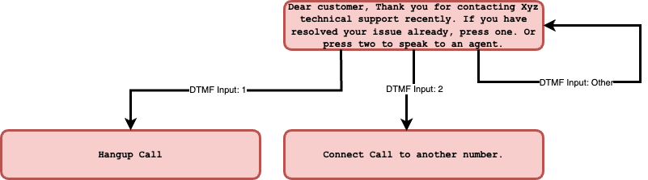
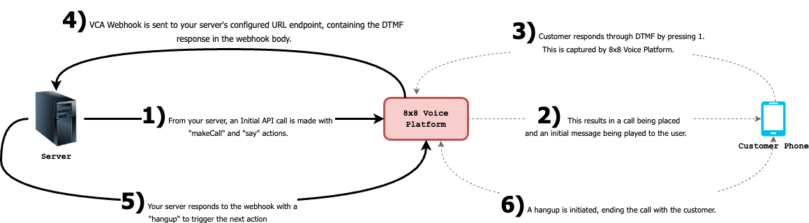

# Simple IVR

Below is a sample of a simple IVR call scenario. The Callflow below demonstrates an example scenario where a callback is placed to a customer seeking technical support. Then in the same call the user has the ability to either contact a member of technical support, end the call or repeat the main menu.

## Demo Video

This video will show a demo of how the Advanced IVR menu will work, including showing webhooks and the Initial API Call.

<iframe
  src="https://www.youtube.com/embed/6UfWfvk8-jY?si=0Embr27hn_krsgKX"
  height="500px"
  width="100%"
  allow="picture-in-picture; web-share"
  allowFullScreen>
</iframe>

## GitHub Repo with Sample Backend Code

In order to make use of the Callflows API, you will need to setup not only Webhooks but a backend server to respond to those webhooks. We have provided a code sample of backend code in Python that processes the webhooks and responds to them to trigger actions in the IVR.

Note: The code for the Simple IVR is under app\_simple\_ivr.py

[GitHub Repo](https://github.com/EMChamp/8x8-advanced-ivr-callsflow-api)

## Diagram of Simple IVR Flow

Below is a description of the IVR Tree that we will be building with this call scenario. There are 3 possible paths and only 1 level in this simple IVR Tree.



## Webhooks and API Calls in Simple IVR Flow

Below is a diagram of how the webhooks and API Calls from your server will work with the 8x8 Voice Platform to create this IVR.



## Example of initial API call to place outbound call

This is the URL to send the initial API request to.

`POST voice.8x8.com/api/v1/subaccounts/{sub-account-id}/callflows`

This is the request body to send the API request to as well. Note, you will need to replace the source with a 8x8 virtual number in your account and destination with a destination phone number to call.

Sample of Simple IVR Request

```json
{
    "callflow": [
          {
            "action": "makeCall",
            "params": {
              "source": "6561115777",
              "destination": "6512345678"
              }
        },
        {
          "action": "sayAndCapture",
          "params": {
              "promptMessage": "Dear customer, Thank you for contacting Xyz technical support recently. If you have resolved your issue already, press one. Or press two to speak to an agent.",
              "voiceProfile": "en-US-BenjaminRUS",
              "repetition": 1,
              "speed": 1,
              "minDigits": 1,
              "maxDigits": 1,
              "digitTimeout": 10000,
              "overallTimeout": 10000,
              "completeOnHash": false,
              "noOfTries": 2,
              "successMessage": null,
              "failureMessage": "Invalid input, please try again"
              }
        }
    ]
}

```

### Example Response Body for an Callflows API request

Below are examples of successful and failure responses to the API request above. Depending on the error the status message may change.

**Success**

```json
{
    "sessionId": "d9874358-89ac-4c50-bbab-1eb634482a94",
    "sessionStatus": "CREATED",
    "callFlowRequestId": "89b545a5-0676-11ee-8100-d500c0d203fc",
    "statusCode": 1,
    "statusMessage": "Created"
}

```

**Failure**

```json
{
    "sessionStatus": "NOT_CREATED",
    "callFlowRequestId": "0564e804-0a7e-11ee-9c83-6df9c048a122",
    "statusCode": -1002,
    "statusMessage": "Speech profile or language parameter invalid"
}

```

### Explaining Session Status in Callflows Response Body

Session status indicates if a call is successfully accepted & created or not created on the 8x8 platform. 8x8 returns two status:

* `CREATED`- call is successfully created on the platform.
* `NOT CREATED`- call is not successfully created on the platform and 8x8 returns `statusCode` and `statusMessage` to understand why the call was not accepted on the platform

### Status Code and Status Message

| Status Code | Message                                                                                                                                                              |
|-------------|----------------------------------------------------------------------------------------------------------------------------------------------------------------------|
| 1           | Created                                                                                                                                                              |
| -1001       | Invalid JSON request body                                                                                                                                            |
| -1002       | Speech profile or language parameter invalid                                                                                                                         |
| -1003       | Valid maxDigits required when minDigits provided                                                                                                                     |
| -1005       | Valid overallTimeout is required when digitTimeout provided                                                                                                          |
| -1007       | $.callflow[0].action should be one of: [Call action names]<br>Eg: `$.callflow[0].action should be one of: say,playFile,sayAndCapture`                                |
| -1008       | Valid maxDigits is required when completeOnHash is false                                                                                                             |
| -1009       | Invalid call flow entry provided. [Additional error details here].<br>Eg: Invalid call flow entry provided. $.callflow[0].params.text: is missing but it is required |
| -9999       | An unknown error has occurred                                                                                                                                        |

## VCA Webhook Example

Once the initial call is made and the user responds with a DTMF input, the server will be sent a [VCA](/connect/reference/voice-message-copy#voice-call-action) webhook which will contain the DTMF input as part of the response body:

```json
{
  "payload": {
    "eventId": "ddc1e44a-9a40-11ee-b7e9-838e846e8a11",
    "callId": "d6333b3f-9a40-11ee-b57c-09a88813d857",
    "sessionId": "d62f91ba-9a40-11ee-945e-5f476b4334a1",
    "subAccountId": "InternalDemoCPaaS_8dD15_voice",
    "callStatus": "DTMF_RECEIVED",
    "callDirection": "OUTBOUND",
    "callType": "PSTN",
    "source": "+6391111111111",
    "destination": "+6599999999",
    "sourceFormat": "MSISDN",
    "destinationFormat": "MSISDN",
    "sourceCountryCode": "PH",
    "destinationCountryCode": "SG",
    "callDuration": 0,
    "dtmf": "3",
    "sipCode": 200,
    "timestamp": "2023-12-14T05:23:08.406Z"
  },
  "namespace": "VOICE",
  "eventType": "CALL_ACTION",
  "description": "Action request of a call"
}

```

This will allow your server to identify the DTMF input and reply with a callflow as the [VCA](/connect/reference/voice-message-copy#voice-call-action) webhook response. Below are examples of Callflow responses. Responding to the VCA webhook with one of these callflows below will trigger the corresponding action.

### DTMF Input 1 - Hangup

Responding with the callflow below will immediately end the call.

Digit 1

```json
{
    "callflow": [
          {
          "action": "hangup"
        }
    ]
}

```

### DTMF Input 2 - Connect Call

Responding with this callflow will connect the existing call to a different number.

Digit 2

```json
{
    "callflow": [
          {
          "action": "makeCall",
          "params": {
            "source": "6512345678",
            "destination": "6561115777"
            }
        }
    ]
}

```

### DTMF Input Other - Repeat Menu

Responding with this callflow will repeat the main menu.

Any Other Digit

```json
{
    "callflow": [
          {
          "action": "sayAndCapture",
          "params": {
              "promptMessage": "Sorry, we did not understand your response. If you have resolved your issue already, press one. Or press two to speak to an agent.",
              "voiceProfile": "en-US-BenjaminRUS",
              "repetition": 1,
              "speed": 1,
              "minDigits": 1,
              "maxDigits": 1,
              "digitTimeout": 10000,
              "overallTimeout": 10000,
              "completeOnHash": false,
              "noOfTries": 2,
              "successMessage": null,
              "failureMessage": "Invalid input, please try again"
              }
        }
    ]
}

```

## Voice Session Summary Webhook

Upon termination of the session the session summary([VSS](/connect/reference/session-status)) will be returned via webhook. To learn more about the Voice Session Summary, please [click here](/connect/reference/session-status).

## Glossary of Callflow Actions used in a successful Voice Messaging call scenario

* [`makecall`](/connect/docs/makecall)
* [`sayAndCapture`](/connect/reference/call-flow-actions-sayandcapture)
* [`hangup`](/connect/docs/hangup)
* [Configured your Voice Call Action[VCA] webhook](/connect/reference/create-a-new-webhook)
