# SMS Analytics

## Dashboard

The dashboard will contain the information about the SMS that you have sent using 8x8. Below is a view of the entire dashboard page, in the following sections we will break down each section's contents.

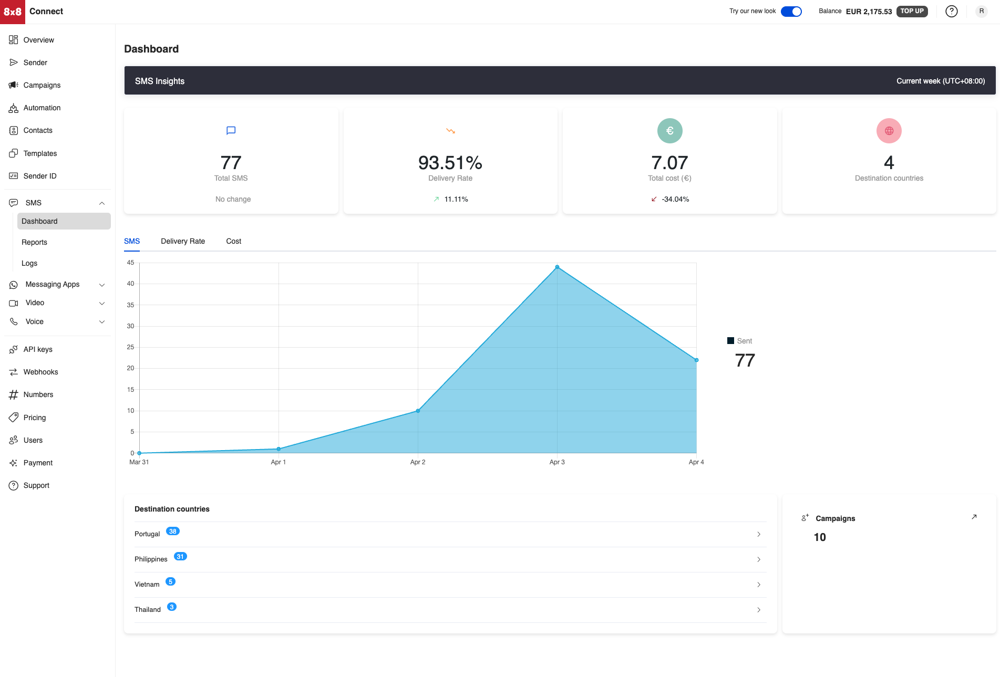

### Statistics

The Dashboard for SMS will show you the following statistics over the given time period which is set to the current week.

| Column                | Description                                                      |
| :-------------------- | :--------------------------------------------------------------- |
| Total SMS             | The total amount of SMS sent in the given time period.           |
| Delivery Rate         | Percentage of SMS delivered in the given time period.            |
| Total Cost            | How much the SMS cost during this time period.                   |
| Destination Countries | The number of different countries the SMS messages were sent to. |

Below is a screenshot of the statistics section in the Dashboard.

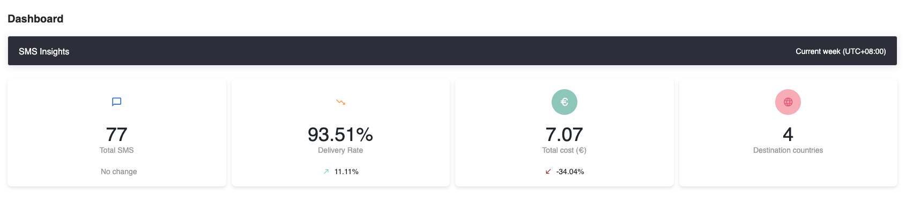

### Charts

There will be the following 3 charts available:

- **SMS:** Shows the amount of SMS sent across the given time period for each of the days

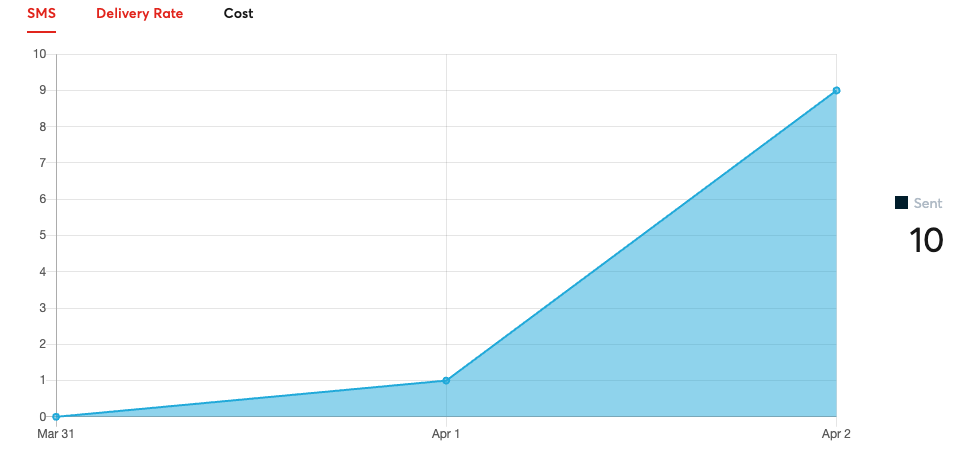

- **Delivery Rate:**  Shows how the delivery rate changes across the given time period for each of the days

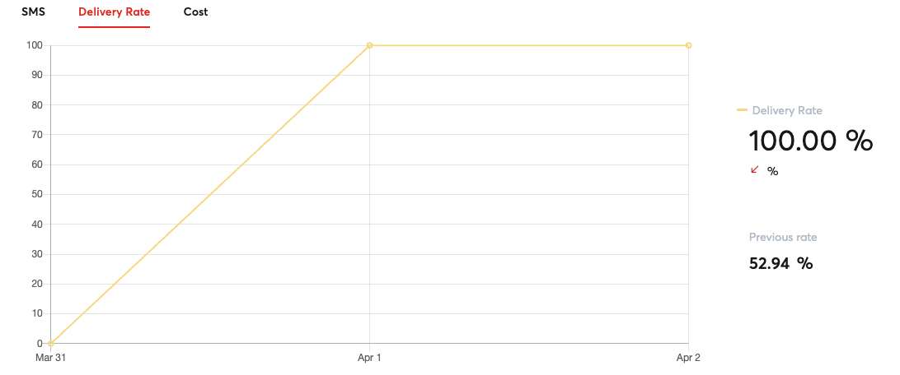

- **Cost:** Shows how the average cost of the SMS changes on a given day

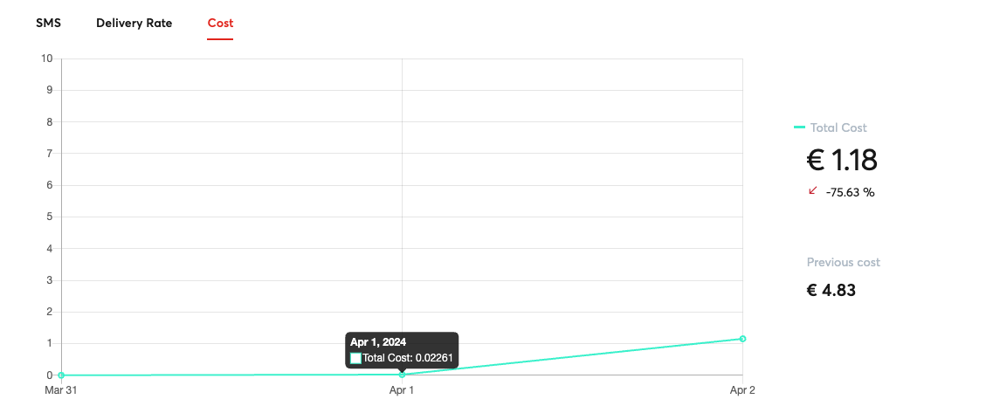

### Destination Countries

This section will break down the amount of SMS sent to each country as well as the SMS operator responsible for sending the message.

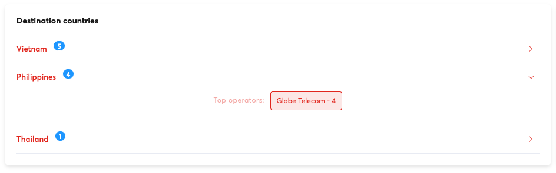

### Campaigns

This area will show the amount of SMS campaigns sent and a link to view the individual details of each campaign.

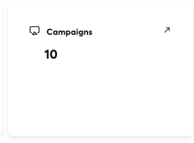

Clicking on the campaigns link will take you to the Campaigns tab of the Dashboard which will contain information about individual campaigns sent.

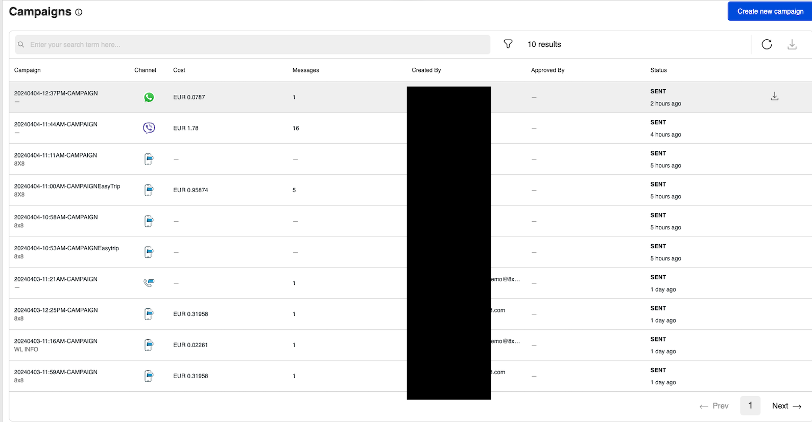

## Reports

The Reports page for SMS will show a further breakdown as compared to the dashboard and allow you to further filter the data. You will also be able to export the information as CSV file from the page to import the data into your own analytics systems.

Besides containing statistics for messages sent via the SMS API, it also contains information relevant for the **Verification API, SMS Engage** and **Short URLs**.

### SMS Messages

The SMS Messages section will allow you to filter your SMS sent by the following options

| Column     | Description                                                            |
| :--------- | :--------------------------------------------------------------------- |
| Subaccount | Filter by the 8x8 Subaccount used                                      |
| Country    | Filter by the Country the SMS is delivered to.                         |
| Operator   | Filter by the SMS Operator of the Handset that the SMS is delivered to |
| Date Range | Filter by the date range the SMS was sent.                             |

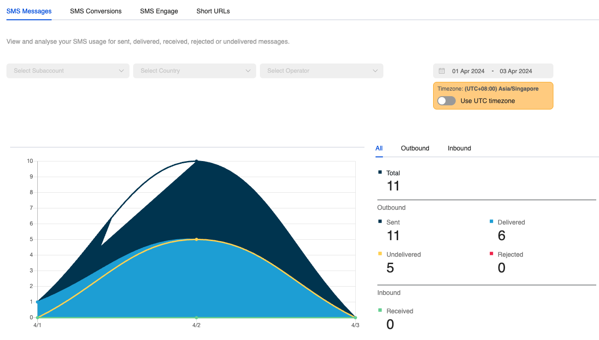

#### Daily Report

It will also feature a **Daily Report** Section where it will have the following stats about messages.

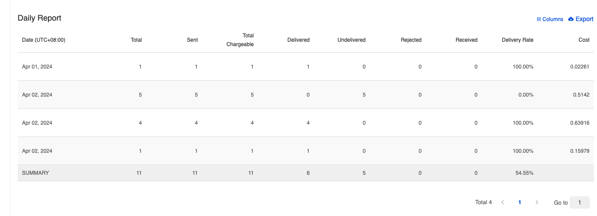

Here is a list of the columns in the **Daily Report** and their meaning.

| Column | Description |
| --- | --- |
| Total | Total amount of messages sent/received in the time period. |
| Sent | Total amount of messages sent in the time period. |
| Total Chargeable | Total messages charged by 8x8 in the time period. |
| Delivered | This means the message has been "delivered to the handset". If the status is not available from the operators, this means that 8x8 has received the confirmation from the carrier that the message has been "delivered to the carrier". |
| Undelivered | We have received confirmation that the message was not delivered. This can be due to various reasons such as: 1. Mobile handset is unavailable (e.g. mobile is switched off or on roaming mode) 2. Filtered out by the operator |
| Rejected | The message has not been accepted by our platform. This can be due to some errors such as incorrect mobile numbers or insufficient credit. You will not be charged for rejected messages. |
| Received | The message has been received by our platform and it is currently being processed before being sent to the carrier. |
| Delivery Rate | Percentage of SMS messages with a status of delivered. |
| Cost | Cost of Each Message. |

#### Export

You can choose to export the daily report immediately which will send a URL link to the specified email.

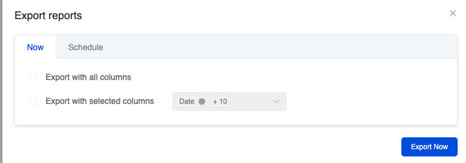

There is also the option to schedule an export to be sent periodically to the specified email.

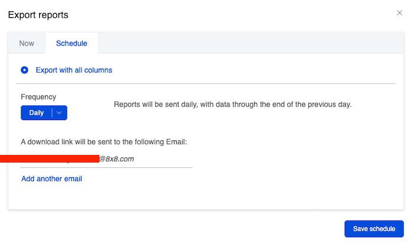

### SMS Conversions

This reports page allows you to see conversions relevant to the [Verification API](/connect/docs/verification-api-get-started), specifically for SMS sent using the service.

The main graph will show how many SMS have been sent using the service over time and what percentage have been successfully converted. This is useful for OTP use cases to track if there are any OTP conversion issues for example.

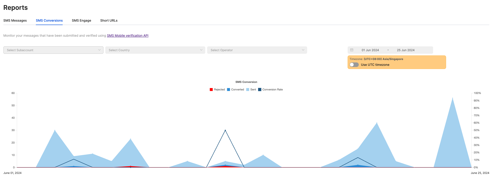

There is also a more detailed reports section on the same page which will show a detailed breakdown of the status of each verification attempt, conversion rate and cost. You can also export the report as a CSV file as well.

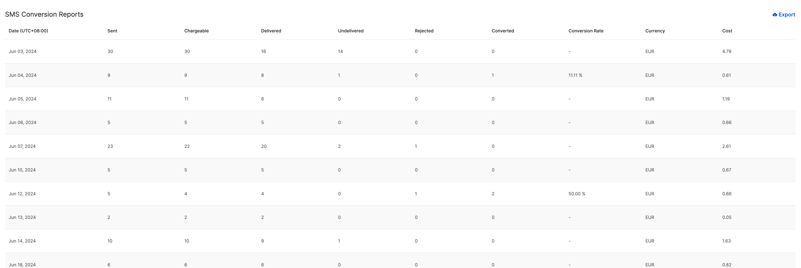

### SMS Engage

This section will contain statistics on SMS Engage Surveys sent. Please see the [section](tutorial-sms-engage) on SMS Engage for more details.

### Short URLs

8x8 offers a URL Shortening service that can redirect from your chosen domain to our URL shortening domain. This feature allows us to offer click tracking. These Short URLs can be sent as part of SMS API messages or SMS Engage Surveys that you send with 8x8. The statistics for click tracking can been see in this section of the Reports.

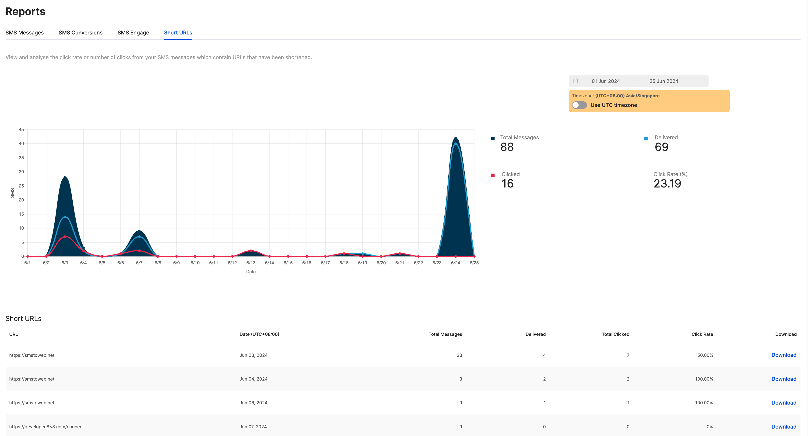

For further details on how to set up Short URLs, reach out to your Account Manager.

## Logs

### SMS Message List

Below is the SMS logs in the Connect Dashboard which shows a record of the SMS that were sent and received by this account.

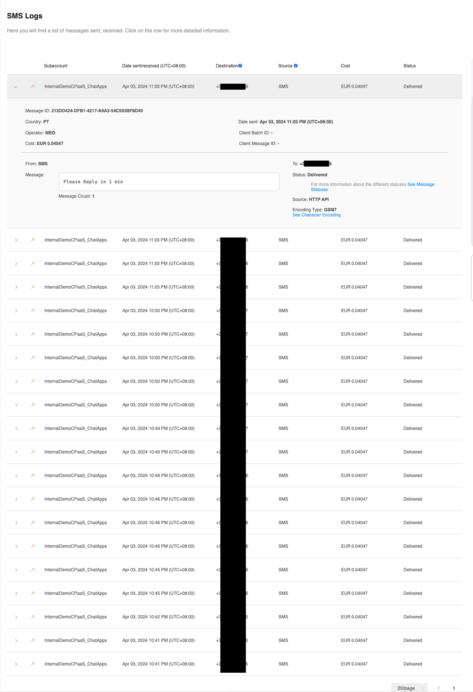

The SMS Logs above shown shares information about individual SMS messages sent including:

| Column             | Description                                                                                           |
| :----------------- | :---------------------------------------------------------------------------------------------------- |
| Subaccount         | 8x8 subaccount used to send/receive the SMS message.                                                  |
| Date sent/received | When the SMS was sent/received.                                                                       |
| Destination        | Virtual Number or Mobile Number that received the message.                                            |
| Source             | Sender ID or Mobile Number used to send the message                                                   |
| Cost               | Cost of sending the message.                                                                          |
| Status             | Shows whether the SMS was sent successfully or other potential statuses including unsuccessful sends. |

### Individual SMS Record

Inside each SMS record, the following information is available:

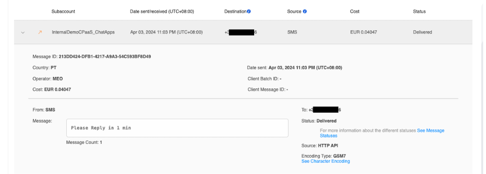

This table shows a description of each of the fields in the SMS record.

| Column                                        | Description                                                                                                |
| :-------------------------------------------- | :--------------------------------------------------------------------------------------------------------- |
| Message ID                                    | Uniquely identifies the message in the system.                                                             |
| Country                                       | The country the message was delivered.                                                                     |
| Operator                                      | SMS Operator handling the message.                                                                         |
| Cost                                          | Same as above, cost of sending the message.                                                                |
| Date sent                                     | Same as above, the date the message was sent.                                                              |
| Client Batch ID                               | An optional parameter that can be used in an API call to identify a message with a unique string.          |
| Client Message ID                             | An optional parameter that can be used in an API call to identify a batch of message with a unique string. |
| From                                          | Same as Source, Sender ID or Mobile Number used to send the message.                                       |
| Message                                       | The message body/content.                                                                                  |
| To                                            | Same as Destination,  Virtual Number or Mobile Number that received the message.                           |
| Source (Different from Source in Main Column) | Method the message was sent. Most commonly this is the HTTP API meaning API request to our SMS API.        |
| Encoding Type                                 | The SMS encoding usually depends on the characters sent as part of the SMS. Either GSM7 or UCS2.           |
