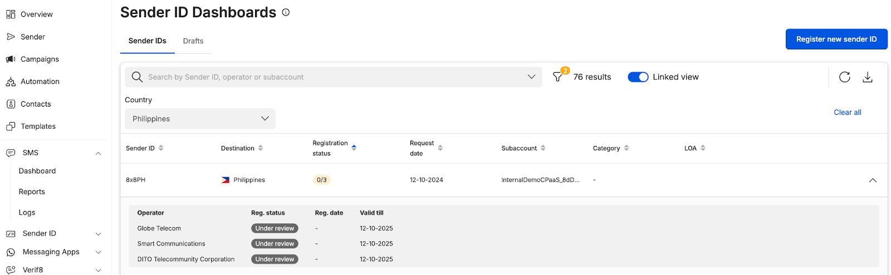
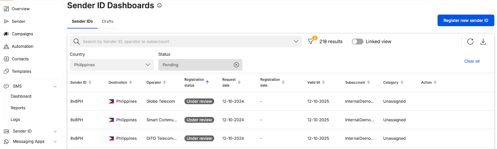
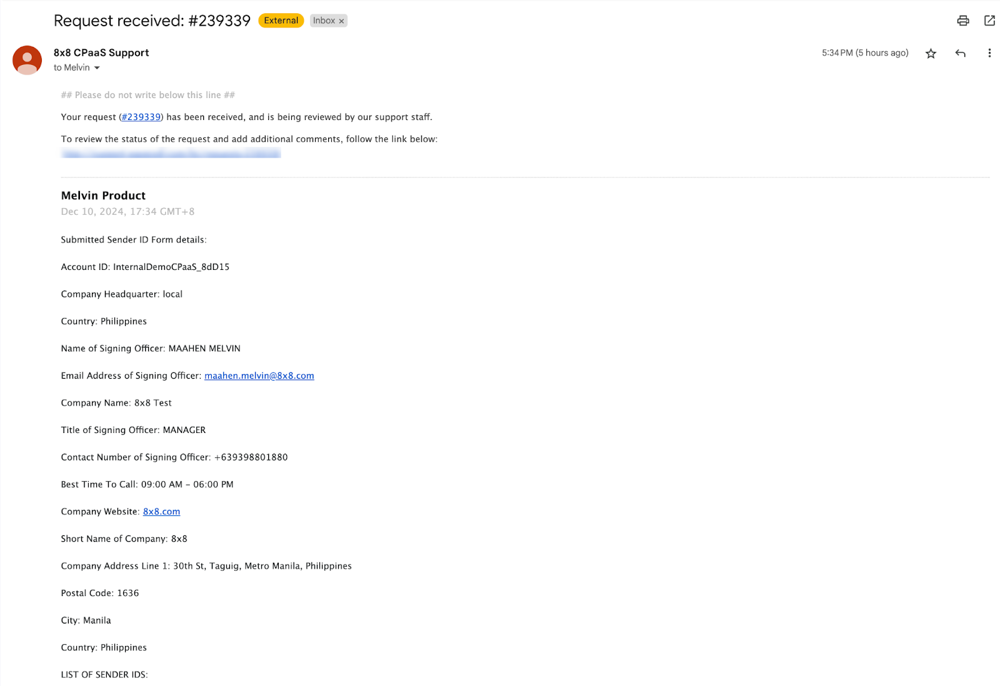
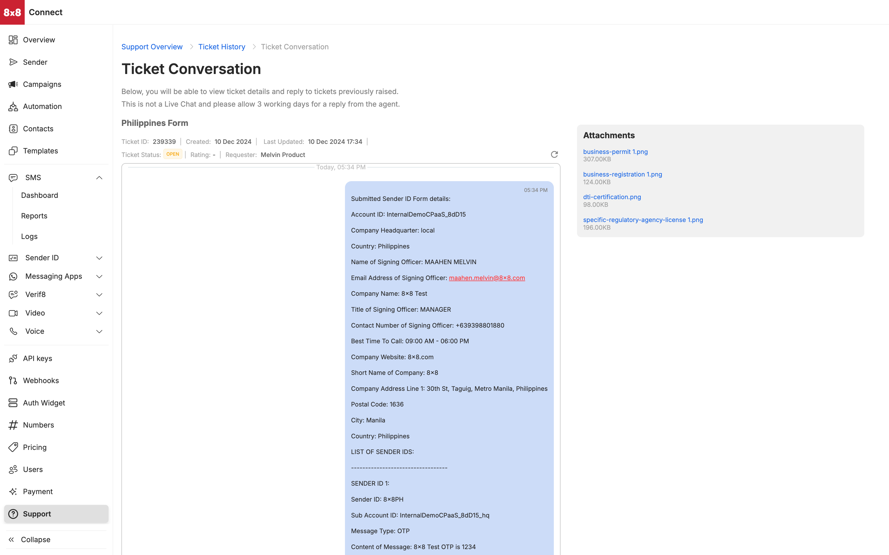

# Submitted Sender ID Registrations

**Sender ID Registration Submission and Sender ID Dashboard**

* User will see the sender ID as under review which means that our back-end system is reviewing your Sender ID registration request and if required, manual checks may be carried out that may lengthen the review process

Linked View of Submitted Sender ID Registrations

Unlinked View of submitted Sender ID registrations

**Support Ticket**

* Email Notification that Sender ID registration has been submitted and a ticket will be assigned

* Alternatively you can view the ticket via our support portal on 8x8 connect, <https://connect.8x8.com/support/tickets>

