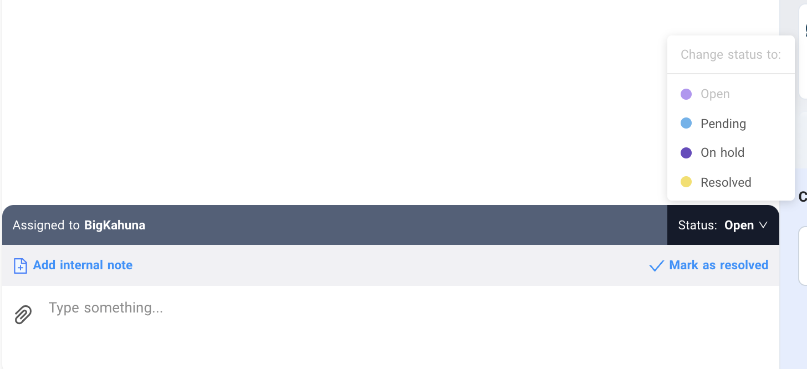
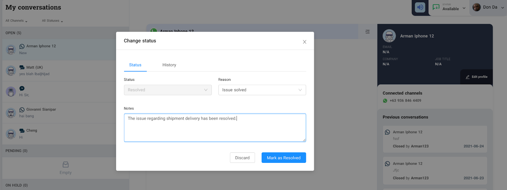
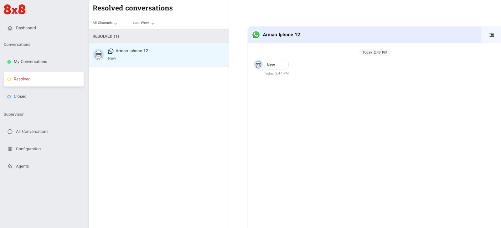
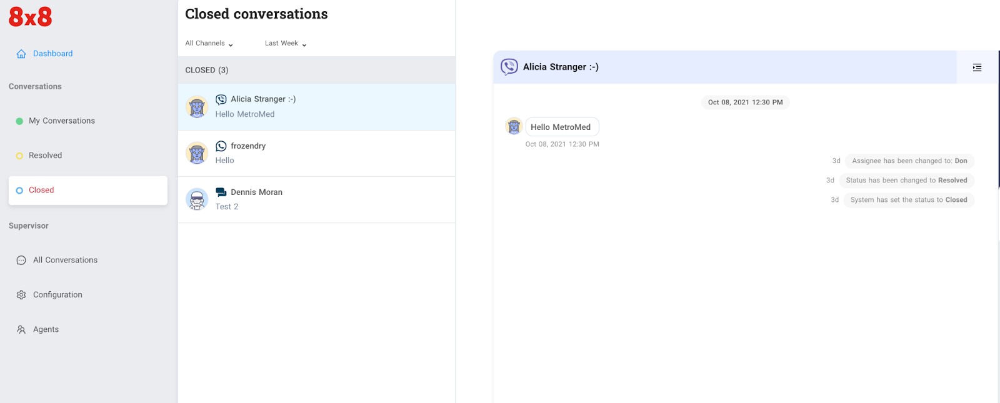
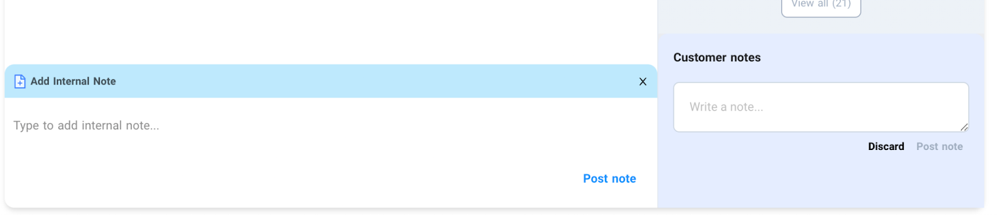

# Ticket Management

\**Here are the different actions available to the agent:*  

Ticket Status

**An agent marks a ticket as RESOLVED:**  

(A) A period of time (default is set to 1 hour, but configurable by managers) lapsed starting from the time it was marked resolved. This leads to the ticket to be marked as CLOSED  

(B) Within the defined period of time, the customer replies. Tickets will be reopened and this status will change back to OPEN.

When an agent marks a ticket as RESOLVED. He/She has the option to add Notes before marking it as shown below.

  
A ticket marked as “Resolved” will be added to the agent’s Resolved conversations page as shown below

  
**An agent marks a ticket as ON HOLD**  

(A) In the case where the agent is waiting for internal information, he can continue chatting with customers once information is obtained.  

(B) In the case the agent is unable to resolve the issue, he has to notify the manager and the manager will manually reassign the ticket directly to another agent. This will mark the ticket as OPEN once assigned.  

(C ) Alternatively once an agent replies to the ticket it should automatically be set to OPEN.

**An agent marks a ticket as PENDING**  

(A) A period of time (default set to 1 hour, but configurable by managers) lapsed starting from the time of the agent's last message. This leads to the ticket automatically marked as CLOSED.  

(B) Customer replies within the defined period and ticket status changes to OPEN.

**Closed tickets**

All closed tickets will be added automatically to the agent’s Closed conversations page

  
## Adding notes

There are two types of notes that you can add during a conversation, these notes can only be read by agents regardless of their role. Notes are useful where the next agent can review previous issues regarding the ticket or the customer. It will help resolve tickets faster.

**Internal notes** - these are notes that can be generated by the system or notes that other agents might add during their call. These notes are useful whenever a ticket is assigned to another agent.

**Customer notes** - these are notes that can be added by agents during the call where they can add more information about the customer. These are useful when a customer engages with other agents either from the same ticket or a new one.

