# Steps

## Overview

**Steps** make up a **workflow definition**. Each step has a unique id that identifies it within that workflow definition. This page aims to define each type of step and the properties that make up that step to better understand how they can be used as part of a workflow definition.

Steps allow you to create custom workflow definitions that can perform different actions within that workflow instance.

## List of Steps

| Step Name | Description | Example |
| --- | --- | --- |
| SMS Message | SMS step allows you to send a message to a recipient as a SMS. | Send an SMS message to a customer. |
| ChatApps Message | ChatApps Message step allows you to send a message using 8x8 Chat Apps messaging API. | Send a ChatApps message to a customer. |
| Wait | Wait step allows you to make the workflow wait for a specified period of time before executing the next step. | Wait 2 hours to send a reminder message to a customer. |
| Branch | Allows you to create multiple paths in a workflow. | Use a Branch step to decide what message to send based on a customer's reply. If a customer replies with 1, send a reminder message. If they reply with 2, send a different message. |
| WaitForReply | The WaitForReply step type allows your workflow to pause till you receive a reply from an end user | Wait till a customer responds to a message. You can pair it with a branch step to decide what to do based on that response. For example you may want to send a message asking a user to check their email for an OTP, then use Wait for Reply to wait for the user to input the OTP before proceeding to the next step. |
| Voice Message | Send a Voice Call to a number | Play a voice message to a specified phone number with a reminder. |
| HTTP Request | Send an HTTP request to an endpoint. Useful for integrating with APIs. | This may be useful to query an HTTP endpoint and use the value returned as part of the flow. For example you can query the Google Calendar API for available meeting slots and use the slots as part of a message response for a user. |
| Jump To | Skip to another step in the workflow definition. This is often useful to better organise your workflow definition. | For example there may be a menu with many options and some of them refer to the same message such as: 1) Office Hours of Restaurant Location 1 2) Office Hours of Restaurant Location 2 3) Office Hours of Restaurant Location 3 If 1+2 are the same, you can use a Jump Step to point to a message that would contain the same message. |
| Send to Converse | Send the current conversation to [Converse](/connect/docs/converse-overview) for an agent to take over. | As part of a menu, you can give the option for the user to escalate to a live agent. |

## Step Descriptions

### SMS Message

SMS step allows you to send a message to a recipient as a SMS using the 8x8 SMS API.

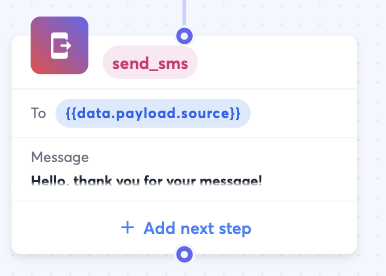

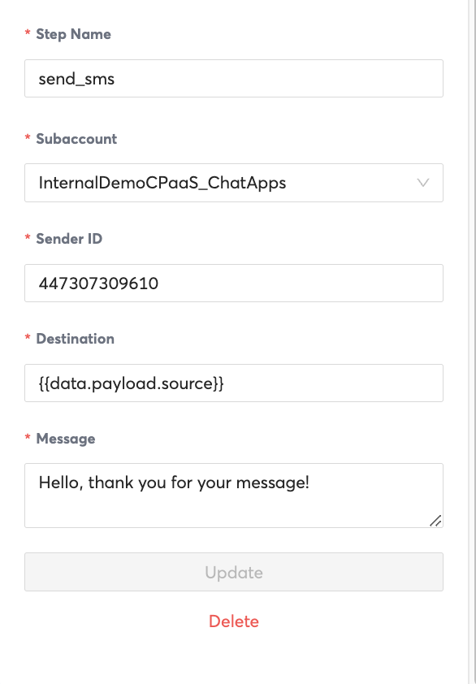

| Property | Description | Example Value |
| --- | --- | --- |
| Step Name | Unique name that identifies a step. | send_sms123 |
| Subaccount | The 8x8 Subaccount that the message will be sent from. | subaccount123 |
| Sender ID | Either the SMS Sender ID or the Virtual Number that the message will be sent from and the user will see. | 44703492340 (Number that is tied to the subaccount123) |
| Destination | The Phone Number that you would like to send the SMS to. | `{{data.payload.source}}` (If the workflow was triggered by an inbound message, this variable would refer to the sender of that inbound message). |

### ChatApps Message

ChatAppsMessage step allows you to send a message using 8x8 Chat Apps API.

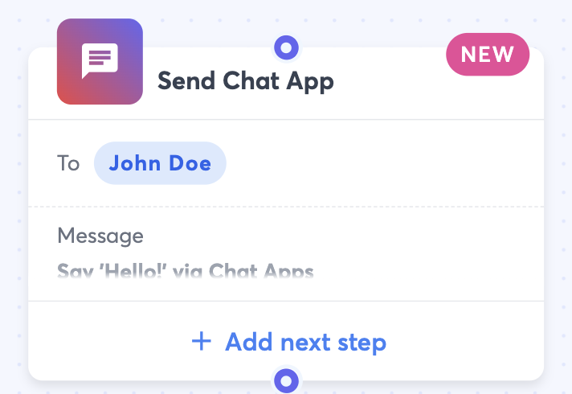

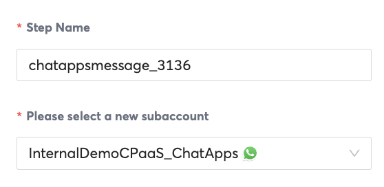
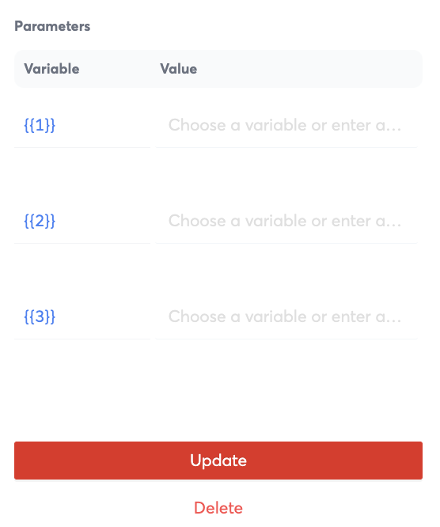

| Property | Description | Example Value |
| --- | --- | --- |
| Step Name | Unique name that identifies a step. | send_sms123 |
| Subaccount | The 8x8 Subaccount that the message will be sent from. | subaccount123 |
| Destination | The Phone Number that you would like to send the SMS to. | `{{data.payload.source}}` (If the workflow was triggered by an inbound message, this variable would refer to the sender of that inbound message). |
| Select an exisiting template or compose a new message | If required, you should select an existing template for the ChatApps Platform you are using. For example WhatsApp requires templates for the first message sent to a customer. | N/A |
| Message | A Preview of the message that will be sent to a customer. | Hi `{{1}}`, good news, your package has been shipped!  |
| Parameters | Variables that can be inputted into a message template that will replace the placeholders. | If the variable is `{{1}}` and the value is "Hello", `{{1}}` will be replaced by "Bob".**Example Template:** Hi `{{1}}`, good news, your package has been shipped!**Replaced Message:** Hi Bob, good news, your package has been shipped! |

### Wait

Wait step allows you to make the workflow wait for a specified period of time before executing the next step.

  

(Note: The duration is yet to be updated, that's why it shows 00:00:00 on the left)

| Property | Description | Example Value |
| --- | --- | --- |
| Step Name | Unique name that identifies a step. | wait_6686 |
| Duration | Duration to wait before proceeding onto the next step | 5 hours |

### Branch

Allows you to create multiple paths in a workflow.

The example below shows the next steps after and before the branch to illustrate it's use.

* The Wait For Reply Step (waitforreply_8622) just before this is waiting for a input from a user
* The Branch Step (branch_8338) checks the value returned in the Wait For Reply Step
  * If 1, chatappsmessage_0501 step is executed, delivering the message "Please enter your email address:"
  * If 2, chatappmessage_9836 step is executed, delivering the message "Goodbye".

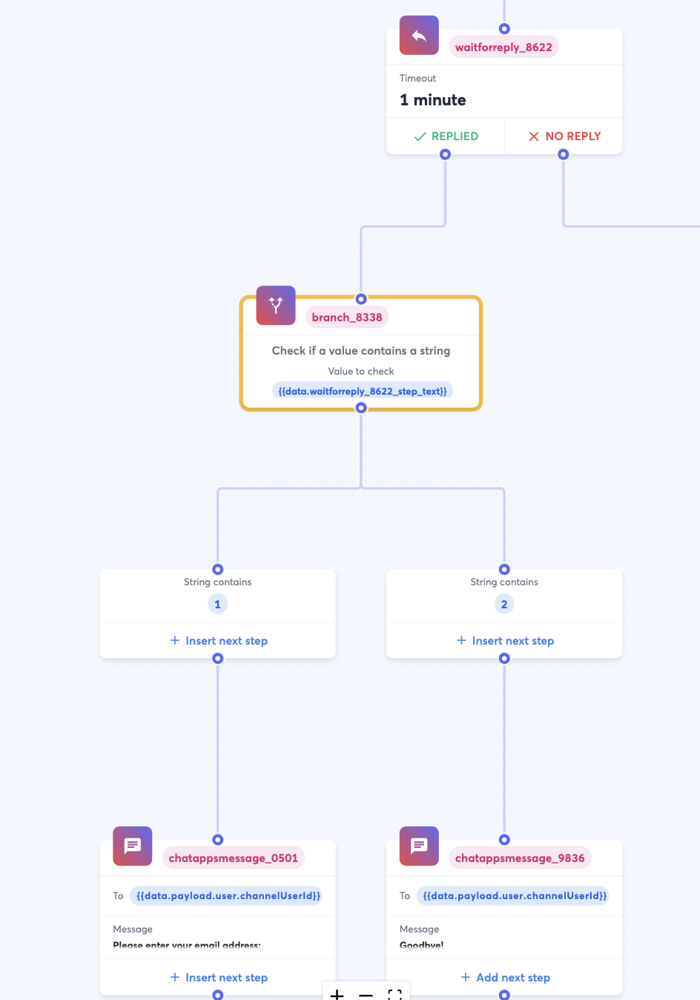

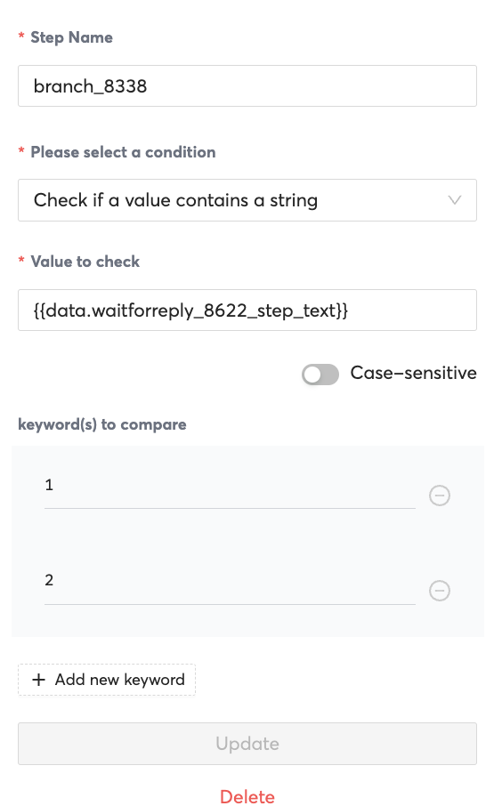

| Property | Description | Example Value |
| --- | --- | --- |
| Step Name | Unique name that identifies a step. | branch_8338 |
| Please select a condition | There are a few possibilities of values to check such as: 1) Check if a value contains a string 2) Check country code of a mobile number 3) Check if date falls within some time of day 4) Check the day of the week of a date 5) Custom Condition | Ii you select "Check if a value contains a string" that allows you to branch off of a user input provided in a previous step. |
| Value to check | This allows you to refer to a previous step in the workflow definition and the value it contains.  | Use the value a user inputted in a Wait For Reply Step as part of the branch logic |
| Keywords to Compare | Fixed values to check the property "Value to Check" against. | You can add 1, 2, 3 as values to compare to create a menu such as the following: 1) Enter 1 to reserve a table 2) Enter 2 for restaurant hours 3) Enter 3 for location |

### Wait For Reply

The WaitForReply step type allows your workflow to pause till you receive a reply from an end user.

For example you may want to send a message asking a user to check their email for an OTP, then use Wait for Reply to wait for the user to input the OTP before proceeding to the next step.

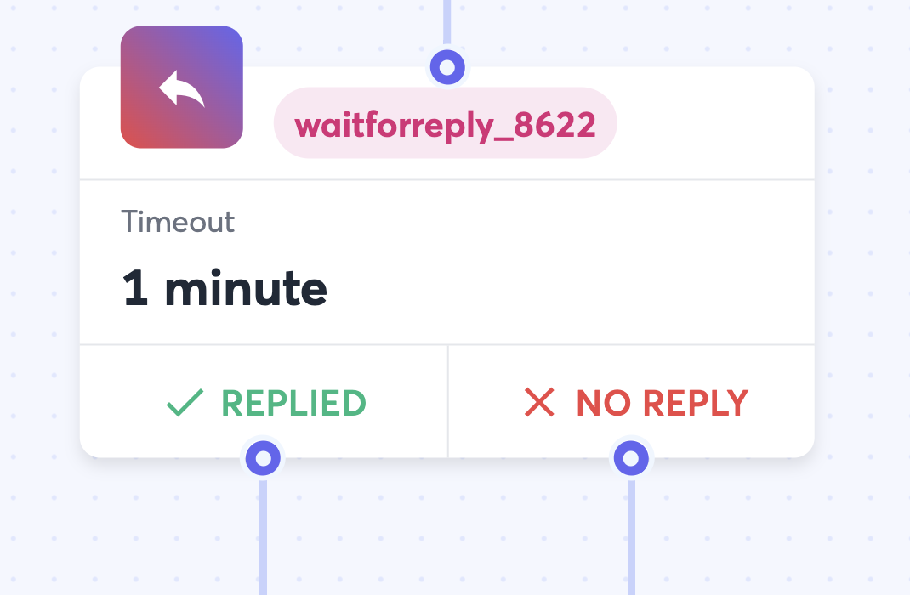

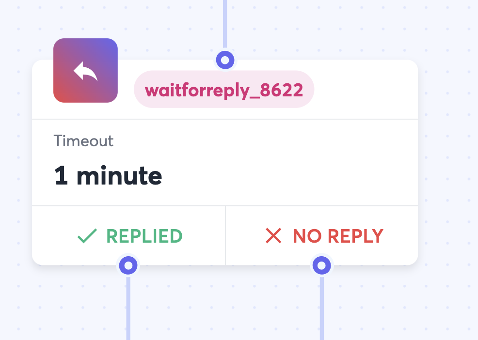
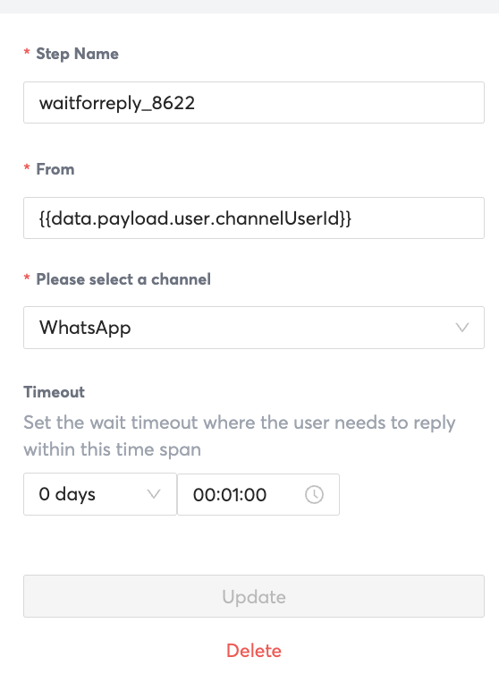

| Property | Description | Example |
| --- | --- | --- |
| Step Name | Unique name that identifies a step. | waitforreply_8622 |
| From | Define which phone number or channel source to wait for a reply from. | `{{data.payload.user.channelUserId}}` |

### Voice Message

The Voice message has 3 possible actions which will change the properties available. There are also generic properties that are required by all 3 possible actions.

#### Voice Message Step and Generic Properties Image

Example of Steps

  

for all actions

#### Generic Properties required for all actions

| Property | Description | Example Value |
| --- | --- | --- |
| Step Name | Unique name that identifies a step. | voicemessage_5246 |
| Please Select a Voice Subaccount | Choose the subaccount to use for the voice call. It should have a 8x8 Phone Number configured | subaccount123 |
| Action | Choose what type of voice message to play to a user: 1) Message with DTMF 2) Text to Speech 3) Play an Audio File | "Message with DTMF" |
| Source | The Phone Number to place the call from | +6512345678 |
| Destination | The Phone Number to call | A Phone Number such as +6512345678. Or a variable such as `{{data.PhoneNumber}}` if the workflow is triggered by a HTTP trigger for exmaple. |

#### "Text to Speech" Action Properties Image

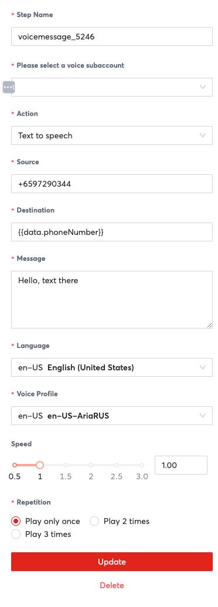

#### "Text to Speech" Action-specific Properties

| Property | Description | Example Value |
| --- | --- | --- |
| Language | The Language of the message | en-US for English (US) |
| Voice Profile | A customized and unique synthesis of vocal characteristics, pitch, and intonation created for a specific user, providing a personalized and natural-sounding audio experience. | en-US en-US-AriaRUS for a Female English speaker |
| Speed | How fast to playback the message | 1 for default speed, 2 for 200% speed. |
| Repetition | How many times to play the message | 1 for playing the message once. |

#### "Play an Audio File" Action Image

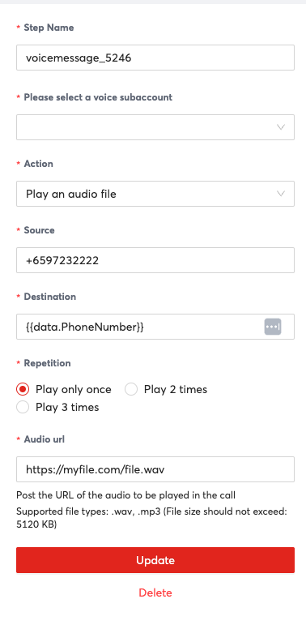

#### "Play an Audio File" Action Properties

| Property | Description | Example Value |
| --- | --- | --- |
| Repetition | How many times to play the message | "1" to play the message once |
| Audio URL | Publicly accessible URL of the audio file to play | [https://filestorage.com/file1.mp3](https://filestorage.com/file1.mp3) |

#### "Message with DTMF" Properties Image

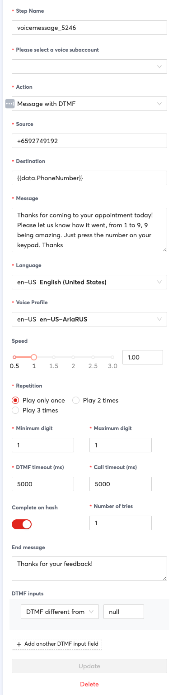

#### "Message with DTMF" Action Properties

| Property | Description | Example Value |
| --- | --- | --- |
| Message | The message to play using text to speech | "Hello, this is ABC Restaurants" |
| Language | The Language of the message | en-US for English (US) |
| Voice Profile | A customized and unique synthesis of vocal characteristics, pitch, and intonation created for a specific user, providing a personalized and natural-sounding audio experience. | en-US en-US-AriaRUSfor a Female English speaker |
| Speed | How fast to playback the message | "1" for default speed, "2" for 200% speed. |
| Repetition | How many times to play the message | "1" for playing the message once. |
| Minimum Digit | Minimum amount of digits of input to accept | "1" for needing to accept 1 digit of input |
| Maximum Digit | Maximum amount of digits of input to accept | "2", so it will only accept at maximum 2 digits |
| DTMF Timeout (ms) | How long in milliseconds to wait for a DTMF response | "5000" would make the step wait for 5 seconds / 5000 milliseconds |
| Call Timeout (ms) | How long in milliseconds to wait for an answer to a call | "5000" for making the step wait 5 seconds for an answered call. |
| Complete on Hash | Whether to complete the message on a hash | "Yes" to require a hash to input a DTMF, "No" to accept DTMF input with just the digit |
| Number of Tries | How many times to try to collect input | "2" for making the step try twice to collect a DTMF |
| End Message | Message to play after collecting a DTMF input | "Thank you for your response" to play that message at the end of DTMF collection. |
| DTMF Inputs | Branching paths based on DTMF input. You can create multiple inputs for as many paths as you would like to support. | Paths: 1 for office hours 2 for office location |

### HTTP Request

Send an HTTP request to an endpoint. Useful for integrating with APIs.

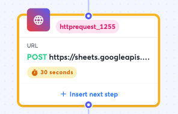

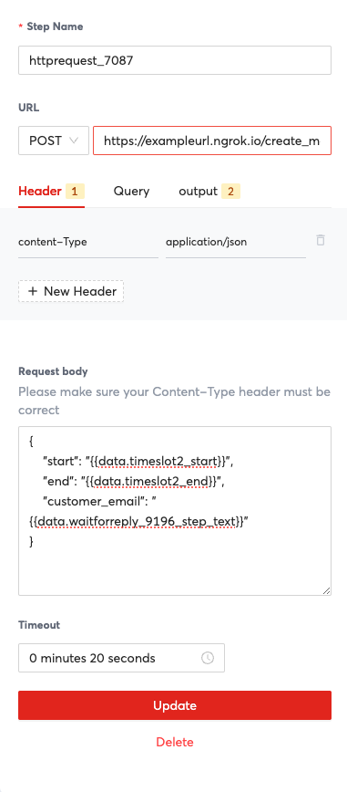

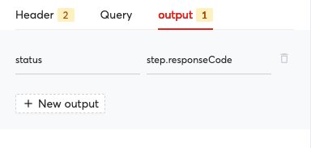

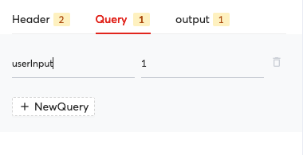

| Property | Description | Example Value |
| --- | --- | --- |
| Step Name | Unique name that identifies a step | httprequest_1255 |
| URL | URL and Method to send an HTTP request to | [https://sheets.googleapi.com/v4/spreadsheets](https://sheets.googleapi.com/v4/spreadsheets) and GET to send a GET request to that URL |
| Header | HTTP Headers to attach to the request | "content-type" and "application/json" to send this key value pair as a part of the HTTP header in the request. |
| Query | HTTP Query to attach to the request. | "userInput" and "1" to send this key value pair as part of the HTTP request. |
| Output | Save outputs from the response of the HTTP request for use in either this step or subsequent steps. | "status" and "step.responseCode" to save the status property for use later in the workflow. It can be referred as a variable by using `{{data.status}}`. You can use this value to take a different action depending on the response code in a branch step for example. |
| Request Body | The request body to send as part of the request. The format should match the Content-Type header that you supply as part of the request. | For example if the endpoint you are sending expects JSON, you should specific the content type appropriately in the header and then send JSON in the request body such as: { "values": [ [ "`{{data.PhoneNumber}}`", "`{{data.Name}}`" ] ] } |
| Timeout | Timeout for the HTTP request | "30 seconds" to wait 30 seconds before timing out |

### Jump To

Skip to another step in the workflow definition. This is often useful to better organise your workflow definition.

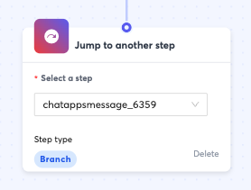

| Property | Description | Example value |
| --- | --- | --- |
| Select a step | This should refer to a step within the same workflow definition that you would like to execute after this jump step. | "chatappsmessage_6359" |

### Send to Converse

Send the current conversation to [Converse](/connect/docs/converse-overview) for an agent to take over.

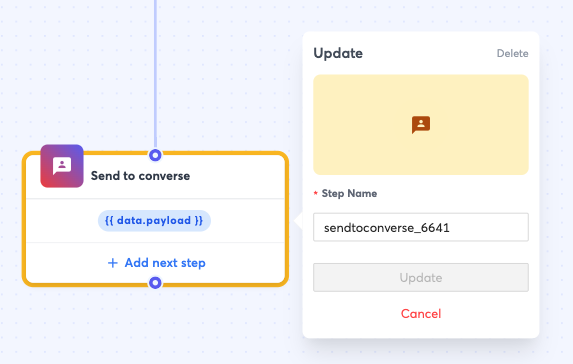

| Property | Description | Example Value |
| --- | --- | --- |
| Step Name | Unique name that identifies a step | "sendtoconverse_6641" |
