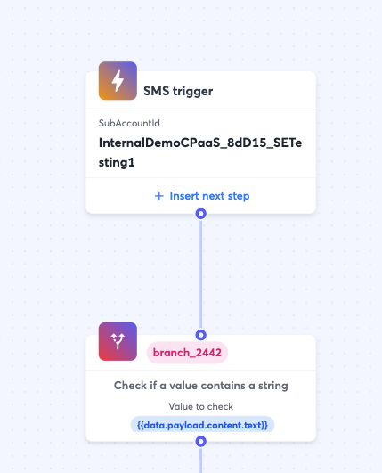
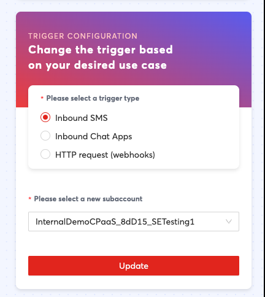
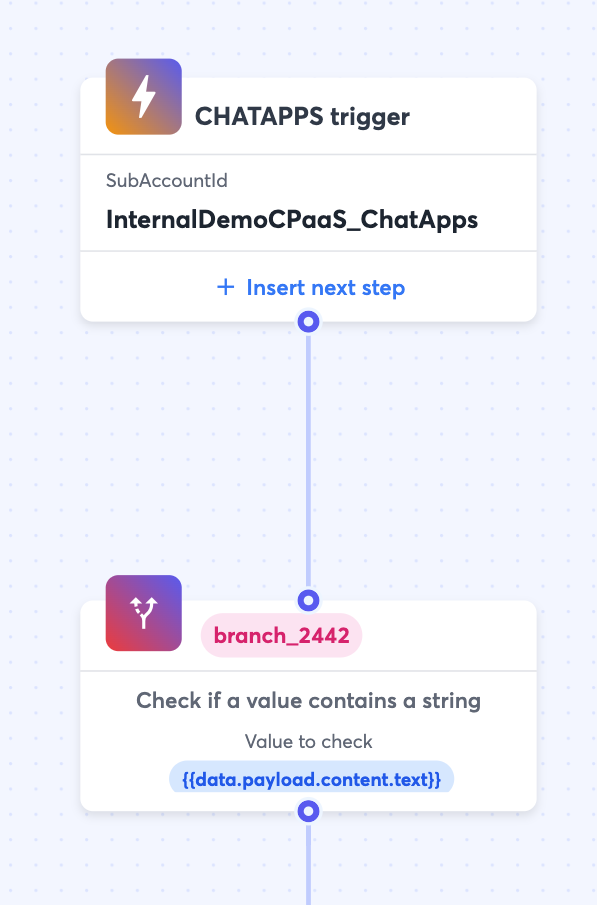
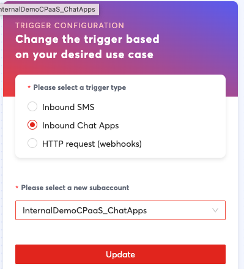
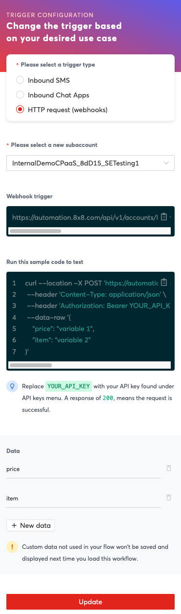

# Triggers

## Overview

**Triggers** are the initial entry point into your workflow definition. They define what event will start a workflow instance.

For example, if you would like to start your workflow when the number tied to your subaccount receives an SMS, you can choose a "Inbound SMS" trigger. Further types of triggers are defined below.

## List of Triggers

| Name | Description |
| --- | --- |
| Inbound SMS | Trigger the workflow when you receive a new incoming SMS on the specified subaccount. |
| Inbound ChatApps | Trigger the workflow when you receive a new incoming ChatApps message on the specified subaccount |
| HTTP Request (Webhooks) | Trigger the workflow when you receive a HTTP events like webhooks with any kind of payload (application/json). This is useful to trigger workflows from external systems. |

## Trigger Descriptions

### Inbound SMS

Below is an example of a SMS trigger step setup as part of the workflow. It is the first part of a workflow and the next step is a branch. This means when this subaccount receives an SMS, it will send it to the branch step.

This may be useful to use when you want to trigger an event such as sending a reply to an inbound SMS to that subaccount.

Inbound SMS Trigger as part of a Workflow Definition

Inbound SMS Trigger Properties

| Property | Description |
| --- | --- |
| Please select a new subaccount | Select the subaccount that should trigger this workflow when it receives an inbound SMS |

### Inbound Chat Apps

Inbound Chat Apps Trigger as part of a workflow

Inbound Chat Apps Trigger Properties

Similar to the Inbound SMS Trigger, this is triggered when a message is sent to the subaccount. However it is triggered off of a Chat Apps message such as an incoming WhatsApp/Viber message to a WhatsApp/Viber account tied to the subaccount.

This may be useful to use when you want to trigger an event such as sending a reply to an inbound ChatApps message to that subaccount.

| Property | Description |
| --- | --- |
| Please select a new subaccount | Select the subaccount that should trigger this workflow when it receives an inbound Chat apps message. |

### HTTP Request (Webhooks)

HTTP Trigger as part of a Workflow

HTTP Trigger Properties

| Property | Description | Example |
| --- | --- | --- |
| Subaccount | The subaccount that should contain this URL endpoint | "subaccount123" |
| Webhook Trigger | This property is not modifiable but it defines the URL endpoint your system should send an HTTP request to, in order to trigger the workflow | [https://automation.8x8.com/api/v1/accounts/InternalDemoCPaaS_8dD15/triggers/http_request?subAccountId=subaccount123](https://automation.8x8.com/api/v1/accounts/InternalDemoCPaaS_8dD15/triggers/http_request?subAccountId=subaccount123) |
| Data | This is a list of parameters that can be accepted by this endpoint. They will later be accessible in the workflow as variables such as {{data.propertyName}} | If you define a "price" and "item" property in the trigger, then {{data.price}} and {{data.item}} will be variables in the workflow you can refer to for the values that were sent as part of the HTTP request to the webhook trigger. For example if a curl request is sent as follows: curl --location -X POST '[https://automation.8x8.com/api/v1/accounts/InternalDemoCPaaS_8dD15/triggers/http_request?subAccountId=subaccount123'](https://automation.8x8.com/api/v1/accounts/InternalDemoCPaaS_8dD15/triggers/http_request?subAccountId=subaccount123') --header 'Content-Type: application/json' --header 'Authorization: Bearer YOUR_API_KEY' --data-raw '{ "price": "10", "item": "vacuum" }' Then {{data.price}} will be 10 and {{data.item}} will be vacuum in the workflow instance that is called. |
