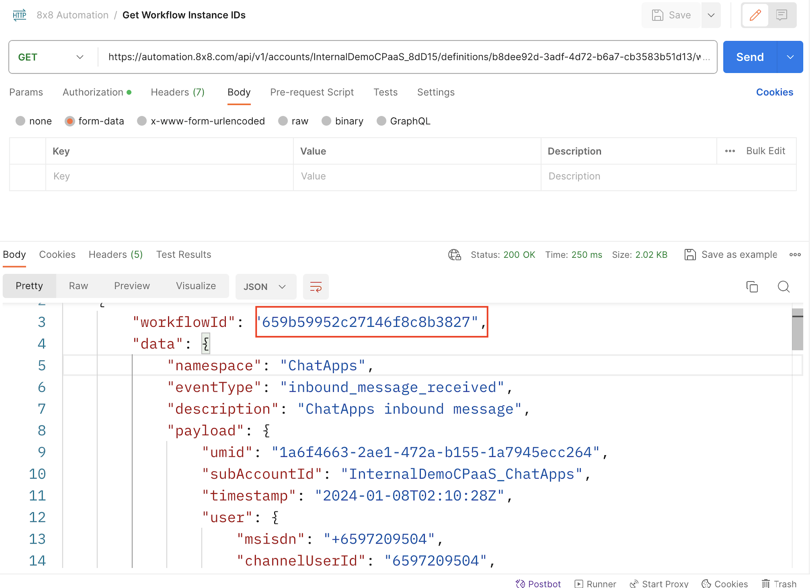
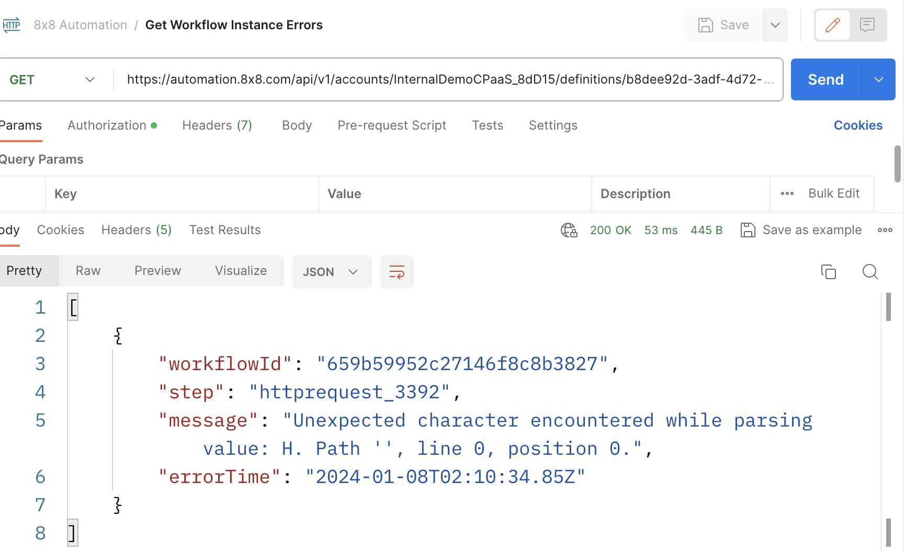

# Troubleshooting

## Overview

Troubleshooting a workflow is currently done via the Automation Builder API. Specifically the API allows you to retrieve error logs related to a workflow instance.

## Steps to Troubleshoot

These steps are assuming you would like to retrieve the most recently executed instance of a workflow to see the errors, although you can easily modify them to retrieve errors for a previous instance.

### 1. Get list of workflow instances

Use the following [endpoint](/connect/reference/get-workflow-instances) to retrieve a list of workflow instances currently active and choose the most recently ran instance.

When calling this endpoint, you will receive a list of the most recent instances. Copy the **workflowId** from the instance you would like to check errors for which will be used in the next step.

### 2. Retrieve errors from workflow instance

Once you have the most recently executed instance's workflowId, use this value in this [endpoint](/connect/reference/get-instance-errors) to retrieve any errors associated with that workflowId.

In this case, there is an error in the HTTP Step that tells us that it is preventing the workflow from being completed.

### Common Errors

This is a list of commonly encountered error messages and general recommendations on how the issue may be resolved.

If you are unable to resolve the error, please send an email with the error details to [cpaas-support@8x8.com](mailto:cpaas-support@8x8.com)

| Error Message Example (may not match text exactly)                                                                                                                                                                                               | Troubleshooting Recommendations                                                                                                            |
|--------------------------------------------------------------------------------------------------------------------------------------------------------------------------------------------------------------------------------------------------|--------------------------------------------------------------------------------------------------------------------------------------------|
| Unexpected character encountered while parsing value: <. Path '', line 0, position 0                                                                                                                                                             | This is usually encountered with the HTTP Step due to an invalid JSON object encountered at the endpoint that the HTTP Step is sending to. |
| Failed to send chat apps message because Invalid 'msisdn'.. Error id: xxxxxxx-xxxxxx                                                                                                                                                             | Invalid phone number / msisdn provided in the Send Chat Message or SMS Message Step.                                                       |
| Failed to send chat apps message because Empty 'user'                                                                                                                                                                                            | Invalid user object that was provided in the Send Chat Message or SMS Message Step.                                                        |
| Call failed. The SSL connection could not be established, see inner exception: POST [https://chatapps.8x8.com/api/v1/subaccounts/subaccount_text_example/messages](https://chatapps.8x8.com/api/v1/subaccounts/subaccount_test_example/messages) | Internal error, please try to invoke the workflow again and report issue to support email above.                                           |
| Failed to evaluate the expression. Error: Object reference not set to an instance of an object.                                                                                                                                                  | Internal error, please try to invoke the workflow again and report issue to support email above.                                           |
