# Tutorial: Building a SMS + ChatApps Reservation Menu

## Overview

This tutorial will show how to build a simple reservation menu with the Automation Builder UI. This simulates many common actions that a customer would want to have access to over a support channel.

The steps in the tutorial is tailored for our Chat Apps API and it is using WhatsApp as the channel in the tutorial However most of the steps will be the same for SMS or other Chat Apps channels. The differences will be in the **ChatApps Trigger** and the **Chat Apps Message Step** where they should be set to the appropriate Chat Apps Channel (or replaced with the **SMS Step** / **SMS Trigger**) and relevant message template.

## Workflow Definition Steps and Explanation

1. **ChatApps Trigger:** When an inbound ChatApps message is received to a number tied to this subaccount a workflow instance is called. This particular flow is for a WhatsApp Message.
2. **Chat Apps Message Step:** A WhatsApp message is sent back to the original sender.
3. **Wait For Reply Step:** Wait up to 5 Minutes for a response.
4. **Branch Step:** If a response is received, redirect it based on if the user responds with a message containing either:

5a. **Branch Step Option:** *Confirm* for confirmation of a reservation.

* 6a. **Chat Apps Message Step:** Send Confirmation Message.
* 7a. **HTTP Step:** Send HTTP Request to third-party API to alert of confirmation.

5b. **Branch Step Option:***Reschedule* for rescheduling a reservation.

* 6b. **Chat App Message Step:**  Send a message containing a URL to schedule the appointment.

5c. **Branch Step Option:***Help* for requesting for help with a reservation.

* 6c. **Send to Converse:**  Redirect the conversation to Converse where a live agent can take over the conversation.

4b. **Chat App Message Step:**  Send a reply message if there is no response received from the original message sender and end the workflow instance.

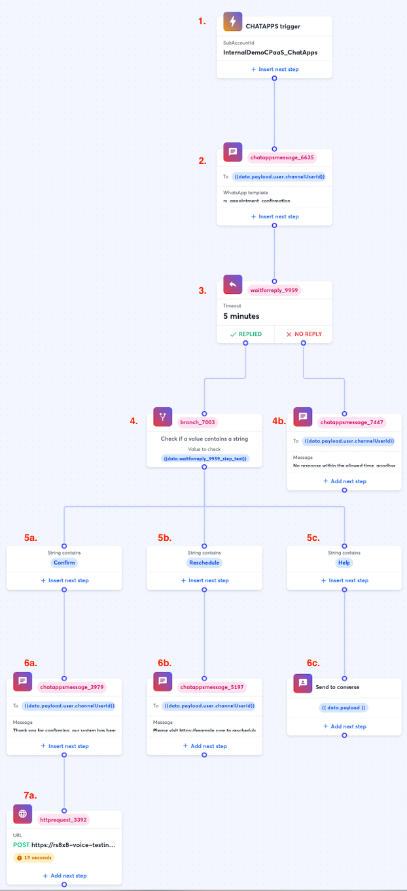

## Workflow Steps In-Depth

### 1. ChatApps Trigger


The **ChatApps trigger** here is set to Chat Apps where you should have a subaccount with an already configured ChatApps channel. You should reach out to your respective account manager to complete the setup for your Chat Apps channel if you do not already have a functioning Chat Apps subaccount.

### 2. ChatApps Message Step

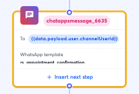

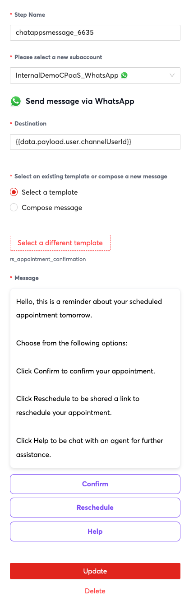

In the **Chat Apps Message Step**, the **destination** property can be set to `{{data.payload.user.channelUserId}}` which refers to the original sender which you can use the subsequent Chat Apps Steps as well.

For the **Select a existing template or compose a new message** property, if you have an existing WhatsApp template you can select it. If there is no existing template, in WhatsApp's case you can apply for a WhatsApp template through the ChatApps section of your 8x8 Connect Dashboard. The template will then be available for selection once Meta approves it within the Chat App Message Step interface. In this case we have a call to action type of message template with 3 possible selections but you can also use other template types.

The **Message** property will either be automatically filled in if you chose to use a template, if you do not wish to use a template, you can simply enter a freeform message body and it will be sent to the user. For the purposes of this tutorial it is fine to use a free form message body which can be copied below.

>
> Hello, this is a reminder about your scheduled appointment tomorrow.
>
>
> Choose from the following options:
>
>
> Click Confirm to confirm your appointment.
>
>
> Click Reschedule to be shared a link to reschedule your appointment.
>
>
> Click Help to be chat with an agent for further assistance.
>
>
>

### 3. Wait for Reply Step


In the **Wait for Reply Step**, the **Channel** property should be set to the channel you expect to receive a message in. In the example we are using WhatsApp.

The **From** property can be set to {{data.payload.user.channelUserId}} which will refer to the original sender.

**Timeout** can be set to an appropriate value for your use case.

### 4. Branch Step (and 5a-c for Branch options)

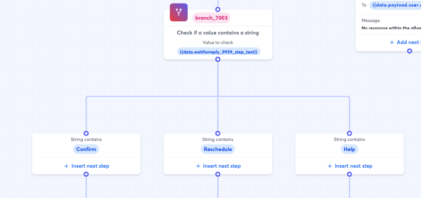

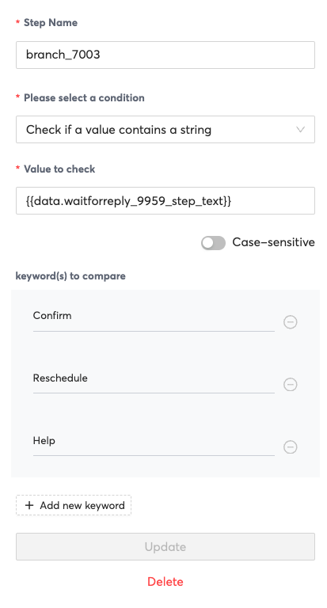

In the **Branch Step**, for **Please select a condition** property, set it to "Check if a value contains a string".

The **Value to check** property can be set to {{data.waitforreply_9959_step_text}}. Note that the Step name for waitforreply_9959_step_text may change in your workflow definition and should be set to the Step Name in your workflow invocation.

For the **keyword(s) to compare** property, add "Confirm", "Reschedule" and "Help" to add three options to the branch.

### 4b. Chat Apps Message

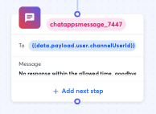

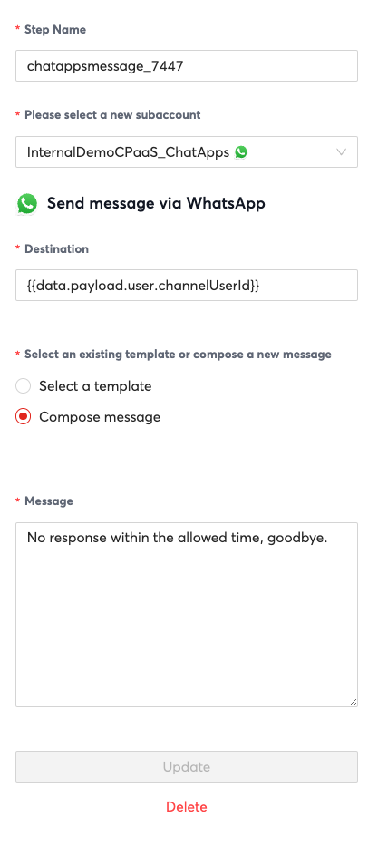

In the **Chat Apps Message Step**, set "Please select a new subaccount" to your subaccount that should already be configured for the Chat Apps channel that you would like to use.

**Destination** can be set to {{data.payload.user.channelUserId}} to reply to the original sender as in previous Chat App Message steps.

Message can be set to a free form message with the following text by selecting "Compose Message"

>
> No Response within the allowed time, goodbye.
>
>
>

### 6a. ChatApps Message Step (Confirm)


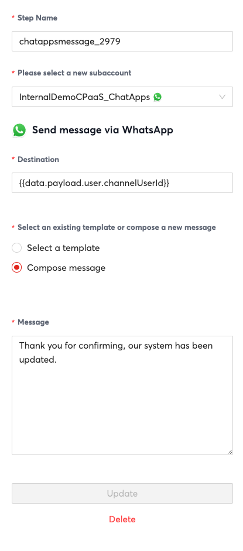

In the **Chat Apps Message Step**, set "Please select a new subaccount" to your subaccount that should already be configured for the Chat Apps channel that you would like to use.

**Destination** can be set to {{data.payload.user.channelUserId}} to reply to the original sender as in previous Chat App Message steps.

Message can be set to a free form message with the following text by selecting "Compose Message"

>
> Thank you for confirming, our system has been updated.
>
>
>

### 6b. ChatApps Message Step (Reschedule)

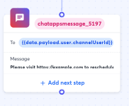

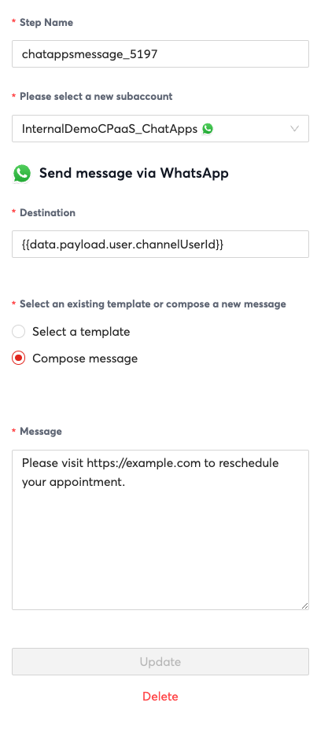

In the **Chat Apps Message Step**, set "Please select a new subaccount" to your subaccount that should already be configured for the Chat Apps channel that you would like to use.

**Destination** can be set to {{data.payload.user.channelUserId}} to reply to the original sender as in previous Chat App Message steps.

Message can be set to a free form message with the following text by selecting "Compose Message"

>
> Please visit [https://example.com](https://example.com) to reschedule your appointment.
>
>
>

### 6c. Send to Converse

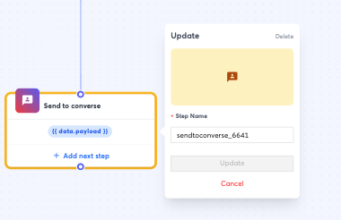

The Send to Converse step will send the conversation to [Converse](https://www.google.com/search?q=converse+8x8+docs&rlz=1C5GCEM_enSG1072SG1072&oq=converse+8x8+docs&gs_lcrp=EgZjaHJvbWUyBggAEEUYOTIICAEQABgWGB4yDQgCEAAYhgMYgAQYigUyBggDEEUYQDIGCAQQRRhAMgYIBRBFGEAyBggGEEUYPDIGCAcQRRg80gEIMTY1MGowajSoAgCwAgA&sourceid=chrome&ie=UTF-8) for a live agent to take over. Converse should be configured for your account prior to using this option.

### 7c. HTTP Request

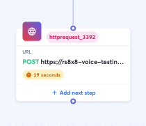

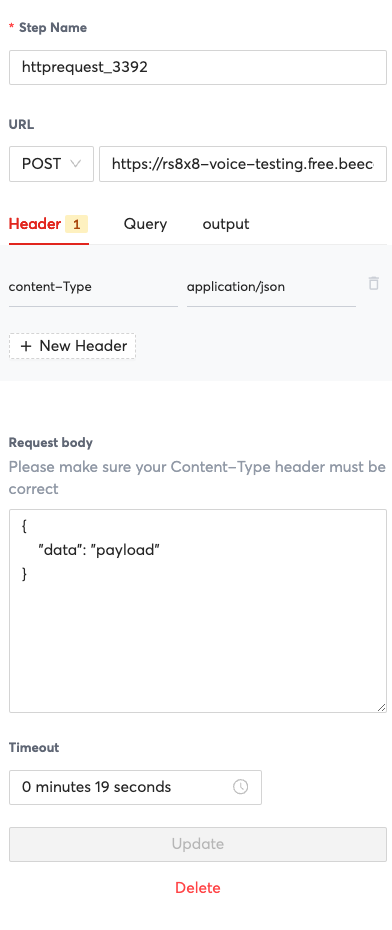

Set the **URL** Property to the Endpoint that you would like to send a HTTP request to. Also modify it's method to the appropriate choice for your endpoint. In the example I use a free endpoint from <beeceptor.com>to do mock API testing and see requests come in.

The **Header** and **Query** properties can also be modified as needed. I set 1 property in the header to be content-type with the value as application/json.

If required you can also change the **Request Body** property, I set the value as below but it is not necessary.

```json
{
  "data": "payload"
}

```

**Timeout** property can be set to any appropriate value, I would recommend above 20 seconds to ensure the server has appropriate time to respond.

## Testing the Workflow

In order to test the workflow, simply send a WhatsApp message to the WhatsApp account tied to your subaccount. In the example you can send any message to start

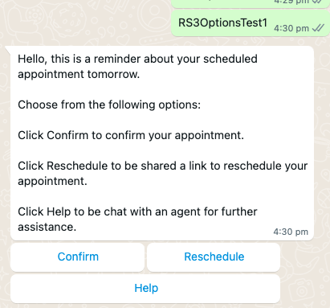

## Tutorial JSON

Automation Builder UI features a function to import workflow definitions for easy versioning and sharing. If you would like to import the example for this tutorial, save the text below as a file such as tutorial_automation_builder.json and import it from the Automation Builder UI.

```json
{
  "definition": {
    "id": "3ca6c9ce-603e-4015-9aab-29047b327e7f",
    "name": "RS 3 Options Test",
    "version": 2,
    "steps": [
      {
        "stepType": "ChatAppsMessage",
        "id": "chatappsmessage_6635",
        "do": [],
        "nextStepId": "waitforreply_9959",
        "inputs": {
          "subAccountId": "InternalDemoCPaaS_WhatsApp",
          "type": "template",
          "content": {
            "template": {
              "name": "rs_appointment_confirmation",
              "components": [
                {
                  "type": "button",
                  "parameters": [
                    {
                      "type": "payload",
                      "payload": "Confirm-Button-Payload",
                      "text": "Confirm"
                    }
                  ],
                  "index": 0,
                  "subType": "QuickReply"
                },
                {
                  "type": "button",
                  "parameters": [
                    {
                      "type": "payload",
                      "payload": "Reschedule-Button-Payload",
                      "text": "Reschedule"
                    }
                  ],
                  "index": 1,
                  "subType": "QuickReply"
                },
                {
                  "type": "button",
                  "parameters": [
                    {
                      "type": "payload",
                      "payload": "Help-Button-Payload",
                      "text": "Help"
                    }
                  ],
                  "index": 2,
                  "subType": "QuickReply"
                }
              ],
              "language": "en_US"
            }
          },
          "user": {
            "msisdn": "{{data.payload.user.channelUserId}}"
          }
        },
        "outputs": {},
        "selectNextStep": {}
      },
      {
        "stepType": "WaitForReply",
        "id": "waitforreply_9959",
        "do": [],
        "nextStepId": null,
        "inputs": {
          "from": "{{data.payload.user.channelUserId}}",
          "channel": "whatsapp",
          "timeout": "0.00:05:00"
        },
        "outputs": {
          "waitforreply_9959_step_text": "{{step.reply.payload.content.text}}"
        },
        "selectNextStep": {
          "branch_7003": "{{ step.reply != null }}",
          "chatappsmessage_7447": "{{ step.reply == null }}"
        }
      },
      {
        "stepType": "Branch",
        "id": "branch_7003",
        "do": [],
        "nextStepId": null,
        "inputs": {},
        "outputs": {},
        "selectNextStep": {
          "chatappsmessage_2979": "{{stringContains(data.waitforreply_9959_step_text, 'Confirm', true)}}",
          "chatappsmessage_5197": "{{stringContains(data.waitforreply_9959_step_text, 'Reschedule', true)}}",
          "sendtoconverse_6641": "{{stringContains(data.waitforreply_9959_step_text, 'Help', true)}}"
        }
      },
      {
        "stepType": "ChatAppsMessage",
        "id": "chatappsmessage_7447",
        "do": [],
        "nextStepId": null,
        "inputs": {
          "subAccountId": "InternalDemoCPaaS_ChatApps",
          "type": "text",
          "content": {
            "text": "No response within the allowed time, goodbye."
          },
          "user": {
            "msisdn": "{{data.payload.user.channelUserId}}"
          }
        },
        "outputs": {},
        "selectNextStep": {}
      },
      {
        "stepType": "SendToConverse",
        "id": "sendtoconverse_6641",
        "do": [],
        "nextStepId": null,
        "inputs": {
          "payload": "{{data.payload}}"
        },
        "outputs": {
          "sendtoconverse_6641_ticketId": "{{step.ticketId}}"
        },
        "selectNextStep": {}
      },
      {
        "stepType": "ChatAppsMessage",
        "id": "chatappsmessage_5197",
        "do": [],
        "nextStepId": null,
        "inputs": {
          "subAccountId": "InternalDemoCPaaS_ChatApps",
          "type": "text",
          "content": {
            "text": "Please visit https://example.com to reschedule your appointment."
          },
          "user": {
            "msisdn": "{{data.payload.user.channelUserId}}"
          }
        },
        "outputs": {},
        "selectNextStep": {}
      },
      {
        "stepType": "ChatAppsMessage",
        "id": "chatappsmessage_2979",
        "do": [],
        "nextStepId": "httprequest_3392",
        "inputs": {
          "subAccountId": "InternalDemoCPaaS_ChatApps",
          "type": "text",
          "content": {
            "text": "Thank you for confirming, our system has been updated."
          },
          "user": {
            "msisdn": "{{data.payload.user.channelUserId}}"
          }
        },
        "outputs": {},
        "selectNextStep": {}
      },
      {
        "stepType": "HttpRequest",
        "id": "httprequest_3392",
        "do": [],
        "nextStepId": null,
        "inputs": {
          "headers": {
            "content-Type": "application/json"
          },
          "method": "POST",
          "url": "https://rs8x8-voice-testing.free.beeceptor.com",
          "parameters": {},
          "body": {
            "data": "payload"
          },
          "timeoutSeconds": 19
        },
        "outputs": {},
        "selectNextStep": {}
      }
    ]
  },
  "subAccountId": "InternalDemoCPaaS_ChatApps",
  "trigger": "inbound_chat_apps",
  "status": "disabled"
}

```
