# Tutorial: Building a WhatsApp + Google Calendar Chat Bot

This tutorial will show you how to build a WhatsApp + Google Calendar chat bot using 8x8 Automation Builder. The resulting chat bot will allow customers to send a message to a WhatsApp Business Account tied to your 8x8 subaccount and schedule an appointment on Google Calendar.

The concepts in this guide are useful as a stepping stone to understand how Automation Builder can be used with other systems that expose APIs to create richer experiences with the 8x8 Chat Apps API.

## Overview

There are two components to this project:

1. **Automation Builder workflow** which will be built on the [Connect](https://connect.8x8.com/) Dashboard. The workflow takes care of orchestrating responses through WhatsApp.
2. **Backend Server** we have provided example server [code](https://github.com/EMChamp/8x8-google-calendar-wa-scheduler) in Python for the Scheduling service described in this diagram. The Backend Server API allows us to connect to the Google Calendar API and also run some scheduling logic based on the responses.

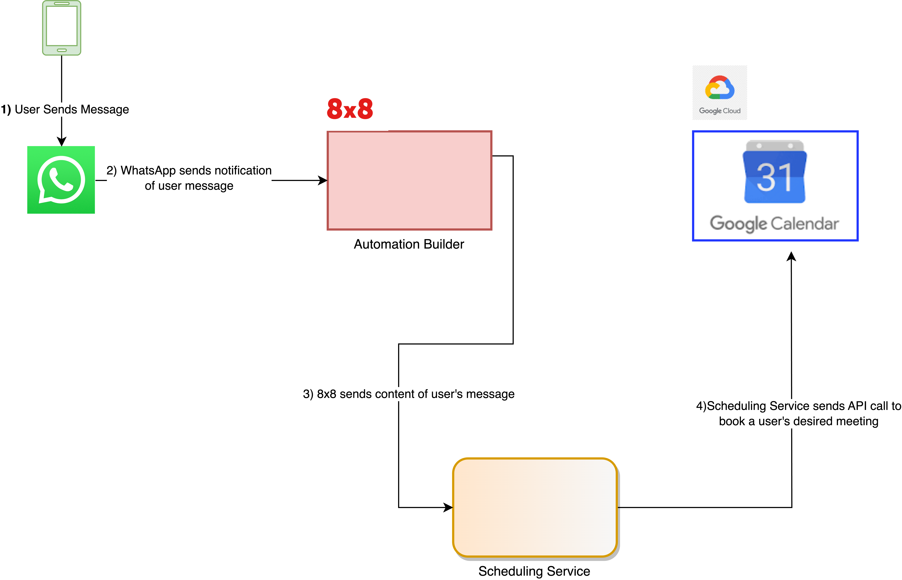

## Demo Video

Please see a demo video of the WhatsApp Chatbot below.

<iframe
  src="https://www.youtube.com/embed/Vv6ruAbdpgs?si=H9YyplFou8hIGlJr"
  height="500px"
  width="100%"
  allow="picture-in-picture; web-share"
  allowFullScreen>
</iframe>

## Automation Builder Workflow Steps

Here is a visual overview of the complete automation builder workflow, we will cover each step in depth in the following section of the tutorial.

1. Customer messages WhatsApp Business Account which triggers the workflow.
2. Chat Apps Message Sends Main Menu to Customer
3. Wait for Customer Reply
4. Check for customer response and branch based on that.
5. Respond according to user's chosen option  

a. Prompt user for Email Address  

b. Send Goodbye message if flow is cancelled.
6. Wait for user reply to email address, in order to save as an output variable for use later in workflow.
7. Send API request to our Backend API to check for available Calendar Timeslots.
8. Share Available Timeslots through WhatsApp as a list.
9. Wait for customer to choose available timeslot from list.
10. Branch based on user's chosen timeslot
11. a/b/c. Send API request to book timeslot based on user's chosen timeslot.  

d. Send Cancellation Message through WhatsApp.
12. a/b/c. Send Confirmation message based on user's chosen timeslot.

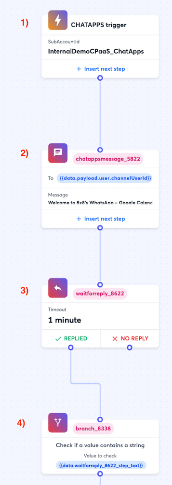

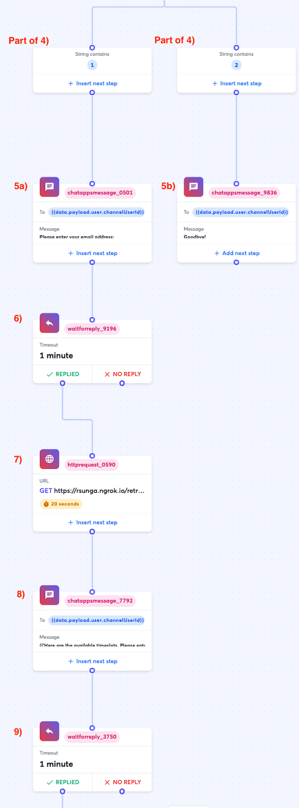

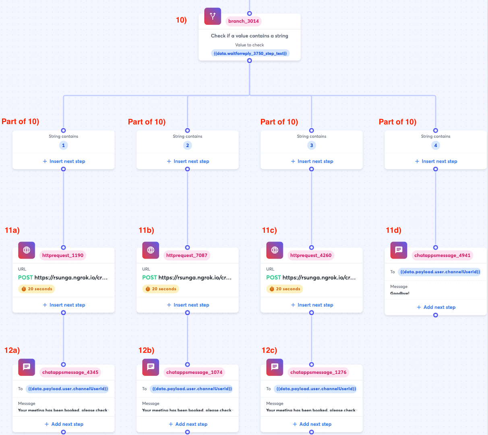

## Workflow Steps In-Depth

### 1) Chat Apps Trigger

This trigger is responsible for kicking off the workflow, by default it will be triggered when any inbound chat apps message is received on the WABA tied to the subaccount you select below.

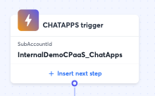

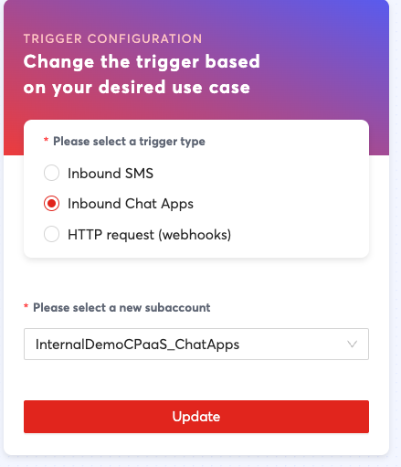

| Field | Value |
| --- | --- |
| Trigger | Inbound Chat Apps |
| Please select a new subaccount | Select the subaccount with the WABA you would like to send from. |

### 2) Chat Apps Message Step - Main Menu

This Chat Apps Message Step introduces the main menu that will start off with a simple welcome message and then display a menu with 2 options for the customer to select from.

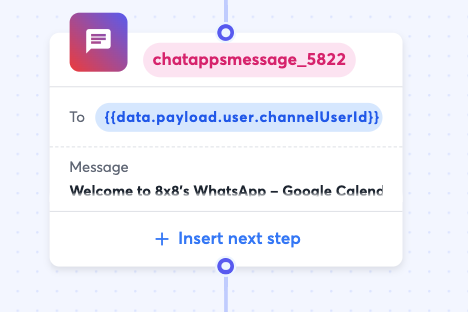

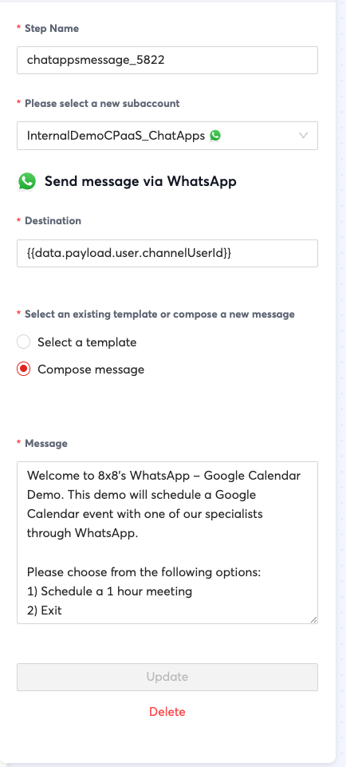

| Field | Value |
| --- | --- |
| Step Name | This is autofilled, the step name can optionally be changed for easier readability.**Note:**  For the sake of brevity, we will ignore the Step Name field for subsequent steps in this tutorial as the recommendation is the same for all steps. |
| Please select a new subaccount | Select the subaccount with the WABA you would like to send from. |
| Destination | `{{data.payload.user.channelUserId}}`**Note:** This allows us to reply to the user who sent the WhatsApp message, which is what we want in a chatbot scenario. |
| Select an existing template or compose a new message | Welcome to 8x8's WhatsApp - Google Calendar Demo. This demo will schedule a Google Calendar event with one of our specialists through WhatsApp.<br>Please choose from the following options:<br>1. Schedule a 1 hour meeting<br>2. Exit |

### 3) Wait for Reply Step - Reply to Main Menu

This step waits for a customer to reply to the main menu option list, their reply will be used in the following branch step.

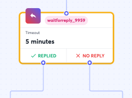
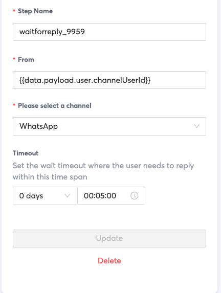

As configured this waits 5 minutes for a customer to reply to the main menu option message in the previous step, however you can change the timeout as desired.

| Field | Value |
| --- | --- |
| From | `{{data.payload.user.channelUserId}}` |
| Please select a channel | WhatsApp |
| Timeout | 5 minutes |

### 4) Branch Step

In this step, we branch off two separate paths depending on the response from the WA user.

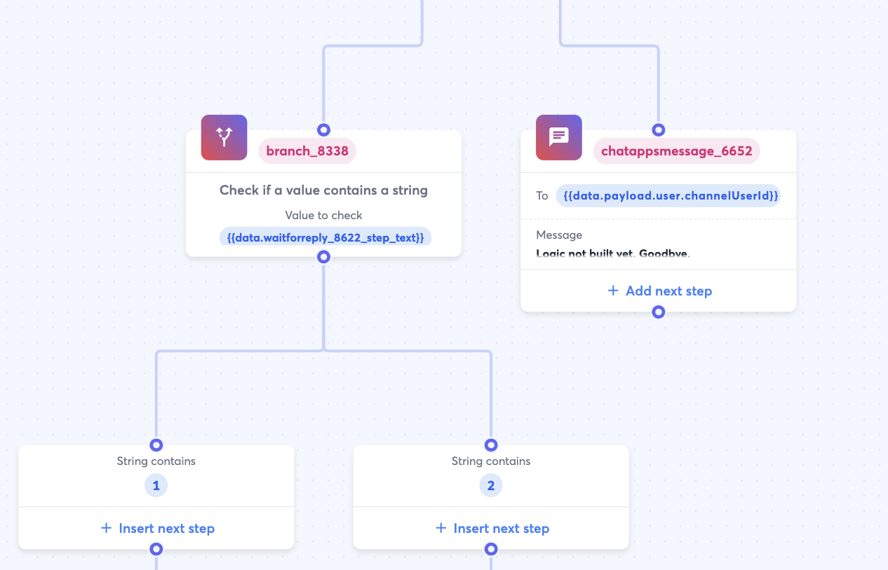

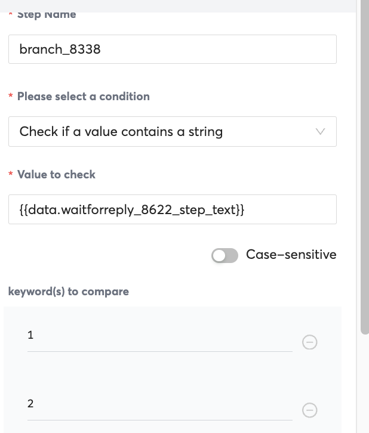

| Field | Value |
| --- | --- |
| Please select a condition | Check if a value contains a string |
| Value to Check | {{data.waitforreply_XXXX_step_text}}<br>Note: Replace XXXX with the number identifier for your previous waitforreply step, this will be auto generated by the system and will be different for your specific workflow. |
| Keywords to Compare | 1, 2 |

### 5a) Chat Apps Message - Enter Email Address

In this Chat Apps message step we will send a very simple prompt to ask the user to input their email address.

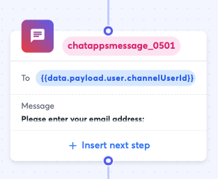

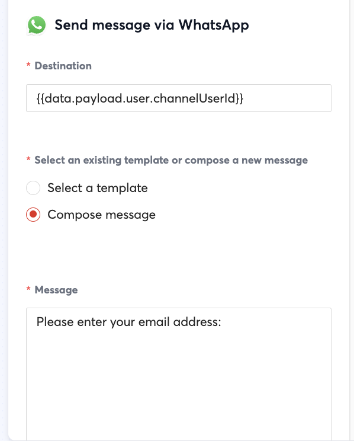

| Field | Value |
| --- | --- |
| Destination | {{data.payload.user.channelUserId}} |
| Select an existing template or compose a new message | Check Compose Message |
| Message | Please enter your email addres |

### 5b) Chat Apps Message - Cancellation Message

This step is if the user chooses not to schedule a meeting in the main menu. In that case a cancellation message will be played for the user.

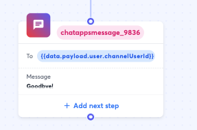

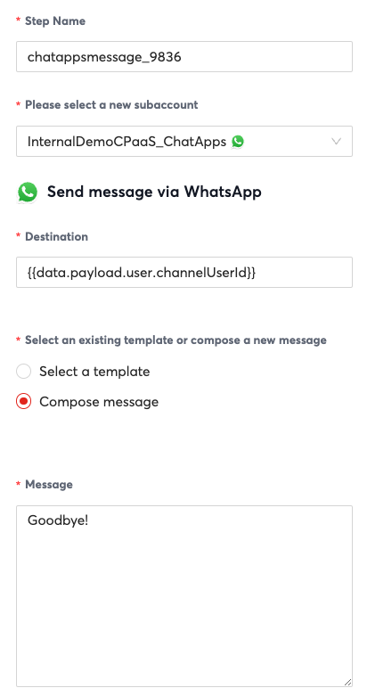

| Field | Value |
| --- | --- |
| Please select a new subaccount | Select the subaccount with the WABA you would like to send from. |
| Destination | {{data.payload.user.channelUserId}} |
| Message | Goodbye! |

### 6) Wait for Reply - Email Address

In the wait for reply step, we will wait for the customer to enter their email address. We give them 1 minute to respond but you can change this value as needed.

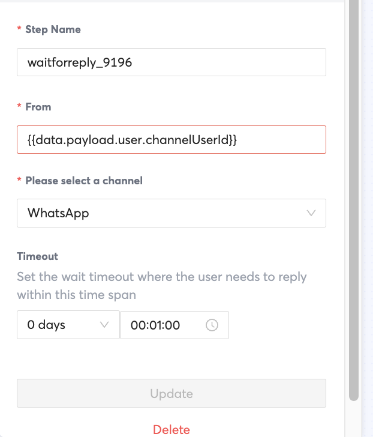

| Field | Value |
| --- | --- |
| From | {{data.payload.user.channelUserId}} |
| Please select a channel | WhatsApp |
| Timeout | 1 Minute |

### 7) HTTP Request Step - Check for available time slots

This is the first of our HTTP Request Steps that will be hitting our **/retrieve_meetings** endpoint that is part of our API. This endpoint will return possible meeting timeslots which can then be presented to the user in the subsequent Chat Apps Message Step.

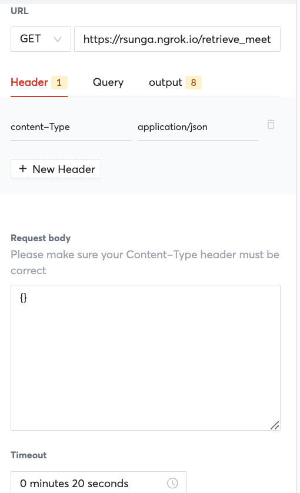

| Field | Value |
| --- | --- |
| URL | This should be your server's publically accessible URL |
| Header | content-type: application/json |
| Request Body | {} |

The outputs of this step is how we save the values from the API response body to be presented to the user. The values match the response body JSON that we will specify in our code.

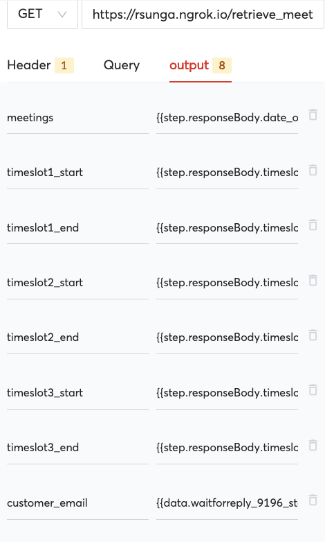

| Field | Value |
| --- | --- |
| meetings | {{step.responseBody.date_options}} |
| timeslot1_start | {{step.responseBody.timeslot1_start}} |
| timeslot1_end | {{step.responseBody.timeslot1_end}} |
| timeslot2_start | {{step.responseBody.timeslot2_start}} |
| timeslot2_end | {{step.responseBody.timeslot2_end}} |
| timeslot3_start | {{step.responseBody.timeslot3_start}} |
| customer_email | {{data.waitforreply_9196_step_text}} |

### 8) Chat Apps Message Step - Meeting Timeslots

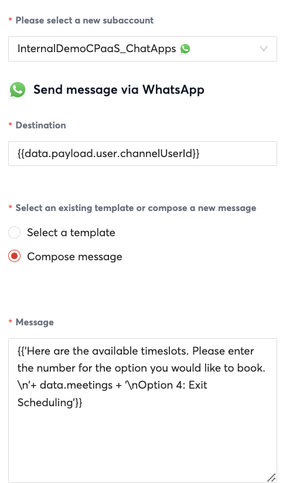

| Field | Value |  |
| --- | --- | --- |
| Please select a new subaccount | Select the subaccount with the WABA you would like to send from. |  |
| Destination | {{data.payload.user.channelUserId}} |  |
| Select an existing template or compose a new message | Compose Message |  |
| Message | {{'Here are the available timeslots. Please enter the number for the option you would like to book. \n'+ data.meetings + '\nOption 4: Exit Scheduling'}} |  |

A bit of an explanation for the **message** field, the entire message is wrapped in curly brackets since we are using the output data.meetings as part of the string. This is combined with the rest of the string in order to produce a message which looks like this:

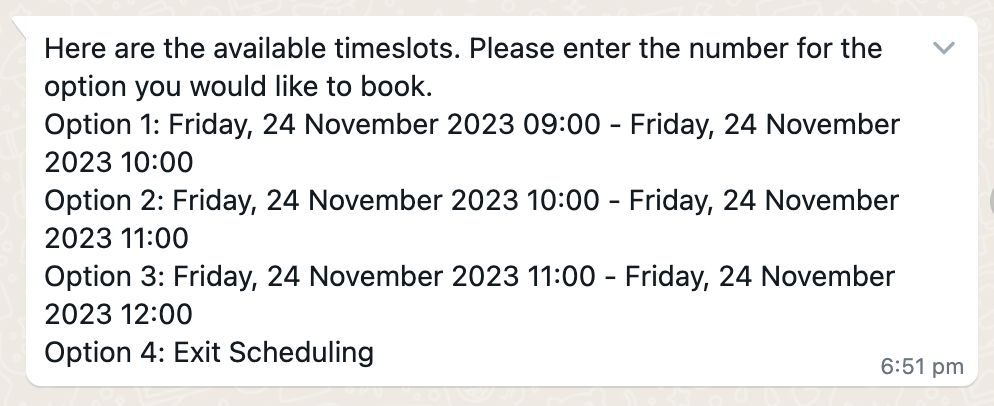

### 9) Wait For Reply Step - Customer Chooses Timeslot

This step will wait for a customer to choose from the options presented above.

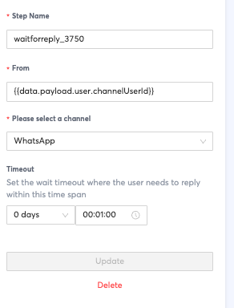

| Field | Value |
| --- | --- |
| From | {{data.payload.user.channelUserId}} |
| Please select a Channel | WhatsApp |
| Timeout | 1 Minute |

### 10) Branch Step - Branch based on Chosen Timeslot

This step will branch based on the customer's input from the previous step. The following steps are HTTP Request steps that will decide what meeting timeslot is booked.

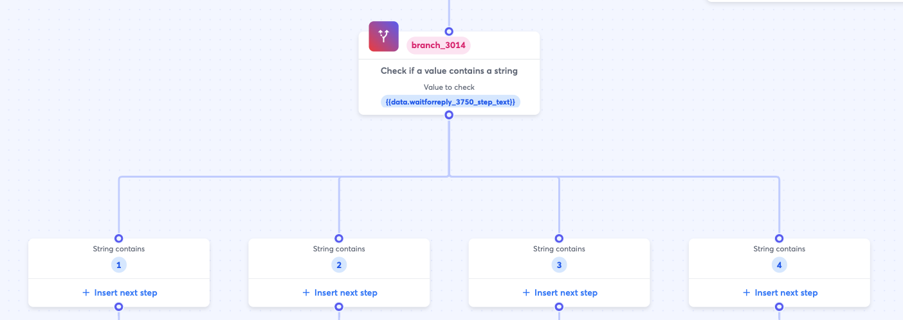

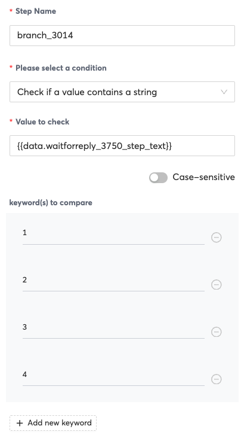

| Field | Value |
| --- | --- |
| Please select a condition | Check if a value contains a string |
| Value to Check | {{data.waitforreply_XXXX_step_text}} |
| Keyword(s) to compare | 1,2,3,4 |

### 11a,b,c) HTTP Request Step - Reserve Calendar Timeslot Based on the User's Input

These three HTTP Request Steps will be tied to the customer's input in the previous step.

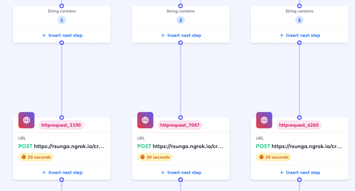

The only difference between these fields will be the numbers used for the timeslot, so the backend server knows what the user chose. For example, we will use {{data.timeslot1_start}} for timeslot 1's start time and then {{data.timeslot2_start}} for timeslot 1's start time.

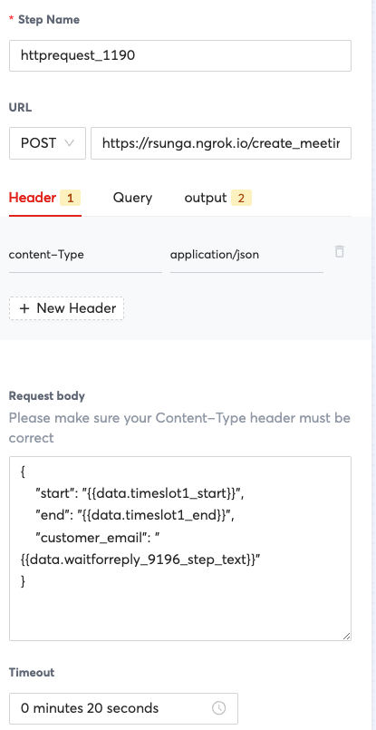

| Field | Value |  |
| --- | --- | --- |
| URL | Your Backend Server's URL |  |
| Request Body | {<br>"start": "{{data.timeslotX_start}}",<br>"end": "{{data.timeslotX_end}}",<br>"customer_email": "{{data.waitforreply_9196_step_text}}"<br>}**Note:** Replace timeslotX with the timeslot option, such as timeslot1, timeslot2, timeslot3. |  |
| Timeout | 20 Seconds |  |

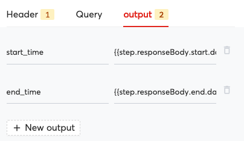

For the output you can save the start_time and end_time for the following confirmation message. The values will be specify to JSON response body of the backend API code that we provide.

| Field | Value |
| --- | --- |
| start_time | {{step.responseBody.start.dateTime}} |
| end_time | {{step.responseBody.end.dateTime}} |

### 11d) Chat Message Step - Cancellation message

This step is if the user chooses not to schedule a meeting in the main menu, in that case a cancellation message is played.


| Field | Value |
| --- | --- |
| Please select a new subaccount | Select the subaccount with the WABA you would like to send from. |
| Destination | {{data.payload.user.channelUserId}} |
| Message | Goodbye! |

### 12a,b,c) Chat Apps Message - Calendar Invite Confirmation Message

This step sends a simple confirmation message through WhatsApp and ends the workflow. If a user sends another message after this workflow ends, then it will trigger a fresh workflow instances from the beginning.

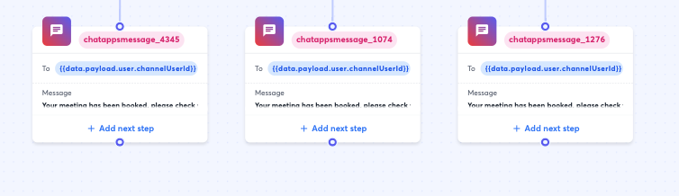

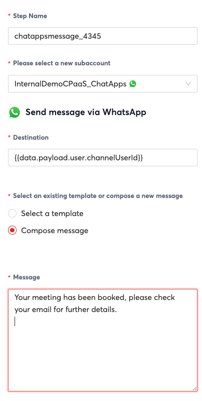

| Field | Value |
| --- | --- |
| Please select a new subaccount | Select the subaccount with the WABA you would like to send from. |
| Destination | {{data.payload.user.channelUserId}} |
| Message | Goodbye! |

## Automation Builder - Example JSON

If you would like to skip building the steps manually above, we have provided an example JSON file to get you started which you can import into Automation Builder. Note that you will have to modify values in the steps according to your specific backend system and also your 8x8 subaccount.

Automation Builder JSON

```json
{
  "definition": {
    "id": "d2f47259-75ff-45bd-950e-97a5dee631e4",
    "name": "RS WhatsApp GCal Demo",
    "version": 25,
    "steps": [
      {
        "stepType": "Branch",
        "id": "branch_6057",
        "do": [],
        "nextStepId": null,
        "inputs": {},
        "outputs": {},
        "selectNextStep": {
          "chatappsmessage_5822": "{{stringContains(data.payload.content.text, 'RSGoogleCalendarDemo', true)}}"
        }
      },
      {
        "stepType": "ChatAppsMessage",
        "id": "chatappsmessage_5822",
        "do": [],
        "nextStepId": "waitforreply_8622",
        "inputs": {
          "subAccountId": "InternalDemoCPaaS_ChatApps",
          "type": "text",
          "content": {
            "text": "Welcome to 8x8's WhatsApp - Google Calendar Demo. This demo will schedule a Google Calendar event with one of our specialists through WhatsApp.\n\nPlease choose from the following options:\n1) Schedule a 1 hour meeting\n2) Exit"
          },
          "user": {
            "msisdn": "{{data.payload.user.channelUserId}}"
          }
        },
        "outputs": {},
        "selectNextStep": {}
      },
      {
        "stepType": "WaitForReply",
        "id": "waitforreply_8622",
        "do": [],
        "nextStepId": null,
        "inputs": {
          "from": "{{data.payload.user.channelUserId}}",
          "channel": "whatsapp",
          "timeout": "0.00:01:00"
        },
        "outputs": {
          "waitforreply_8622_step_text": "{{step.reply.payload.content.text}}"
        },
        "selectNextStep": {
          "branch_8338": "{{ step.reply != null }}",
          "chatappsmessage_6652": "{{ step.reply == null }}"
        }
      },
      {
        "stepType": "Branch",
        "id": "branch_8338",
        "do": [],
        "nextStepId": null,
        "inputs": {},
        "outputs": {},
        "selectNextStep": {
          "chatappsmessage_0501": "{{stringContains(data.waitforreply_8622_step_text, '1', true)}}",
          "chatappsmessage_9836": "{{stringContains(data.waitforreply_8622_step_text, '2', true)}}"
        }
      },
      {
        "stepType": "ChatAppsMessage",
        "id": "chatappsmessage_6652",
        "do": [],
        "nextStepId": null,
        "inputs": {
          "subAccountId": "InternalDemoCPaaS_ChatApps",
          "type": "text",
          "content": {
            "text": "No Reply Detected within the allotted time, please try again."
          },
          "user": {
            "msisdn": "{{data.payload.user.channelUserId}}"
          }
        },
        "outputs": {},
        "selectNextStep": {}
      },
      {
        "stepType": "ChatAppsMessage",
        "id": "chatappsmessage_9836",
        "do": [],
        "nextStepId": null,
        "inputs": {
          "subAccountId": "InternalDemoCPaaS_ChatApps",
          "type": "text",
          "content": {
            "text": "Goodbye!"
          },
          "user": {
            "msisdn": "{{data.payload.user.channelUserId}}"
          }
        },
        "outputs": {},
        "selectNextStep": {}
      },
      {
        "stepType": "ChatAppsMessage",
        "id": "chatappsmessage_0501",
        "do": [],
        "nextStepId": "waitforreply_9196",
        "inputs": {
          "subAccountId": "InternalDemoCPaaS_ChatApps",
          "type": "text",
          "content": {
            "text": "Please enter your email address:"
          },
          "user": {
            "msisdn": "{{data.payload.user.channelUserId}}"
          }
        },
        "outputs": {},
        "selectNextStep": {}
      },
      {
        "stepType": "WaitForReply",
        "id": "waitforreply_9196",
        "do": [],
        "nextStepId": null,
        "inputs": {
          "from": "{{data.payload.user.channelUserId}}",
          "channel": "whatsapp",
          "timeout": "0.00:01:00"
        },
        "outputs": {
          "waitforreply_9196_step_text": "{{step.reply.payload.content.text}}"
        },
        "selectNextStep": {
          "httprequest_0590": "{{ step.reply != null }}"
        }
      },
      {
        "stepType": "HttpRequest",
        "id": "httprequest_0590",
        "do": [],
        "nextStepId": "chatappsmessage_7792",
        "inputs": {
          "method": "GET",
          "url": "https://rsunga.ngrok.io/retrieve_meetings",
          "headers": {
            "content-Type": "application/json"
          },
          "parameters": {},
          "body": {},
          "timeoutSeconds": 20
        },
        "outputs": {
          "meetings": "{{step.responseBody.date_options}}",
          "timeslot1_start": "{{step.responseBody.timeslot1_start}}",
          "timeslot1_end": "{{step.responseBody.timeslot1_end}}",
          "timeslot2_start": "{{step.responseBody.timeslot2_start}}",
          "timeslot2_end": "{{step.responseBody.timeslot2_end}}",
          "timeslot3_start": "{{step.responseBody.timeslot3_start}}",
          "timeslot3_end": "{{step.responseBody.timeslot3_end}}",
          "customer_email": "{{data.waitforreply_9196_step_text}}"
        },
        "selectNextStep": {}
      },
      {
        "stepType": "ChatAppsMessage",
        "id": "chatappsmessage_7792",
        "do": [],
        "nextStepId": "waitforreply_3750",
        "inputs": {
          "subAccountId": "InternalDemoCPaaS_ChatApps",
          "type": "text",
          "content": {
            "text": "{{'Here are the available timeslots. Please enter the number for the option you would like to book. \\n'+ data.meetings + '\\nOption 4: Exit Scheduling'}}"
          },
          "user": {
            "msisdn": "{{data.payload.user.channelUserId}}"
          }
        },
        "outputs": {},
        "selectNextStep": {}
      },
      {
        "stepType": "WaitForReply",
        "id": "waitforreply_3750",
        "do": [],
        "nextStepId": null,
        "inputs": {
          "from": "{{data.payload.user.channelUserId}}",
          "channel": "whatsapp",
          "timeout": "0.00:01:00"
        },
        "outputs": {
          "waitforreply_3750_step_text": "{{step.reply.payload.content.text}}"
        },
        "selectNextStep": {
          "branch_3014": "{{ step.reply != null }}"
        }
      },
      {
        "stepType": "Branch",
        "id": "branch_3014",
        "do": [],
        "nextStepId": null,
        "inputs": {},
        "outputs": {},
        "selectNextStep": {
          "httprequest_1190": "{{stringContains(data.waitforreply_3750_step_text, '1', true)}}",
          "httprequest_7087": "{{stringContains(data.waitforreply_3750_step_text, '2', true)}}",
          "httprequest_4260": "{{stringContains(data.waitforreply_3750_step_text, '3', true)}}",
          "chatappsmessage_4941": "{{stringContains(data.waitforreply_3750_step_text, '4', true)}}"
        }
      },
      {
        "stepType": "ChatAppsMessage",
        "id": "chatappsmessage_4941",
        "do": [],
        "nextStepId": null,
        "inputs": {
          "subAccountId": "InternalDemoCPaaS_ChatApps",
          "type": "text",
          "content": {
            "text": "Goodbye!"
          },
          "user": {
            "msisdn": "{{data.payload.user.channelUserId}}"
          }
        },
        "outputs": {},
        "selectNextStep": {}
      },
      {
        "stepType": "HttpRequest",
        "id": "httprequest_4260",
        "do": [],
        "nextStepId": "chatappsmessage_1276",
        "inputs": {
          "headers": {
            "content-Type": "application/json"
          },
          "method": "POST",
          "url": "https://rsunga.ngrok.io/create_meeting",
          "parameters": {},
          "body": {
            "start": "{{data.timeslot3_start}}",
            "end": "{{data.timeslot3_end}}",
            "customer_email": "{{data.waitforreply_9196_step_text}}"
          },
          "timeoutSeconds": 20
        },
        "outputs": {
          "start_time": "{{step.responseBody.start.dateTime}}",
          "end_time": "{{step.responseBody.end.dateTime}}"
        },
        "selectNextStep": {}
      },
      {
        "stepType": "HttpRequest",
        "id": "httprequest_7087",
        "do": [],
        "nextStepId": "chatappsmessage_1074",
        "inputs": {
          "headers": {
            "content-Type": "application/json"
          },
          "method": "POST",
          "url": "https://rsunga.ngrok.io/create_meeting",
          "parameters": {},
          "body": {
            "start": "{{data.timeslot2_start}}",
            "end": "{{data.timeslot2_end}}",
            "customer_email": "{{data.waitforreply_9196_step_text}}"
          },
          "timeoutSeconds": 20
        },
        "outputs": {
          "start_time": "{{step.responseBody.start.dateTime}}",
          "end_time": "{{step.responseBody.end.dateTime}}"
        },
        "selectNextStep": {}
      },
      {
        "stepType": "HttpRequest",
        "id": "httprequest_1190",
        "do": [],
        "nextStepId": "chatappsmessage_4345",
        "inputs": {
          "method": "POST",
          "url": "https://rsunga.ngrok.io/create_meeting",
          "headers": {
            "content-Type": "application/json"
          },
          "parameters": {},
          "body": {
            "start": "{{data.timeslot1_start}}",
            "end": "{{data.timeslot1_end}}",
            "customer_email": "{{data.waitforreply_9196_step_text}}"
          },
          "timeoutSeconds": 20
        },
        "outputs": {
          "start_time": "{{step.responseBody.start.dateTime}}",
          "end_time": "{{step.responseBody.end.dateTime}}"
        },
        "selectNextStep": {}
      },
      {
        "stepType": "ChatAppsMessage",
        "id": "chatappsmessage_1276",
        "do": [],
        "nextStepId": null,
        "inputs": {
          "subAccountId": "InternalDemoCPaaS_ChatApps",
          "type": "text",
          "content": {
            "text": "Your meeting has been booked, please check your email for further details."
          },
          "user": {
            "msisdn": "{{data.payload.user.channelUserId}}"
          }
        },
        "outputs": {},
        "selectNextStep": {}
      },
      {
        "stepType": "ChatAppsMessage",
        "id": "chatappsmessage_1074",
        "do": [],
        "nextStepId": null,
        "inputs": {
          "subAccountId": "InternalDemoCPaaS_ChatApps",
          "type": "text",
          "content": {
            "text": "Your meeting has been booked, please check your email for further details."
          },
          "user": {
            "msisdn": "{{data.payload.user.channelUserId}}"
          }
        },
        "outputs": {},
        "selectNextStep": {}
      },
      {
        "stepType": "ChatAppsMessage",
        "id": "chatappsmessage_4345",
        "do": [],
        "nextStepId": null,
        "inputs": {
          "subAccountId": "InternalDemoCPaaS_ChatApps",
          "type": "text",
          "content": {
            "text": "Your meeting has been booked, please check your email for further details.\n"
          },
          "user": {
            "msisdn": "{{data.payload.user.channelUserId}}"
          }
        },
        "outputs": {},
        "selectNextStep": {}
      }
    ]
  },
  "subAccountId": "InternalDemoCPaaS_ChatApps",
  "trigger": "inbound_chat_apps",
  "status": "disabled"
}

```

## Backend Server - Example Code

Please see the following [repository](https://github.com/EMChamp/8x8-google-calendar-wa-scheduler) for the sample backend code. This includes instructions on how to run the server locally.

You will need to expose it to the public internet so that Automation Builder can call the API. While this is assumed knowledge and beyond the scope of the tutorial, we used a service from <ngrok.com> to expose the server running locally for demonstration purposes.

### Code Explanation - API

```python
from flask import Flask, request
from google_calendar_create_event import create_event
from google_calendar_retrieve_events import retrieve_events
app = Flask(__name__)

@app.route("/create_meeting", methods=['POST'])
def create_meeting():
     # Retrieve JSON data from the request body
    request_data = request.get_json()

    # Extract the "start" and "end" parameters from the JSON data
    start = request_data.get('start')
    end = request_data.get('end')
    customer_email = request_data.get('customer_email')
    return create_event(start, end, customer_email)

@app.route("/retrieve_meetings")
def retrieve_meetings():
    return retrieve_events()

if __name__ == '__main__':
    app.run(debug=True, port=5003)

```

This is the API code, it exposes two endpoints:

* The **/create_meeting** endpoint which will gather information about which meeting timeslot to book.
* The **/retrieve_meetings** endpoint which will return available timeslots from a user's google calendar.

In this example, we hardcode the Google Calendar that we want to book meetings to in our config file. Also note, that this tutorial assumes that you have access rights to the Google Calendar API for that user.

### Code Explanation - Retrieve Events

This code is responsible for retrieving events from your chosen Google Calendar user's calendar in order to find out which timeslots are free. These are returned in lines 135-144 as a human readable text to be printed by Automation Builder in **Step 8)** in the tutorial.

Please note it requires the use of credentials for the Google Calendar API in line 80. Google has a [quickstart](https://developers.google.com/calendar/api/quickstart/python) on getting started with the Google Calendar API which we used as the basis for this backend code. Please read through their quick start in order to generate the credentials.json which will be used as the google_api_creds.json below.

Also please note, the code uses the Singapore timezone by default in line 93 which should be changed according to your google calendar user's timezone.

Retrieve Events

```python
from __future__ import print_function

import datetime
import os.path
import json

from google.auth.transport.requests import Request
from google.oauth2.credentials import Credentials
from google_auth_oauthlib.flow import InstalledAppFlow
from googleapiclient.discovery import build
from googleapiclient.errors import HttpError

# If modifying these scopes, delete the file token.json.
SCOPES = ['https://www.googleapis.com/auth/calendar']

# Function to format a datetime object as a human-readable string
def format_datetime(dt):
    return dt.strftime('%A, %d %B %Y %H:%M')

# Function to check if a date is a weekday (Monday to Friday)
def is_weekday(date):
    return date.weekday() < 5  # Monday to Friday are 0 to 4

# Function to format time slots
def format_time_slot(slot, option_number):
    start_time = datetime.fromisoformat(slot["start"])
    end_time = datetime.fromisoformat(slot["end"])
    formatted_option = f"Option {option_number}) {start_time.strftime('%B %d, %I%p')} - {end_time.strftime('%I%p')}"
    return formatted_option

def get_next_weekday(now_singapore):
    # Check if it's a weekday and within the 9 AM to 6 PM time range
    if is_weekday(now_singapore) and now_singapore.hour < 9:
        # If today is a weekday and within the specified time range, use the current time
        start_singapore = now_singapore.replace(hour=9, minute=0, second=0, microsecond=0)
    elif is_weekday(now_singapore) and now_singapore.hour >=18:
        # Determine the number of days to add to get to the next weekday
        if now_singapore.weekday() in [0, 1, 2, 3]:
            next_weekday = now_singapore + datetime.timedelta(days=1)
        else:
            next_weekday = now_singapore + datetime.timedelta(days=3)

        # Set the start and end times for the next weekday
        start_singapore = next_weekday.replace(hour=9, minute=0, second=0, microsecond=0)
    elif is_weekday(now_singapore) and 9 <= now_singapore.hour < 18:
        #Pick the next timeslot at least an hour away
        next_weekday = now_singapore + datetime.timedelta(hours=1) #This needs to be one hour or the logic for retrieve events will break 
        start_singapore = next_weekday.replace(minute=0, second=0, microsecond=0)
    else:
        if now_singapore.weekday() == 5:
            next_weekday = now_singapore + datetime.timedelta(days=2)
        else:
            next_weekday = now_singapore + datetime.timedelta(days=1)
        start_singapore = next_weekday.replace(hour=9, minute=0, second=0, microsecond=0)
    return start_singapore

def is_valid_timeslot(timeslot):
    if is_weekday(timeslot) and 9 <= timeslot.hour < 18:
        return True
    else:
        return False

def retrieve_events():
    """Shows basic usage of the Google Calendar API.
    Prints the start and name of the next 10 events on the user's calendar.
    """
    creds = None
    # The file token.json stores the user's access and refresh tokens, and is
    # created automatically when the authorization flow completes for the first
    # time.
    if os.path.exists('token.json'):
        creds = Credentials.from_authorized_user_file('token.json', SCOPES)
    # If there are no (valid) credentials available, let the user log in.
    if not creds or not creds.valid:
        if creds and creds.expired and creds.refresh_token:
            creds.refresh(Request())
        else:
            flow = InstalledAppFlow.from_client_secrets_file(
                'google_api_creds.json', SCOPES)
            creds = flow.run_local_server(port=0)
        # Save the credentials for the next run
        with open('token.json', 'w') as token:
            token.write(creds.to_json())

    try:
        # Build Google calendar Service
        service = build('calendar', 'v3', credentials=creds)
        
        # Get current time in Singapore timezone
        singapore_timezone = datetime.timezone(datetime.timedelta(hours=8))  # UTC+8
        now_singapore = datetime.datetime.now(singapore_timezone)

        # Get Start of next Weekday
        start_singapore = get_next_weekday(now_singapore)

        # Create a list to store available time slots
        available_time_slots = []

        # Create a list to store human-readable date options
        date_options = []

        # Iterate through the time slots until there are at least 3.
        current_time = start_singapore
        option_number = 1
        iterator = 1
        print("current time = " + str(current_time))
        while len(available_time_slots) < 3:
            print(iterator)
            iterator+=1
            # Check if the current time slot is available
            events_result = service.events().list(calendarId='primary', timeMin=current_time.isoformat(),
                                                timeMax=(current_time + datetime.timedelta(hours=1)).isoformat(),
                                                maxResults=1, singleEvents=True, orderBy='startTime').execute()
            events = events_result.get('items', [])

            # If no event is scheduled, the slot is available
            if not events and is_valid_timeslot(current_time):
                slot_start = current_time
                slot_end = current_time + datetime.timedelta(hours=1)
                
                # Add the human-readable date option
                date_options.append(f"Option {option_number}: {format_datetime(slot_start)} - {format_datetime(slot_end)}")
                
                available_time_slots.append({'start': slot_start.isoformat(), 'end': slot_end.isoformat()})
                option_number+=1

            current_time = get_next_weekday(current_time)

        # Convert the list of date options to a human-readable string
        date_options_str = "\n".join(date_options)

        # Return the available_time_slots JSON and the human-readable date options as a tuple
        result = {
            "date_options": date_options_str,
            "timeslot1_start": available_time_slots[0]['start'],
            "timeslot1_end": available_time_slots[0]['end'],
            "timeslot2_start": available_time_slots[1]['start'],
            "timeslot2_end": available_time_slots[1]['end'],
            "timeslot3_start": available_time_slots[2]['start'],
            "timeslot3_end": available_time_slots[2]['end']
        }
        return result
            

    except HttpError as error:
        print('An error occurred: %s' % error)

if __name__ == '__main__':
    retrieve_events()

```

### Code Explanation - Create Event

This code is responsible for creating events once the customer has decided which event to book. The API endpoint is called in **Step 7)** of the automation builder workflow.

Please note it requires the use of credentials for the Google Calendar API as mentioned in the section above.

Create Event

```python
# Refer to the Python quickstart on how to setup the environment:
# https://developers.google.com/calendar/quickstart/python
# Change the scope to 'https://www.googleapis.com/auth/calendar' and delete any
# stored credentials.
from __future__ import print_function
from flask import jsonify
import datetime
import os.path
import config

from google.auth.transport.requests import Request
from google.oauth2.credentials import Credentials
from google_auth_oauthlib.flow import InstalledAppFlow
from googleapiclient.discovery import build
from googleapiclient.errors import HttpError

# If modifying these scopes, delete the file token.json.
SCOPES = ['https://www.googleapis.com/auth/calendar']

def generate_request_id(customer_email):
    # Generate a unique requestId based on current date, time, and guest email
        current_time = datetime.datetime.now().strftime("%Y%m%d%H%M%S")
        request_id = f'{current_time}_{customer_email}'
        return request_id

def create_event(timeslot_start, timeslot_end, customer_email):
    """Shows basic usage of the Google Calendar API.
    Prints the start and name of the next 10 events on the user's calendar.
    """
    creds = None
    # The file token.json stores the user's access and refresh tokens, and is
    # created automatically when the authorization flow completes for the first
    # time.
    if os.path.exists('token.json'):
        creds = Credentials.from_authorized_user_file('token.json', SCOPES)
    # If there are no (valid) credentials available, let the user log in.
    if not creds or not creds.valid:
        if creds and creds.expired and creds.refresh_token:
            creds.refresh(Request())
        else:
            flow = InstalledAppFlow.from_client_secrets_file(
                'google_api_creds.json', SCOPES)
            creds = flow.run_local_server(port=0)
        # Save the credentials for the next run
        with open('token.json', 'w') as token:
            token.write(creds.to_json())

    try:
        service = build('calendar', 'v3', credentials=creds)
        request_id = generate_request_id(customer_email)
        event = {
            'summary': '8x8 Customer Meeting',
            'description': 'A chance to speak to a 8x8 support team expert.',
            'start': {
                'dateTime': timeslot_start,
                'timeZone': 'Asia/Singapore',
            },
            'end': {
                'dateTime': timeslot_end,
                'timeZone': 'Asia/Singapore',
            },
            'reminders': {
                'useDefault': False,
                'overrides': [
                {'method': 'email', 'minutes': 24 * 60},
                {'method': 'popup', 'minutes': 10},
                ],
            },
            'attendees': [
                {'email': config.GOOGLE_ACCOUNT},
                {'email': customer_email},
            ],
            'conferenceData': {
                'conferenceSolution': {
                    'key': {
                        "type":"addOn"
                    },
                    'name': '8x8'
                },
                'entryPoints': [
                    {
                        'entryPointType': 'video',
                        'uri': 'https://8x8.vc/8x8/'+request_id,  # Replace with your custom conference link
                        'label': 'https://8x8.vc/8x8/'+request_id,
                    }
                ]
            }
        }

        event_details = service.events().insert(calendarId='primary', body=event, conferenceDataVersion=1,sendUpdates="all").execute()

        return jsonify(event_details)
    
    except HttpError as error:
        print(str(error))
        return jsonify({'error': str(error)}), 400

if __name__ == '__main__':
    create_event()

```

### Google Calendar Organizational Use

Use for an organization is beyond the scope of this tutorial. If you are trying to book to a Google Calendar for a user managed by an organization, then you may need to ask your IT team's admin for access to a service account with account-wide delegation [access](https://support.google.com/a/answer/162106?hl=en).
