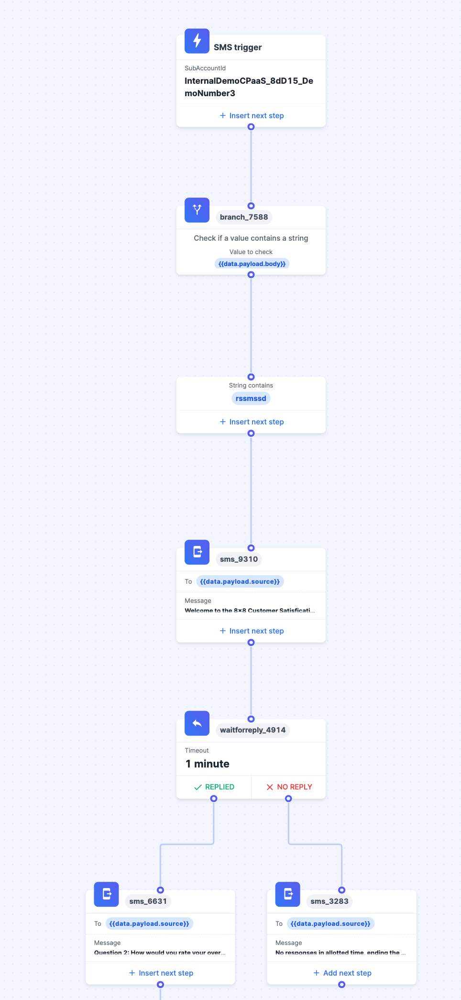
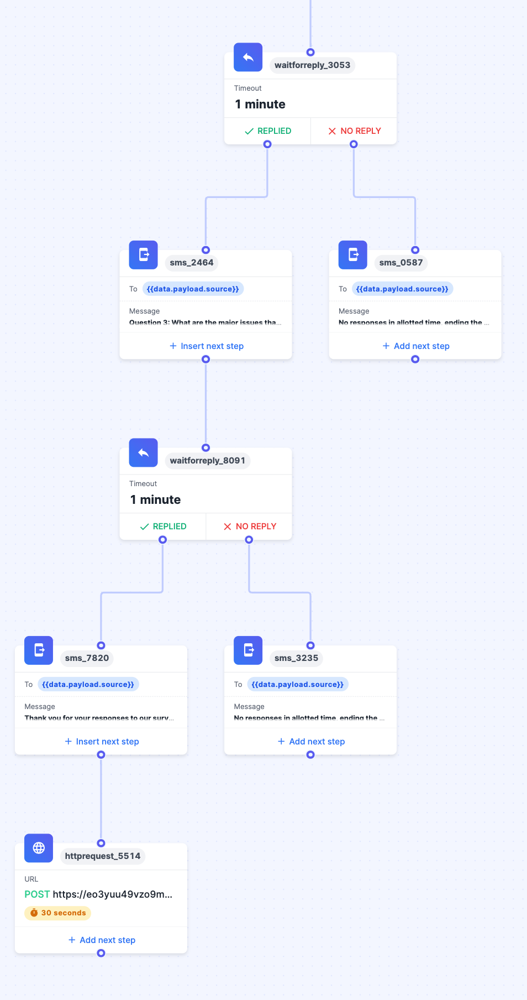
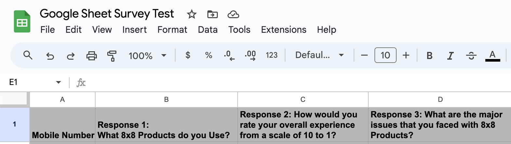
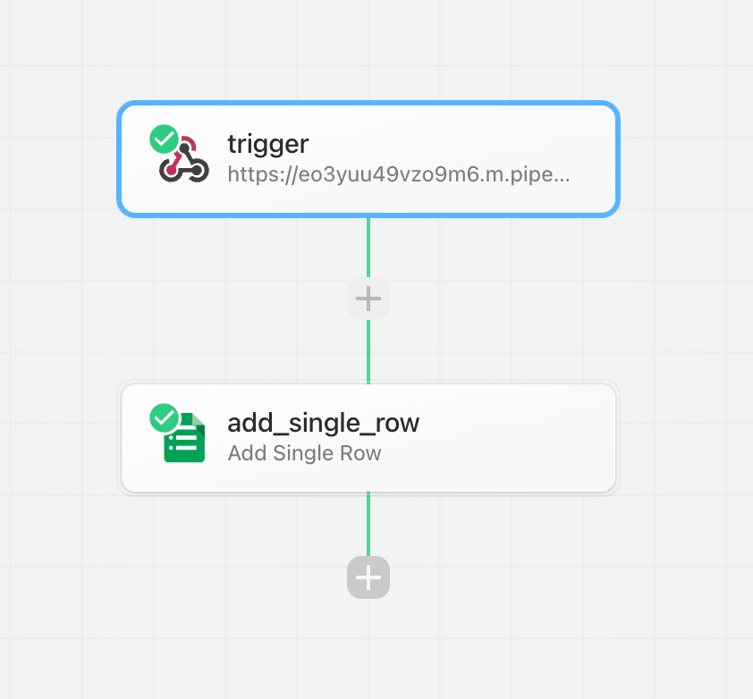
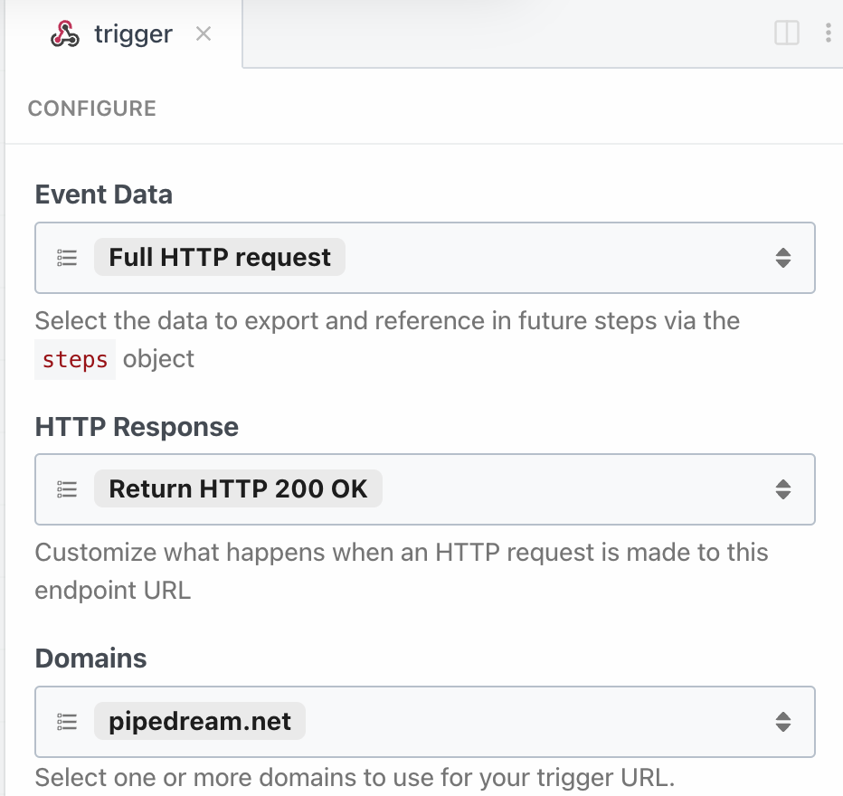
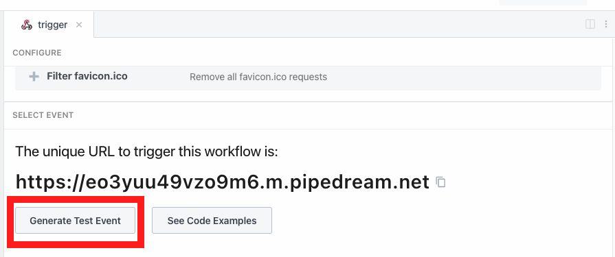
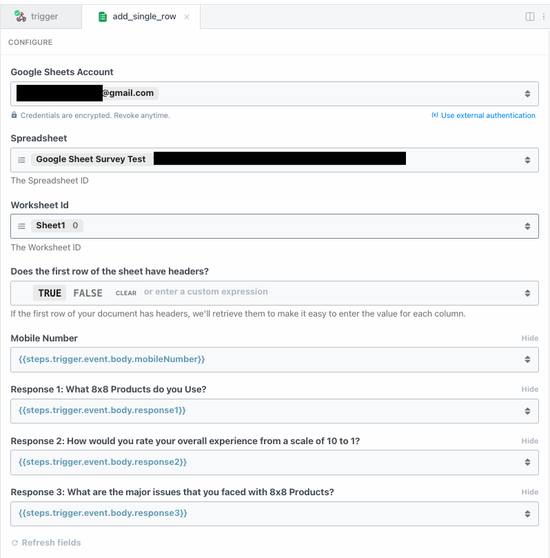
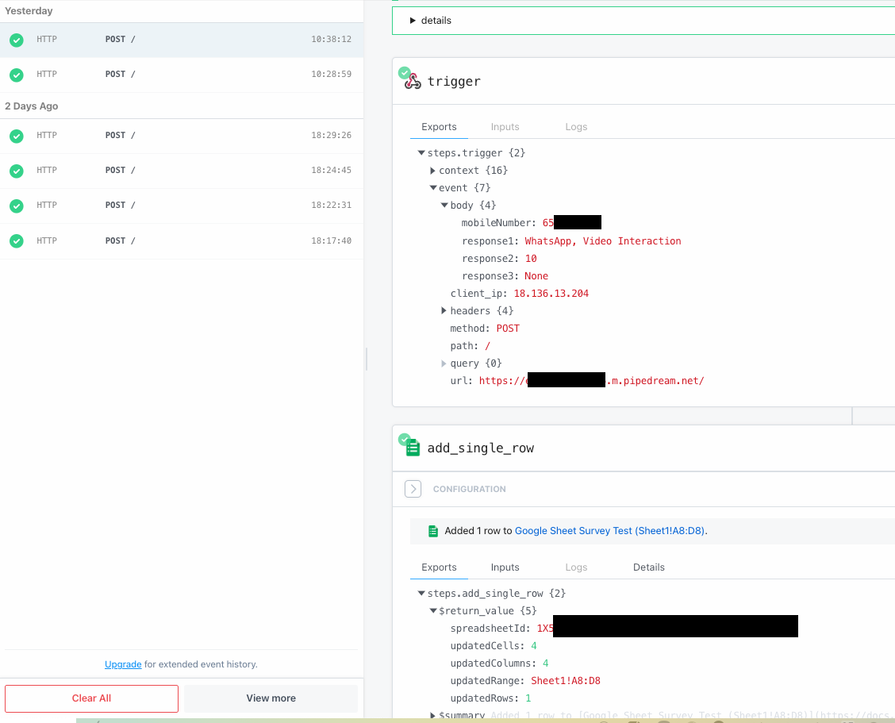
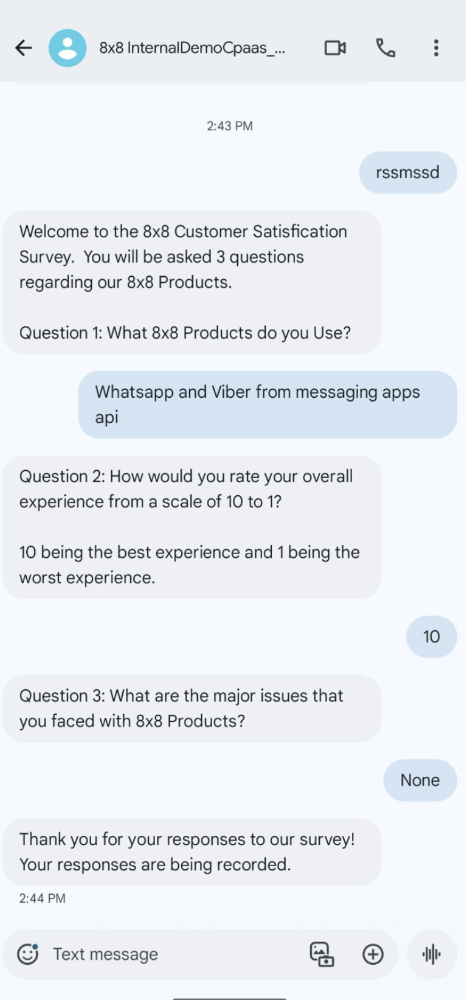
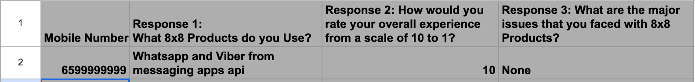

# Tutorial: Customer Survey via SMS

## Introduction

In this tutorial, you'll learn how to create an SMS-based chatbot that prompts users with survey questions and sends their responses to Google Sheets. This process can also be adapted for other survey tools like Qualtrics or SurveyMonkey.

The default tutorial includes three questions, but you can customize it with your own questions and modify the workflow as needed. Use this tutorial as a foundation to develop your own tailored customer surveys.

## Prerequisites

Ensure you have:

* An **8x8 account** with a subaccount setup.
* An **8x8 Virtual Number** to use to send SMS that is already registered with 8x8.
* Access to **Google Sheets** and its API (or another sheet/survey tool)
* **Pipedream** account (or a similar API connector tool like Zapier, Make, or your own API server)

If you do not have an 8x8 account or virtual number, reach out to your 8x8 account manager or email [cpaas_sales@8x8.com](mailto:cpaas_sales@8x8.com).

## Video Demo

This is a accompanying video meant to show the SMS Customer Survey as a demo.

<iframe
  src="https://www.youtube.com/embed/TbcB1i0noKc?si=jmzyvbs67PwYsOCc"
  height="500px"
  width="100%"
  allow="picture-in-picture; web-share"
  allowFullScreen>
</iframe>

## Step 1: Setup the Automation Builder Workflow

You can find an example Automation Workflow workflow below, which you can use to import into the Automation Builder UI in [Connect](https://connect.8x8.com/automation).

While we will not explain the different components of the tutorial here, if you need a refresher please see our section on Automation Builder [Steps](triggers-and-steps-library) and [Triggers](triggers).

> 📘 **Note**
>
> Please change the mobile number in the JSON below and the keywords as necessary.
>
>

tutorial_sms_survey.json

```json
{
  "definition": {
    "id": "75f9d264-8d6a-428d-989d-2093343b3f12",
    "name": "RS SMS Survey Demo",
    "version": 14,
    "steps": [
      {
        "stepType": "Branch",
        "id": "branch_7588",
        "do": [],
        "nextStepId": null,
        "inputs": {},
        "outputs": {},
        "selectNextStep": {
          "sms_9310": "{{stringContains(data.payload.body, 'rssmssd', true)}}"
        }
      },
      {
        "stepType": "SMS",
        "id": "sms_9310",
        "do": [],
        "nextStepId": "waitforreply_4914",
        "inputs": {
          "subAccountId": "InternalDemoCPaaS_8dD15_DemoNumber3",
          "source": "+6599999999",
          "destination": "{{data.payload.source}}",
          "text": "Welcome to the 8x8 Customer Satisfication Survey.  You will be asked 3 questions regarding our 8x8 Products.\n\nQuestion 1: What 8x8 Products do you Use?"
        },
        "outputs": {},
        "selectNextStep": {}
      },
      {
        "stepType": "WaitForReply",
        "id": "waitforreply_4914",
        "do": [],
        "nextStepId": null,
        "inputs": {
          "from": "{{data.payload.source}}",
          "channel": "sms",
          "timeout": "0.00:01:00"
        },
        "outputs": {
          "waitforreply_4914_step_body": "{{step.reply.payload.body}}"
        },
        "selectNextStep": {
          "sms_6631": "{{ step.reply != null }}",
          "sms_3283": "{{ step.reply == null }}"
        }
      },
      {
        "stepType": "SMS",
        "id": "sms_6631",
        "do": [],
        "nextStepId": "waitforreply_3053",
        "inputs": {
          "subAccountId": "InternalDemoCPaaS_8dD15_DemoNumber3",
          "source": "+6599999999",
          "destination": "{{data.payload.source}}",
          "text": "Question 2: How would you rate your overall experience from a scale of 10 to 1? \n\n10 being the best experience and 1 being the worst experience."
        },
        "outputs": {},
        "selectNextStep": {}
      },
      {
        "stepType": "SMS",
        "id": "sms_3283",
        "do": [],
        "nextStepId": null,
        "inputs": {
          "subAccountId": "InternalDemoCPaaS_8dD15_DemoNumber3",
          "source": "+6599999999",
          "destination": "{{data.payload.source}}",
          "text": "No responses in allotted time, ending the survey. Your responses have not been recorded."
        },
        "outputs": {},
        "selectNextStep": {}
      },
      {
        "stepType": "WaitForReply",
        "id": "waitforreply_3053",
        "do": [],
        "nextStepId": null,
        "inputs": {
          "from": "{{data.payload.source}}",
          "channel": "sms",
          "timeout": "0.00:01:00"
        },
        "outputs": {
          "waitforreply_3053_step_body": "{{step.reply.payload.body}}"
        },
        "selectNextStep": {
          "sms_2464": "{{ step.reply != null }}",
          "sms_0587": "{{ step.reply == null }}"
        }
      },
      {
        "stepType": "SMS",
        "id": "sms_2464",
        "do": [],
        "nextStepId": "waitforreply_8091",
        "inputs": {
          "subAccountId": "InternalDemoCPaaS_8dD15_DemoNumber3",
          "source": "+6599999999",
          "destination": "{{data.payload.source}}",
          "text": "Question 3: What are the major issues that you faced with 8x8 Products?"
        },
        "outputs": {},
        "selectNextStep": {}
      },
      {
        "stepType": "SMS",
        "id": "sms_0587",
        "do": [],
        "nextStepId": null,
        "inputs": {
          "subAccountId": "InternalDemoCPaaS_8dD15_DemoNumber3",
          "source": "+6599999999",
          "destination": "{{data.payload.source}}",
          "text": "No responses in allotted time, ending the survey. Your responses have not been recorded."
        },
        "outputs": {},
        "selectNextStep": {}
      },
      {
        "stepType": "WaitForReply",
        "id": "waitforreply_8091",
        "do": [],
        "nextStepId": null,
        "inputs": {
          "from": "{{data.payload.source}}",
          "channel": "sms",
          "timeout": "0.00:01:00"
        },
        "outputs": {
          "waitforreply_8091_step_body": "{{step.reply.payload.body}}"
        },
        "selectNextStep": {
          "sms_7820": "{{ step.reply != null }}",
          "sms_3235": "{{ step.reply == null }}"
        }
      },
      {
        "stepType": "SMS",
        "id": "sms_7820",
        "do": [],
        "nextStepId": "httprequest_5514",
        "inputs": {
          "subAccountId": "InternalDemoCPaaS_8dD15_DemoNumber3",
          "source": "+6599999999",
          "destination": "{{data.payload.source}}",
          "text": "Thank you for your responses to our survey! Your responses are being recorded."
        },
        "outputs": {},
        "selectNextStep": {}
      },
      {
        "stepType": "SMS",
        "id": "sms_3235",
        "do": [],
        "nextStepId": null,
        "inputs": {
          "subAccountId": "InternalDemoCPaaS_8dD15_DemoNumber3",
          "source": "+6583390627",
          "destination": "{{data.payload.source}}",
          "text": "No responses in allotted time, ending the survey. Your responses have not been recorded."
        },
        "outputs": {},
        "selectNextStep": {}
      },
      {
        "stepType": "HttpRequest",
        "id": "httprequest_5514",
        "do": [],
        "nextStepId": null,
        "inputs": {
          "headers": {
            "content-Type": "application/json"
          },
          "method": "POST",
          "url": "https://eo4yuu59vzo9m6.m.pipedream.net",
          "parameters": {},
          "body": {
            "response1": "{{data.waitforreply_4914_step_body}}",
            "response2": "{{data.waitforreply_3053_step_body}}",
            "response3": "{{data.waitforreply_8091_step_body}}",
            "mobileNumber": "{{data.payload.source}}"
          },
          "timeoutSeconds": 30
        },
        "outputs": {},
        "selectNextStep": {}
      }
    ]
  },
  "subAccountId": "InternalDemoCPaaS_8dD15_DemoNumber3",
  "trigger": "inbound_sms",
  "status": "enabled"
}

```

Once the workflow is imported, it should appear within Automation Builder similar to the one below.

Workflow Part 1 of 2

Workflow Part 2 of 2.

It is comprised of **Send SMS Step, Branch Step, Wait for Reply Step** and a single **HTTP Request Step**. If you choose to modify the flow you may also need to modify the request body to Pipedream at the end depending on the questions that you ask.

## Step 2: Setup Google Sheet

Setup a Google Sheet with the following columns on your Google Account which we will use later within Pipedream to populate.



Here is an example table that you can be copy/pasted to your Google Sheet.

| Mobile Number | Response 1:<br>What 8x8 Products do you Use? | Response 2: How would you rate your overall experience from a scale of 10 to 1? | Response 3: What are the major issues that you faced with 8x8 Products? |
| --- | --- | --- | --- |
|  |  |  |  |

## Step 3: Setup Pipedream

Setup a new workflow with an **HTTP Trigger** followed by a **Google Sheets: Add Single Row Step**



The  **HTTP Trigger** should have these following configurations:


  
Within the **HTTP Trigger,** go to **Generate Test Event** and use the following JSON as the Test Event's input. This will allow us to correctly populate the values for the following Google Sheet step.



```json
{
  "response1": "WhatsApp, SMS",
  "response2": "10",
  "response3": "No Issues!",
  "mobileNumber": "+6599999999"
}

```

The **Google Sheets Step** should have the following configuration.



Within **Pipedream**, you should be able to see the HTTP responses sent by Automation Builder which may be useful in case any debugging is required.



## Step 4: Send SMS

After setting up the above, you should be able to send a SMS message to your Virtual Number tied to 8x8 and receive responses back prompting you to complete the survey as outlined below.


  
This should result in a row being added to your Google Sheet with the response.



## Conclusion

While we use **Google Sheets** in this tutorial, the same idea can be extended to a dedicated Customer Survey software like **Qualtrics, SurveyMonkey, Alchemer**, **etc**. Similarly while we used **Pipedream** for this tutorial, another tool that offers similar HTTP Trigger and Google Sheet Integration capabilities can also be used in it's place.

**Expanded Explanation**

* **Increased Response Rate:** Reduces friction, making it easier for users to participate.
* **Higher Engagement Levels:** Uses interactive features to keep respondents interested.
* **Enhanced Reach and Accessibility:** Broadens audience reach due to SMS near ubiquitous reach.
* **Reduced Technical Issues:** Minimizes problems like slow loading and compatibility issues.

We encourage to take this tutorial as a template and try it out with your own systems to craft a survey using automation builder.
