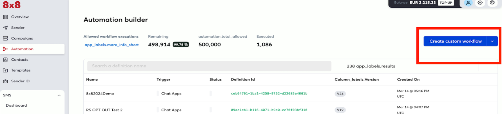
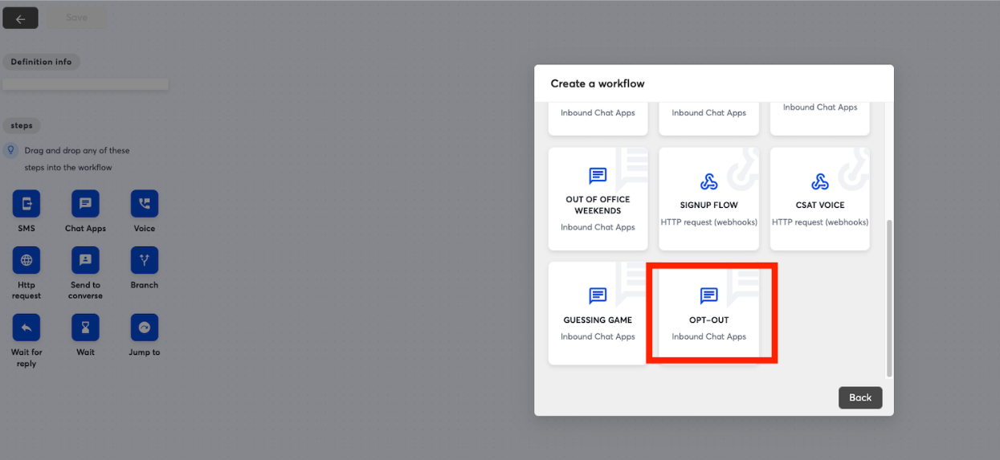
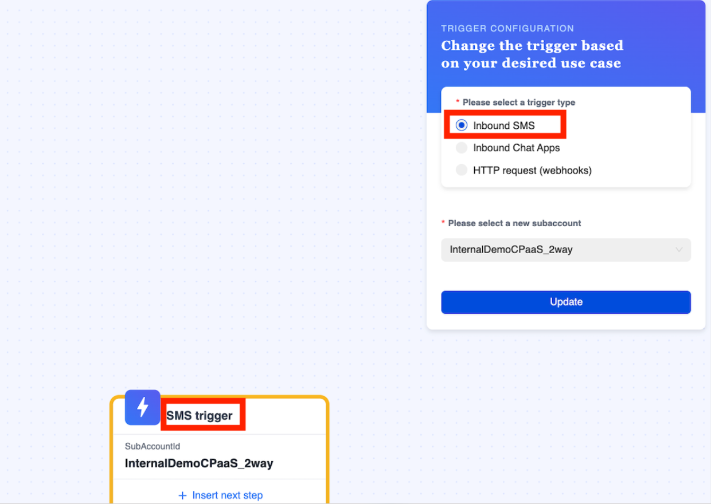
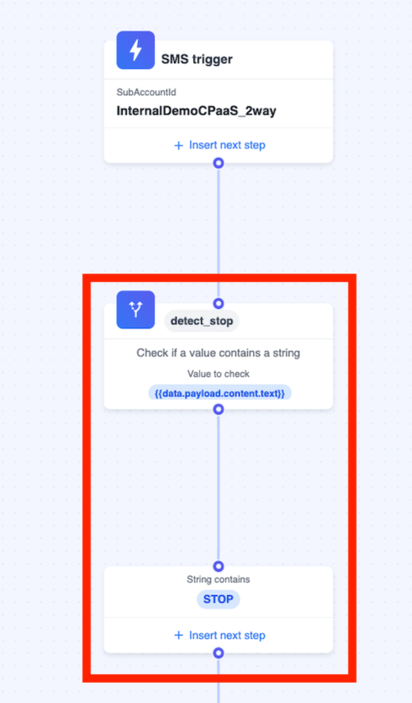
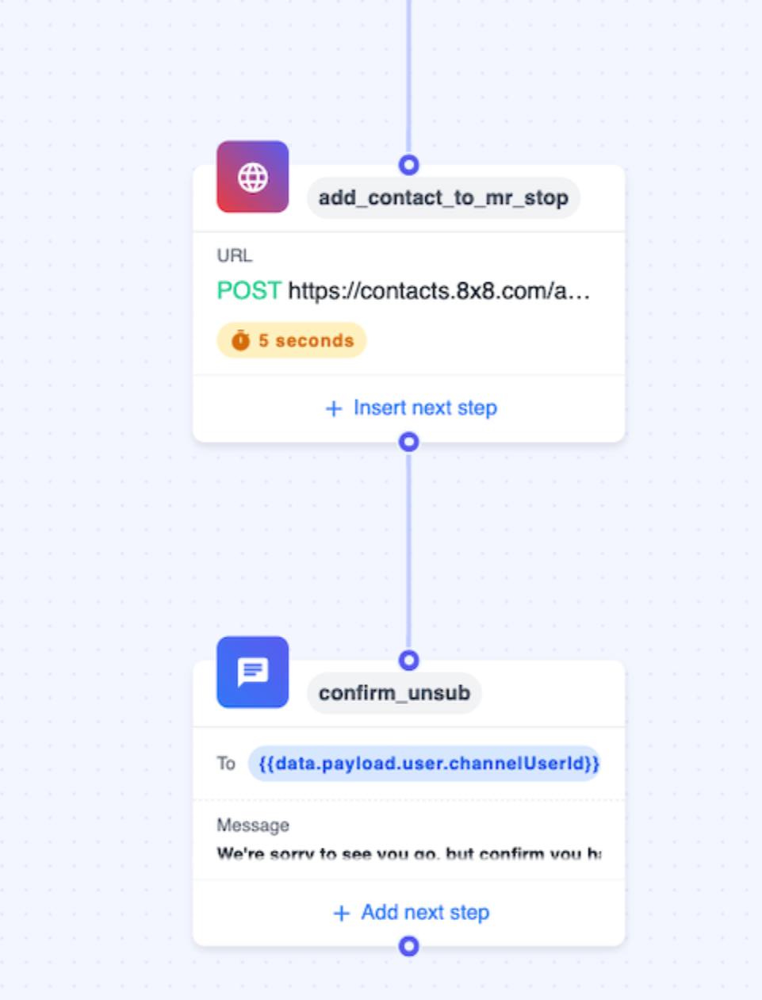
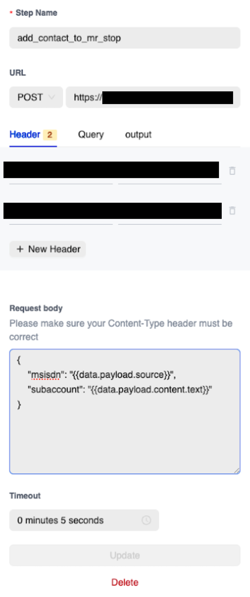
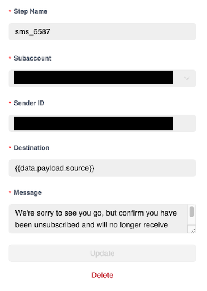
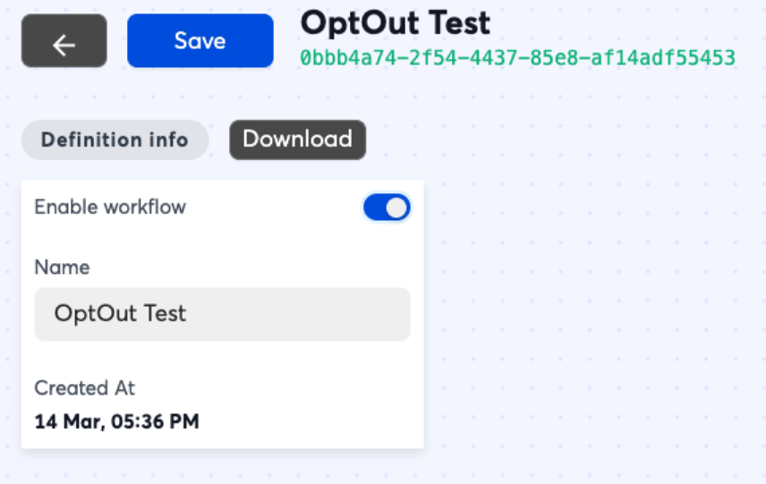

# Tutorial: Opt Out Keyword (SMS) for Third-Party System

## Overview

This tutorial will show you how to use Automation Builder to build an **opt-out flow** for SMS.

**This workflow in automation builder will perform these steps:**

1. Listen for a keyword sent via SMS to a specific number attached to your subaccount
2. Send a HTTP request to your server with information regarding the customer’s phone number and the keyword they specified so that your server can perform opt-out logic
3. Send a follow up SMS to let the customer know they have opted out.

8x8 has already pre-built an Automation Builder template which allows you to add a keyword which will allow customers to opt out of further communications. We will use this template as the basis of the tutorial.

## Pre-Built Template

First go to the Automation Builder page ([https://connect.8x8.com/automation](https://connect.8x8.com/automation)) and select the blue button for "Create Custom Workflow"

## Opt-Out Template

From the pop up in the next page, select the "Opt-Out" template to use as our base.

## Building the Workflow

In the next page the workflow should be pre-populated with steps, click on the "Trigger" step which is the first step in the flow. Select the subaccount which has the shortcode number that you wish to associate with this opt-out flow. Once it is selected click "Update" to save it to the step.

## Deciding the Keyword

The **keyword** is controlled by the "Branch" Step in red, in this example it is set to **STOP** but you can modify this if you wish to change the condition to trigger the opt out.

> 📘 **The branch step has a limit of 5 choices in the Automation Builder UI. You can create additional workflows with additional choices if you need them at the top level of your menu. Another option is to look into the Automation Builder API to build this workflow instead which can support more than 5 choices.**
>
>

## Add Contact to Opt Out Group

Once that is done, you can move on to modifying the HTTP Request itself. In the examples the URL and the headers should be substituted for the URL and headers (if required) of your server endpoint instead.

| Field | Value |
| --- | --- |
| Step Name | Any Value |
| URL | POST to your URL endpoint to handle the request. |
| Header - Content Type | application/json |
| Header - Authorisation Note: Your API key can be obtained from the API Keys section of the Connect Dashboard. | Bearer  |
| Request Body (Example, this will include the phone number that sent the SMS message to your 8x8 number from {{data.payload.source}}. The text that the user inputted will be in {{data.payload.content.text}}. The example will send a JSON response body to your API endpoint that will be similar to. { "msisdn": "+6512345678", "subaccount": "SAMPLE_SUBACCOUNT" } | { "msisdn": "{{data.payload.source}}", "subaccount": "{{data.payload.content.text}}" } |

## Opt Out Message

You can replace the message with a custom message to your users. Make sure to again select the correct subaccount for your short code that you want to send the SMS from.

| Field | Example Value |
| --- | --- |
| Step Name | Any Value |
| Please select a new subaccount | Your 8x8 Subaccount |
| Sender ID | Your 8x8 Sender ID |
| Destination | {{data.payload.source}} |
| Message | We're sorry to see you go, but confirm you have been unsubscribed and will no longer receive SMS from us. |

After saving these changes, the opt out flow can be enabled by enabling the button at the top left and saving. It will activate immediately and any message that contains the keyword will result in a user being added to the opt-out group.

## Testing

Once the automation workflow is in place, you can test it by sending the opt-out keyword via SMS to the phone number attached to your subaccount.

Note you will need to build a URL endpoint to accept the HTTP request that will come from the Automation Builder workflow which is outside the scope of this guide.

## Removing from Opt out list

You can reverse this logic to implement something like a resubscribe or an opt-in so that customers can resubscribed if needed.
