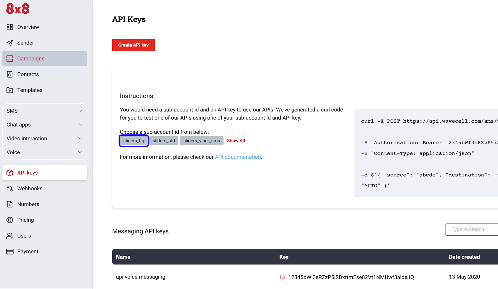
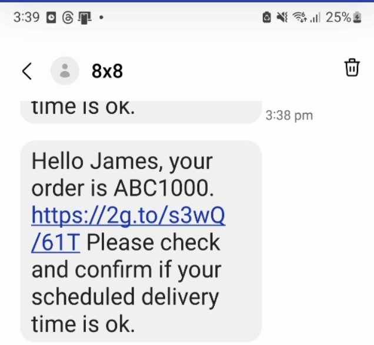
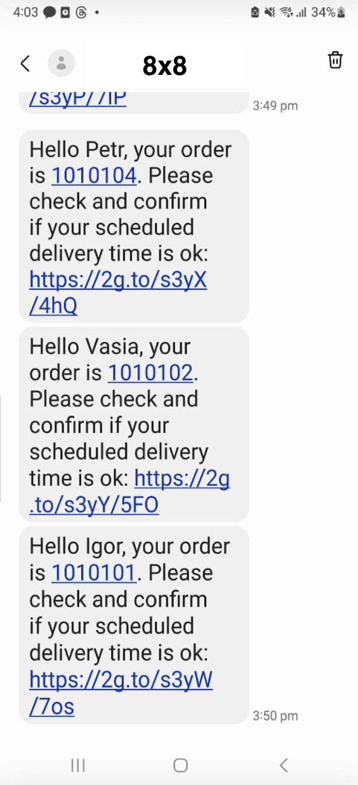
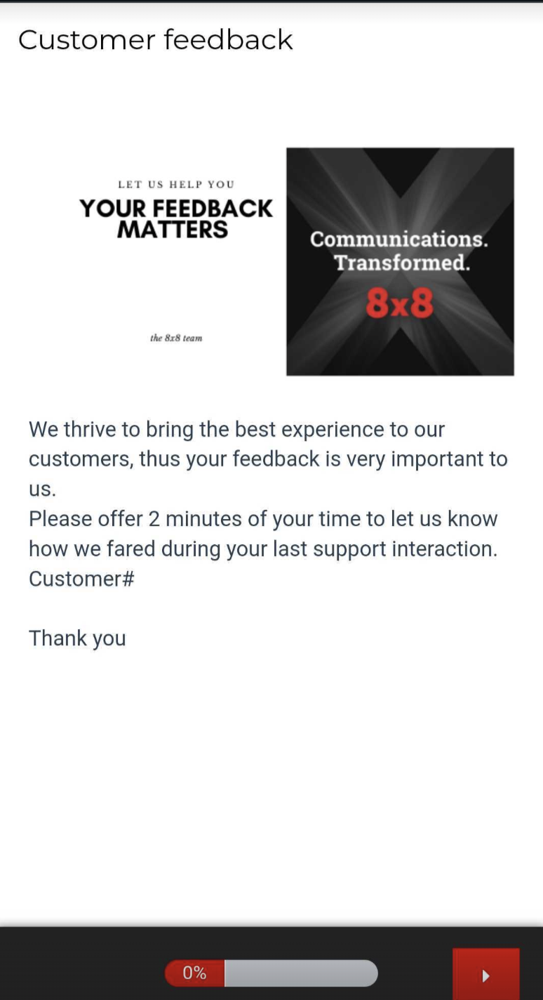
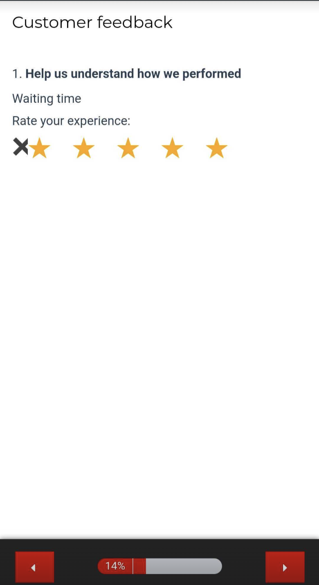
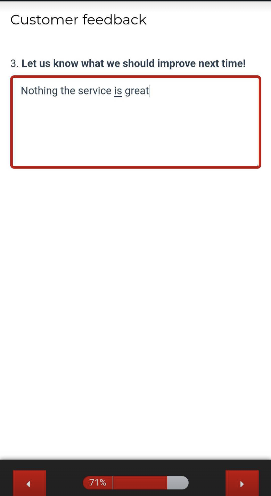
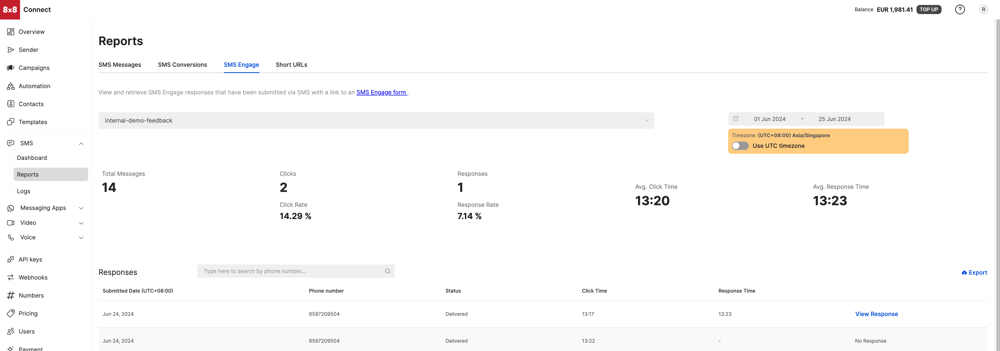
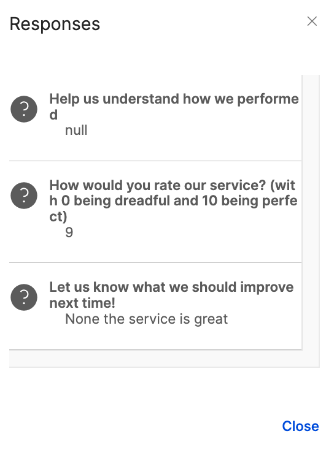
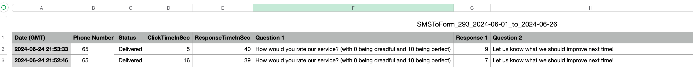

# SMS Engage

## Introduction

8x8 offers API methods that allow you to send SMS Engage programmatically.  

In this tutorial, we will cover how to send a single SMS Engage: [Send SMS Engage survey](/connect/reference/survey-send) and multiple SMS Engage: [Send SMS Engage surveys as batch](/connect/reference/survey-send-many) in one command.

---

## Video Demo

This video below will take you through a demo of SMS Engage including: sending a survey via API, filling out a survey and viewing the responses on the Connect Dashboard.

<iframe
  src="https://www.youtube.com/embed/6NB0_7ZaepE?si=O_vGsatqoINr1rPI"
  height="500px"
  width="100%"
  allow="picture-in-picture; web-share"
  allowFullScreen>
</iframe>

## Prerequisites

* **8x8 Account** with an SMS Engage form created
  * If you do not have an SMS engage form, see the **SMS Engage Form** section below on how to obtain one.
* **8x8 API Key**
  * Please see [this](developer-tools) page on how to create API Keys if you do not have an existing one.

---

## SMS Engage Form

You must have at least one SMS Engage form created for you by 8x8. SMS Engage forms are created based on your use-cases. Once they are created, 8x8 will provide you a **surveyId** and \*_url_ac\*.

* Please note that the variable url is your default SMS Engage link which 8x8 has set up for you (e.g. [http://smstoweb.net?sid=1234](http://smstoweb.net?sid=1234)). The url is shortened once the message has been sent.
  * The shortened url is always **21 characters** in length.
* If you want to get the data via **Webhooks**, simply provide us a specific url where we will post the data.
* For more information on **how to create an SMS engage form** please contact your account manager or send an email to [8x8 Support](mailto:cpaas-support@8x8.com).



---

## Send Single SMS Engage Survey

The 8x8 SMS Engage survey method expects requests sent by developers to respect a specific format.

In the following section, we are going to go over the different elements of the request:

* URL format
* Authentication
* Data payload

At the end of the section, we will generate a cURL command to send an SMS Engage directly from the command line.

### Request URL

* As detailed in the [Send SMS Engage survey](/connect/reference/survey-send) , the URL is defined by the following pattern: `https://sms.8x8.com/api/v1/subaccounts/{subAccountId}/surveys/{surveyId}/messages`
  * The **{subAccountID}** should be replaced by your own 8x8 Subaccount ID and the **{surveyId}** should be replaced by your Survey ID in a request.

### Authentication

Use your **API Key** in the **Authorization** header of your HTTP request, this is denoted with the  variable below.

```bash
curl --location 'https://sms.8x8.com/api/v1/subaccounts/<subaccount>/surveys/<surveyId>/messages' \
--header 'Content-Type: application/json' \
--header 'Authorization: <apiKey>' \

```

### Data payload

The API expects to receive a structured request containing the SMS data in a specific format. As detailed in the documentation, the data that we have to submit should be a JSON object.

To send a **single SMS Engage** message here is an example of a data payload:

```json
{
  "destination": "<mobileNumber>",
  "templateBody": "Hello {{firstName}}, your order is {{order_nr}}. {{url}} Please check and confirm if your scheduled delivery time is ok.",
  "templateVariables": {
    "firstName": "James",
    "order_nr": "ABC1000"
  },
  "source": "<sourceVnOrSenderId>"
}

```

The JSON parameters are explained in the table below:

| Parameter | Description | Example Value |
| --- | --- | --- |
| destination | Mobile Number in international format | +6512345678 |
| templateBody | Template of message to user. It should have the variable **{{url}}**, this variable will be substituted in the SMS by the link set for you by 8x8. | Hello {{firstName}}, your order is {{order_nr}}. {{url}} Please check and confirm if your scheduled delivery time is ok. |
| templateVariables | Variables or pre-defined fields used inside the templateBody. Your url should have the value or link set for you by 8x8. | "templateVariables": {<br>"firstName": "James",<br>"order_nr": "ABC1000"<br>}, |
| Source | The Sender ID or Virtual Number to send the SMS from. | Acme |

### Sending the API Request

Now that the API request is setup correctly you need, let’s try this by using cURL. If you are running **Mac OS**, **cURL** is already installed. Just run the **Terminal** app (Located under Applications->Utilities).

For **Windows** based machines click [here](https://developer.zendesk.com/documentation/api-basics/getting-started/installing-and-using-curl/) on how to install curl.

Alternatively you can use **Postman** if you are familiar with the tool as well to send this request.

For **cURL** the command should look as follows, which can also be adapted into Postman.

```bash
curl --location 'https://sms.8x8.com/api/v1/subaccounts/<subaccount>/surveys/<surveyId>/messages' \
--header 'Content-Type: application/json' \
--header 'Authorization: <apiKey>' \
--data '{
  "destination": "<mobileNumber>",
  "templateBody": "Hello {{firstName}}, your order is {{order_nr}}. {{url}} Please check and confirm if your scheduled delivery time is ok.",
  "templateVariables": {
    "firstName": "James",
    "order_nr": "ABC1000"
  },
  "source": "8x8"
}'

```

Remember to replace the **,** and  values above. The **{{url}}** value does not need to be included in the te**mplateVariables** and will be automatically substituted by 8x8.

This should result in a SMS being sent similar to the one below with the URL replacing the {{url}} parameter's place in the SMS Body.



A successful request should return an 200 OK HTTP Response Code and the Response Body should appear as below:

```json
{
    "umid": "<umid>",
    "clientMessageId": null,
    "destination": "<mobileNumber>",
    "encoding": "GSM7",
    "status": {
        "code": "QUEUED",
        "description": "SMS is accepted and queued for processing"
    }
}

```

Note that **mobileNumber** and **umid's** values will be replaced with your request's unique values.

## Send Batch SMS Engage Survey

Now that we have covered how to send a Single SMS Engage Survey, there may also be times that it is appropriate to send multiple SMS Engage Surveys in a single API request. For those use cases, we can use the [SMS Engage Batch API Endpoint](survey-send-many).

In the following section, we are going to go over the different elements of the request:

* URL format
* Authentication
* Data payload

At the end of the section, we will generate a cURL command to send an SMS Engage directly from the command line.

### Request URL

* As detailed in the [Send SMS Engage survey](/connect/reference/survey-send) , the URL is defined by the following pattern: `https://sms.8x8.com/api/v1/subaccounts/{subAccountId}/surveys/{surveyId}/messages/batch`
  * The **{subAccountID}** should be replaced by your own 8x8 Subaccount ID and the **{surveyId}** should be replaced by your Survey ID in a request.

### Authentication

Use your **API Key** in the **Authorization** header of your HTTP request, this is denoted with the  variable below.

```bash
curl --location 'https://sms.8x8.com/api/v1/subaccounts/<subaccount>/surveys/<surveyId>/messages/batch' \
--header 'Content-Type: application/json' \
--header 'Authorization: <apiKey>' \

```

### Data payload

The API expects to receive a structured request containing the SMS data in a specific format. As detailed in the documentation, the data that we have to submit should be a JSON object.

To send a **batch SMS Engage** message here is an example of a data payload:

```json
{
  "messages": [
    {
      "templateVariables": {
        "firstName": "Igor",
        "order_nr": "1010101",
        "age": 24
      },
      "destination": "<mobileNumber>"
    },
    {
      "templateVariables": {
        "firstName": "Petr",
        "order_nr": "1010104",
        "age": 20
      },
      "destination": "<mobileNumber>"
    },
    {
      "templateVariables": {
        "firstName": "Vasia",
        "order_nr": "1010102",
        "age": 22
      },
      "destination": "<mobileNumber>"
    }
  ],
  "template": {
    "source": "YourBrand",
    "templateBody": "Hello {{firstName}}, your order is {{order_nr}}. Please check and confirm if your scheduled delivery time is ok: {{url}}"
  },
  "clientBatchId": "MyBatch00001",
  "includeMessagesInResponse": true
}

```

The JSON parameters are explained in the table below:

| Parameter | Description | Example Value |
| --- | --- | --- |
| messages | Contains an array of at minimum templateVariables and destinations | {<br>"templateVariables": {<br>"firstName": "Petr",<br>"order_nr": "1010104",<br>"age": 20<br>},<br>"destination": ""<br>}, |
| template | Template of message to user. It is required to contain a **templateBody** that should have the variable **{{url}}**, this variable will be substituted in the SMS by the link set for you by 8x8.<br><br>**Source** should also be included which is the Sender ID or 8x8 Virtual Number to send the SMS from.  | "template": {<br>"source": "YourBrand",<br>"templateBody": "Hello {{firstName}}, your order is {{order_nr}}. Please check and confirm if your scheduled delivery time is ok: {{url}}"<br>}, |
| clientBatchId | Custom string to associate with this batch of messages. | MyBatch001 |
| includeMessagesInResponse | Whether to include the details of each individual message in the HTTP Response. | True |

### Sending the API Request

Now that the API request is setup correctly you need, let’s try this by using cURL. If you are running **Mac OS**, **cURL** is already installed. Just run the **Terminal** app (Located under Applications->Utilities).

For **Windows** based machines click [here](https://developer.zendesk.com/documentation/api-basics/getting-started/installing-and-using-curl/) on how to install curl.

Alternatively you can use **Postman** if you are familiar with the tool as well to send this request.

For **cURL** the command should look as follows, which can also be adapted into Postman.

```bash
curl --location 'https://sms.8x8.com/api/v1/subaccounts/<subaccount>/surveys/<surveyId>/messages/batch' \
--header 'Content-Type: application/json' \
--header 'Authorization: <apiKey>' \
--data '{
  "messages": [
    {
      "templateVariables": {
        "firstName": "Igor",
        "order_nr": "1010101",
        "age": 24
      },
      "destination": "<mobileNumber>"
    },
    {
      "templateVariables": {
        "firstName": "Petr",
        "order_nr": "1010104",
        "age": 20
      },
      "destination": "<mobileNumber>"
    },
    {
      "templateVariables": {
        "firstName": "Vasia",
        "order_nr": "1010102",
        "age": 22
      },
      "destination": "<mobileNumber>"
    }
  ],
  "template": {
    "source": "YourBrand",
    "templateBody": "Hello {{firstName}}, your order is {{order_nr}}. Please check and confirm if your scheduled delivery time is ok: {{url}}"
  },
  "clientBatchId": "<batchId>",
  "includeMessagesInResponse": true
}'

```

Remember to replace the  **,** **,** and  values above. The **{{url}}** value does not need to be included in the **templateVariables** and will be automatically substituted by 8x8.

This should result in a SMS being sent similar to the one below with the URL replacing the {{url}} parameter's place in the SMS Body.



A successful request should return an 200 OK HTTP Response Code and the Response Body should appear as below.

HTTP Response

```json
{
    "batchId": "<batchUmid>",
    "clientBatchId": "<batchId>",
    "acceptedCount": 3,
    "rejectedCount": 0,
    "messages": [
        {
            "umid": "<umid>",
            "clientMessageId": "<batchId>/<mobileNumber>",
            "destination": "<mobileNumber>",
            "encoding": "GSM7",
            "status": {
                "code": "QUEUED",
                "description": "SMS is accepted and queued for processing"
            }
        },
        {
            "umid": "<umid>",
            "clientMessageId": "<batchId>/<mobileNumber>",
            "destination": "<mobileNumber>",
            "encoding": "GSM7",
            "status": {
                "code": "QUEUED",
                "description": "SMS is accepted and queued for processing"
            }
        },
        {
            "umid": "<umid>",
            "clientMessageId": "<batchId>/<mobileNumber>",
            "destination": "<mobileNumber>",
            "encoding": "GSM7",
            "status": {
                "code": "QUEUED",
                "description": "SMS is accepted and queued for processing"
            }
        }
    ]
}

```

You should receive multiple messages in the **messages** array assuming you set **includeMessagesInResponse** as **true** in the request body. If it was set to **false** then the **messages** array will be **null**.

Note that the **batchUmid**, **batchId**, **mobileNumber** and **umid's** values will be replaced with your request's unique values.

## Survey Appearance

The webpages for the surveys are built by the 8x8 team for each customer based on their inputs. A few example pages are included below as they would appear in a mobile browser. They can include both text box and multiple choice type of questions.

Survey Initial Page

1-5 Rating Type Question

Long response type question

The web pages are only **examples**, a survey webpage will be built by 8x8 as part of onboarding to SMS Engage that can be customised in terms of appearance and questions. please contact your account manager or send an email to [8x8 Support](mailto:cpaas-support@8x8.com).

## Reports

Reports related to SMS engage, you can check the Reports section of the Connect Dashboard.

For a given time period, reports will include the following information

| Term | Description |
| --- | --- |
| Total Messages | The number of surveys sent by SMS engage. |
| Clicks | The number of Surveys sent out that had the URL clicked. |
| Responses | The number of participants who successfully completed the survey and sent back their responses. |
| Click Rate | The percentage of total survey URLs that were clicked by recipients. Calculated as (Clicks / Total Messages) \* 100. |
| Response Rate | The percentage of total survey URLs that resulted in a completed survey response. Calculated as (Responses / Total Messages) \* 100. |
| Average Click Time | The average time between when an SMS message was sent and the time the survey URL was clicked. |
| Average Response Time | The average time between when an SMS message was sent and the time a completed survey response was submitted. |



For each survey response, clicking **View response** in the associated row will bring up the actual responses from the customer.



The **Export** button on the same page will give you the option to email a CSV file of the responses in the survey.


