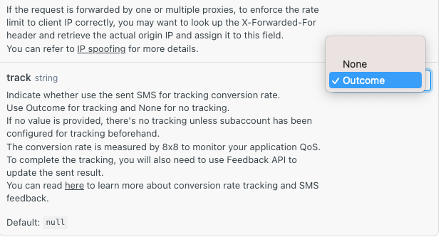
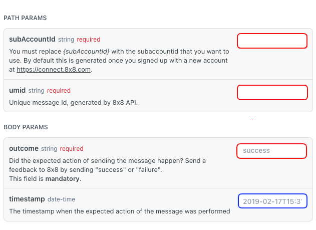
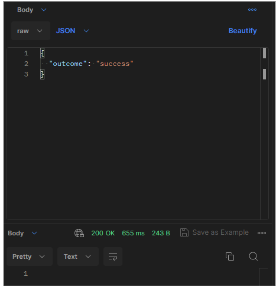

# SMS Feedback API

To ensure the efficient delivery of SMS verification codes to users' mobile devices, 8x8 provides our customers with the [Success Feedback API](/connect/reference/api-sms-feedback) (not applicable to SMPP).

The Success Feedback API provides 8x8 insight into the success of your OTP verification code (by your OTP Generator) sent using our SMS API. For users who need an OTP Generator, may consider using [8x8 Verification API](/connect/reference/verification-api-get-started)( generate OTP and validate OTP message conversion).

With 8x8 being aware of the conversion rate, it activates the Omni Shield for your subaccount. 8x8 will be able to detect any abnormal conversion rate proactively. The intelligent routing feature of the 8x8 platform is automatically triggered, seamlessly switching to pre-configured backup routes to carriers. Furthermore, 8x8's 24-hour technical operations team monitors network health around the clock, ensuring uninterrupted and smooth customer business operations 24/7.

---

## Prerequisites

* Command line interface compatible with CURL
* 8x8 account with SMS actovated with your subaccount.
* apiKey (Bearer token)
* 8x8 CPaaS subaccountid

---

1. **Tracking the Results on [SMS API](/connect/reference/send-sms-single)**

2. **Sending the Outcome of OTP Conversion using [Feedback API](/connect/reference/api-sms-feedback)**
  1. Success Feedback is a POST request
  2. There are four parameters three of which are mandatory— `subAccountId`, `umid`, and `outcome` (success or failure) which are highlighted in red. The optional Parameter is the `timestamp` which provides time (UTC) and date reference which allows 8x8 Omni Shield to work promptly.  
  
  > 📘 **Validity Period**
  >
  > The Success Feedback API call should be made within 15 minutes of the original message being sent. If the API call is not made during this timeframe then the data we receive may not accurately reflect your real conversion rate.
  >
  >

3. **Successful Post Request of Success Feedback API**

Upon successfully pushing the Success Feedback API, it is normal for the HTTP 200 response to have no content returned.

