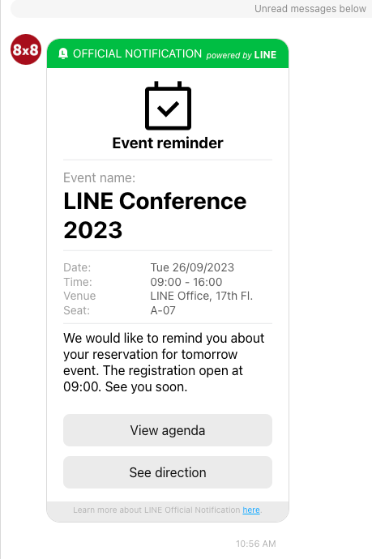

# LINE Official Notification

> 🚧 **LINE Official Notification requires your templates to be approved by LINE team before they can be sent. Reach out to [cpaas-support@8x8.com](mailto:cpaas-support@8x8.com) if you wish to submit new templates**
>
>

> 👍 **LON uses [a different endpoint](https://chatapps.8x8.com/api/v1/subaccounts/%7BsubAccountId%7D/lon) compared to other Channels. Refer to [LON Send API](/connect/reference/send-lon-message) for the full API reference.**
>
>

### Sending an Event reminder notification

This sample API request shows the full capability of LON message, with all the components included. Based on your preferred template you can modify or remove the label and contents of these messages.

```json
{
    "user": {
        "msisdn": "+60000000"
    },
    "smsFallback": {
        "text": "Event reminder",
        "source": "<SENDER ID>",
        "encoding": "auto"
    },
    "content": {
        "title": "Event reminder",
        "company": "LINE",
        "icon": "calendarCheck",
        "emphasis": {
            "label": "Event name",
            "Content": "LINE Conference 2023"
        },
        "list": [
            { "label": "Date:", "content": "Tue 26/09/2023" },
            { "label": "Time:", "content": "09:00 - 16:00" },
            { "label": "Venue", "content": "LINE Office, 17th Fl." },
            { "label": "Seat:", "content": "A-07" }
        ],
        "explanation": "We would like to remind you about your reservation for tomorrow event. The registration open at 09:00. See you soon.",
        "actions": [
            { "title": "View agenda", "url": "https://gdconf.com/conference" },
            { "title": "See direction", "url": "https://www.google.com/maps" }
        ]
    }
}

```

The corresponding LON message received by the customer would look like:



Sample LON message with all components included
