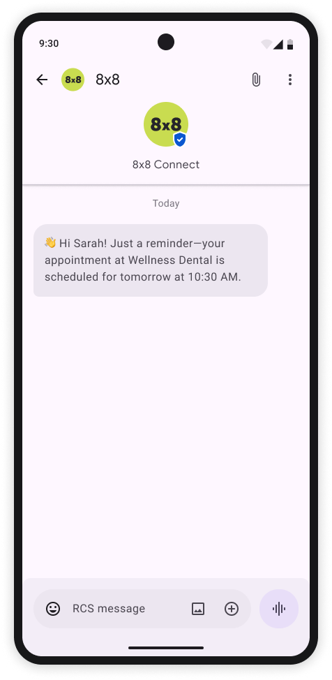
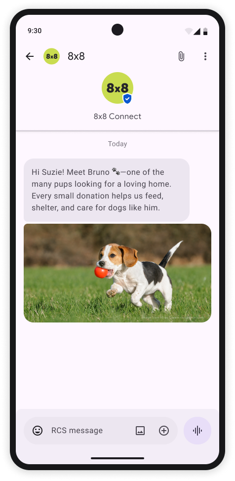
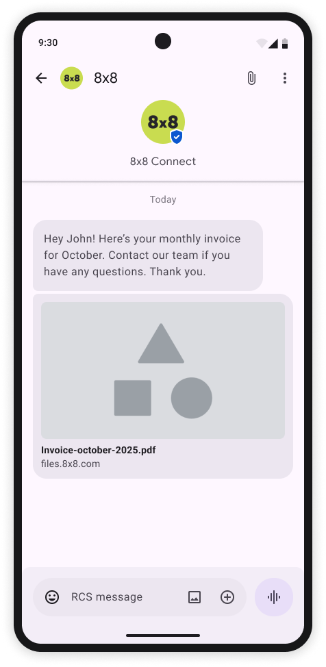
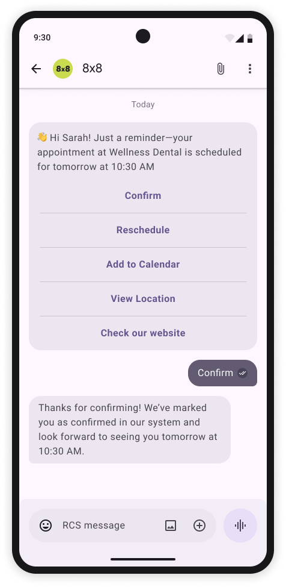

# Message types and samples

> 👍 **Please see [Messaging API](/connect/reference/send-message) for the full API reference.**
>
>

## Text Message

**Content:** Text only  

**Character Limit:** Up to 3072 characters

**Use Cases:** OTP codes, simple alerts

### Payload sample

```json
{
    "user": {
        "msisdn": "+10000000000"
    },
    "type": "Text",
    "content": {
        "text": ":wave: Hi Sarah! Just a reminder—your appointment at Wellness Dental is scheduled for tomorrow at 10:30 AM"
    }
}

```

The corresponding message the user will receive:



---

## Sending a Rich Media Message

* Media Types Supported: Images, videos, documents
* File formats: .ogx, .pdf, .aac, .mp3, .mpeg, .mp3, .mp4, .mp4, .3gp, .jpeg, .jpg, .gif, .png, .h263, .m4v, .mp4, .mp4, .mpeg, .webm
* Text Caption: Up to 2,000 UTF-8 characters
* File Size Limits: 100MB
* File URL limit: 2,048 characters

### Image & text

```json
{
    "user": {
        "msisdn": "+10000000000" 
    },
    "type": "Image",
    "content": {
        "url": "https://www.example.com/image.jpg",
        "text": "Hi Suzie! Meet Bruno :feet:—one of the many pups looking for a loving home. Every small donation helps us feed, shelter, and care for dogs like him."
    }
}

```

The corresponding message the user will receive:


  
---

### Video & text

```json
{
    "user": {
        "msisdn": "+10000000000"
    },
    "type": "Video",
    "content": {
        "url": "https://www.example.com/video.mp4",
        "text": "Hi Suzie! Meet Bruno :feet:—one of the many pups looking for a loving home. Every small donation helps us feed, shelter, and care for dogs like him."
    }
}

```

The corresponding message the user will receive:


  
---

### Audio & text

```json
{
    "user": {
        "msisdn": "+10000000000" 
    },
    "type": "Audio",
    "content": {
        "url": "https://www.example.com/video.mp4",
        "text": "Hi There, this is a Sample RCS Audio Message"
    }
}

```

The corresponding message the user will receive:

---

### File & text

```json
{
    "user": {
        "msisdn": "+10000000000" 
    },
    "type": "Text",
    "content": {
        "url": "https://example.com/links/Invoice-october-2025.pdf",
        "text": "Hey John! Here’s your monthly invoice for October. Contact our team if you have any questions. Thank you"
    }
}

```

The corresponding message the user will receive:


  
---

## Suggested Actions

Suggestions in RCS Business Messaging provide interactive buttons, chips, or quick replies that guide users seamlessly through rich conversational experiences. By using suggestions, brands can streamline user journeys, enhance engagement, improve conversions, and gather immediate user feedback.

### Available Suggestion Types

| Suggestion type | One-line description | Typical brand use cases | Core benefit |
| --- | --- | --- | --- |
| **Suggested Reply** | Sends a predefined text back to your agent or bot. | *Yes/No*, choose size/colour, CSAT “👍/👎”, OTP confirmation. | Keeps flow structured and speeds funnel completion. |
| **Dial a Number** | Opens the dialer with a preset phone number. | Escalate to live agent, click-to-call for abandoned carts, fraud alerts. | Instant voice escalation builds trust and saves high-value sales. |
| **View a Location** | Launches maps focused on a given pin or search term. | Store locator, nearest ATM/locker, travel itinerary. | Drives measurable footfall from messaging. |
| **Open URL / Webview** | Opens browser or in-app webview (full/half/tall). | Secure checkout, product page, claim form, loyalty sign-in. | Seamless upsell without forcing an app download. |
| **Create Calendar Event** | Pre-fills a calendar entry in the user’s default calendar. | Doctor appointments, flight reminders, webinar invites. | Cuts no-shows by embedding reminders directly in the calendar. |


  
### Best practices

* Limit to 4‑5 suggestions per message to avoid cognitive overload.
* Use clear, action‑oriented labels (e.g. “Track Order” instead of “Order”).
* Always set postback data so downstream systems can act on replies.
* Include capability fallback (SMS or URL) when the user’s client does not support a given action.
* Instrument analytics to track tap‑through and optimise suggestion wording.

### Implementation Example

```json
"user": {
        "msisdn": "+10000000000"
    },
    "type": "Text",
    "content": {
        "text": ":wave: Hi Sarah! Just a reminder—your appointment at Wellness Dental is scheduled for tomorrow at 10:30 AM",
        "suggestions": [
            {
                "reply": {
                    "text": "Confirm",
                    "postbackData": "user_confirmed"
                }
            },
            {
                "reply": {
                    "text": "Reschedule",
                    "postbackData": "user_rescheduled"
                }
            },
            {
                "action": {
                    "text": "Add to Calendar",
                    "postbackData": "add_event_to_calendar",
                    "createCalendarEventAction": {
                        "title": "Doctor Appointment",
                        "description": "Annual health checkup at City Medical Center",
                        "startTime": "2025-07-25T10:30:00Z",
                        "endTime": "2025-07-25T11:00:00Z"
                    }
                }
            },
            {
                "action": {
                    "text": "View Location",
                    "postbackData": "view_clinic_location",
                    "viewLocationAction": {
                        "latLong": {
                            "latitude": 37.7749,
                            "longitude": -122.4194
                        },
                        "label": "Star Clinic",
                        "query": "clinics near me"
                    }
                }
            },
            {
                "action": {
                    "text": "Check our website",
                    "postbackData": "open_product_page",
                    "openUrlAction": {
                        "url": "https://cpaas.8x8.com/en/",
                        "application": "WEBVIEW",
                        "webviewViewMode": "FULL",
                        "description": "View product details"
                    },
                    "fallbackUrl": "https://example.com/fallback"
                }
            }
        ]
    }
}'

```

## Overview of file types and limits

### Supported **File** formats are

| Category | Extensions / MIME types | Notes |
| --- | --- | --- |
| **Images** | `.jpeg` / `.jpg` (`image/jpeg`), `.png` (`image/png`), `.gif` (`image/gif`) | Supported in rich cards & media messages |
| **Video** | `.h263` (`video/h263`), `.m4v` (`video/m4v`), `.mp4` (`video/mp4`, `video/mpeg4`), `.mpeg` (`video/mpeg`), `.webm` (`video/webm`) | Supported in rich cards & media messages |
| **Audio** | `.aac` (`audio/aac`), `.mp3` (`audio/mp3`, `audio/mpeg`, `audio/mpg`), `.mp4` (`audio/mp4`, `audio/mp4-latm`), `.3gp` (`audio/3gpp`), `.ogx` / `.ogg` (`application/ogg`, `audio/ogg`) | Media messages only |
| **Documents** | `.pdf` (`application/pdf`) | Media messages (not rich cards) |
| **File size cap** | Up to **100 MB** per attachment |  |

### Limits

| Message element / field | Limit |
| --- | --- |
| **Plain text message** | 3 072 characters |
| **Rich-card title** | 200 characters |
| **Rich-card description** | 2 000 characters |
| **Suggested-reply text** | 25 characters |
| **Suggested-action text** | 25 characters |
| **Suggestion chips per message** | Up to 11 chips (4 in-card + 7 extra) |
| **Carousel cards per message** | Up to 10 cards |
| **Text caption with media** | 2 000 characters |
| **Postback data** (per suggestion) | 2 048 characters |
| **Rich-card payload size** | 250 KB |
