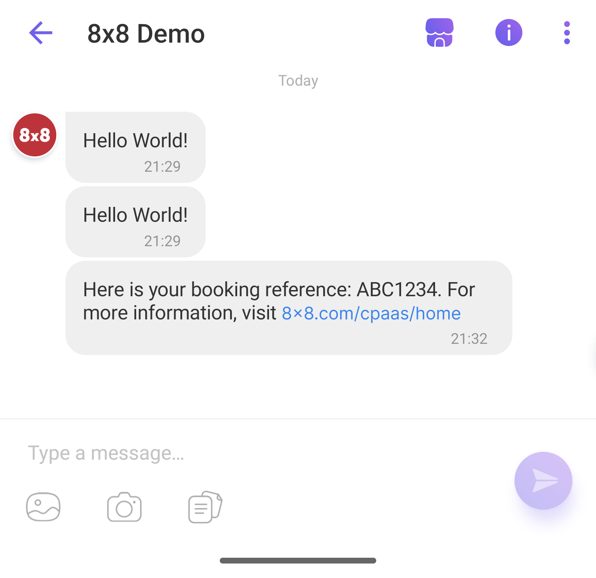
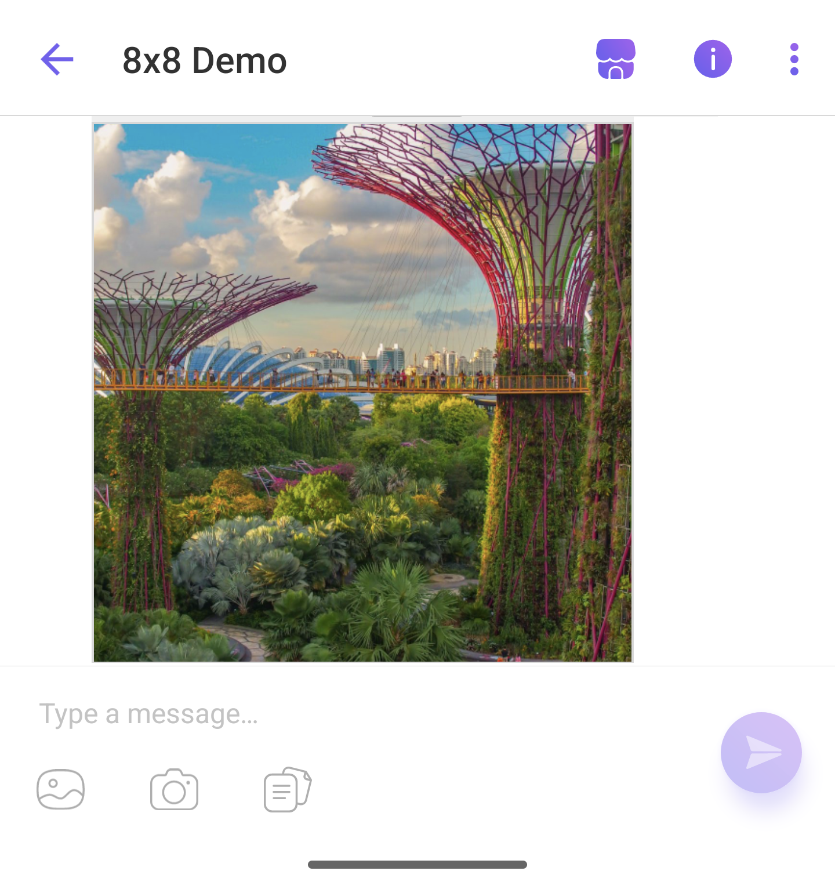
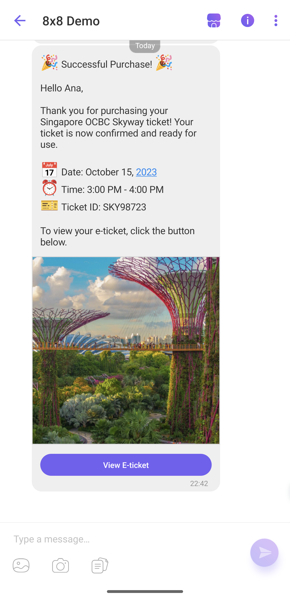
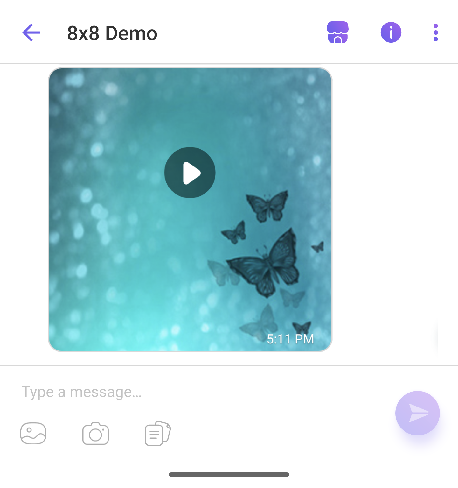
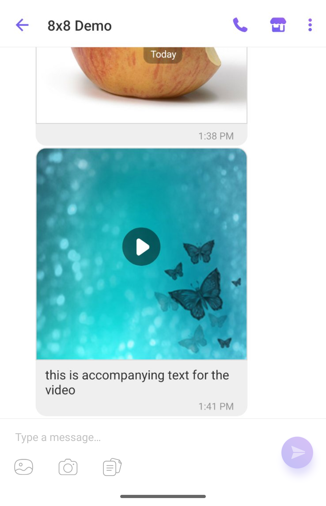
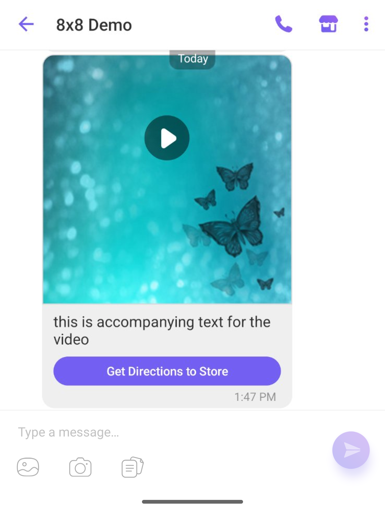
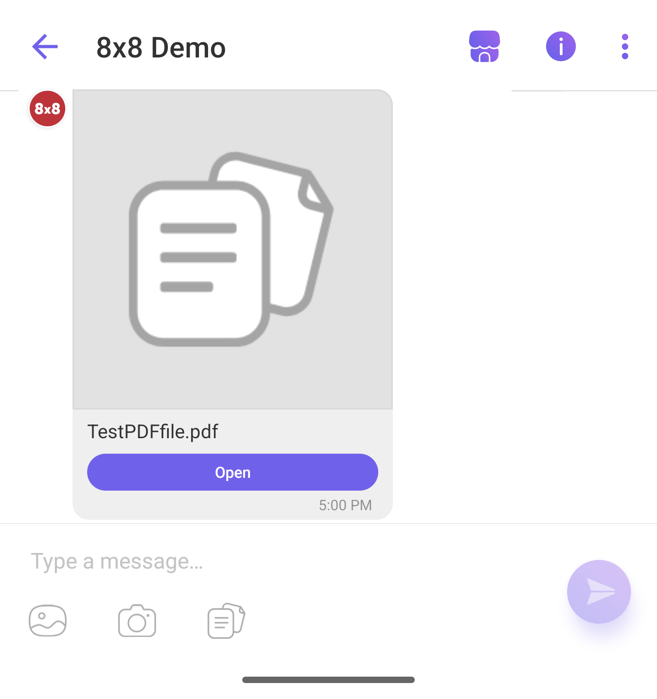
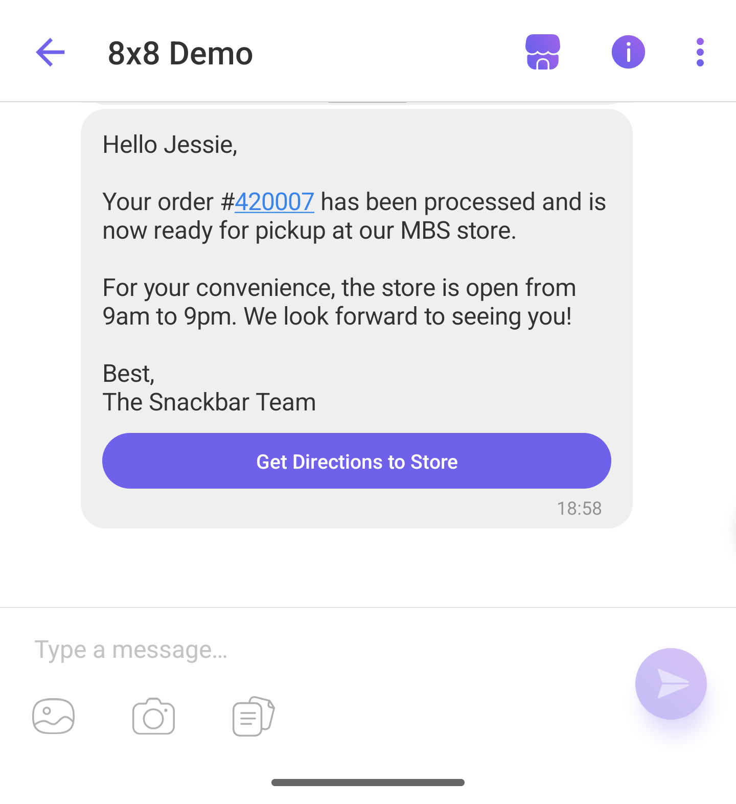

# Viber

> 👍 **Please see [Messaging API](/connect/reference/send-message) for the full API reference.**
>
>

## Sending a Text Message

### Text only

```json
{
    "user": {
        "msisdn": "+6500000"
    },
    "type": "text",
    "content": {
        "text": "Here is your booking reference: ABC1234. For more information, visit https://8x8.com/1234!"
    }
}

```

The corresponding message the user will receive:

Viber text messages can include URL

---

## Sending a Rich Media Message

### Image only

```json
{
    "user": {
        "msisdn": "+6500000"
    },
    "type": "image",
    "content": {
        "url": "https://www.redbrick.sg/wp-content/uploads/2020/04/coleen-rivas-OZ2rS2zCjNo-unsplash-1125x1500.jpg"
    }
}

```

The corresponding message the user will receive:

Viber Rich Media: Image only message

---

### Text + Image

```json
{
  "user": {
    "msisdn": "+650000000"
  },
  "type": "image",
  "content": {
    "url": "https://www.redbrick.sg/wp-content/uploads/2020/04/coleen-rivas-OZ2rS2zCjNo-unsplash-1125x1500.jpg",
    "text": "This is the text accompanying the image"
  }
}

```

The corresponding message the user will receive:

Viber Rich Media: Text and Image

---

### Text + Image + Button

```json
{
  "user": {
    "msisdn": "+65000000"
  },
  "type": "buttons",
  "content": {
    "text": "🎉 Successful Purchase! 🎉\n\nHello Ana,\n\nThank you for purchasing your Singapore OCBC Skyway ticket! Your ticket is now confirmed and ready for use.\n\n📅 Date: October 15, 2023\n\n⏰ Time: 3:00 PM - 4:00 PM\n\n🎫 Ticket ID: SKY98723\n\nTo view your e-ticket, click the button below.",
    "url": "https://www.redbrick.sg/wp-content/uploads/2020/04/coleen-rivas-OZ2rS2zCjNo-unsplash-1125x1500.jpg",
    "button": {
      "caption": "View E-ticket",
      "action": "https://ocbcskyway.com/e-ticket/SKY1234"
    }
  }
}

```

The corresponding message the user will receive:

Viber Rich Media: Text + Image + Button

---

### Video only

Refer to [Supported Content Types](/connect/reference/supported-chat-apps-content-type) for more info on supported file formats and size limits.

##### Sample Request

```json
{
    "user": {
        "msisdn": "+6500000"
    },
    "type": "video",
    "content": {
        "url": "https://samplelib.com/lib/preview/mp4/sample-5s.mp4",
        "video": {
            "filesize": "2700",
            "duration": "5",
            "thumbnail": "https://sample-videos.com/img/Sample-jpg-image-50kb.jpg"
        }
    }
}

```

The corresponding message the user will receive:

Viber Rich Media: Video-only message

---

### Text + Video

Refer to [Supported Content Types](/connect/reference/supported-chat-apps-content-type) for more info on supported file formats and size limits.

```json
{
  "user": {
    "msisdn": "+6500000"
  },
  "type": "video",
  "content": {
"text": "this is accompanying text for the video",
    "video": {
      "filesize": "2700",
      "duration": "5",
      "thumbnail": "https://sample-videos.com/img/Sample-jpg-image-50kb.jpg"
    },
    "url": "https://samplelib.com/lib/preview/mp4/sample-5s.mp4"
  }
}

```

The corresponding message the user will receive:

Viber Rich Media: Text + Video

---

### Text + Video + Button

```json
{
    "user": {
        "msisdn": "+6500000000"
    },
    "type": "video",
    "content": {
        "text": "This is the accompanying text for the video",
        "video": {
            "filesize": "2700",
            "duration": "5",
            "thumbnail": "https://sample-videos.com/img/Sample-jpg-image-50kb.jpg"
        },
        "url": "https://samplelib.com/lib/preview/mp4/sample-5s.mp4",
        "button": {
            "caption": "Get Directions to Store",
            "action": "https://maps.google.com/?q=Your+Store+Location"
        }
    }
}

```

The corresponding message the user will receive:

Viber Rich Media: Text + Video + Image

---

### File only

Refer to [Supported Content Types](/connect/reference/supported-chat-apps-content-type) for more info on supported file formats and size limits.

##### Sample Request

```json
{
    "user": {
        "msisdn": "+6500000"
    },
    "type": "file",
    "content": {
        "url": "https://www.clickdimensions.com/links/TestPDFfile.pdf"
    }
}

```

The corresponding message the user will receive:

Viber Rich Media: File-only message

---

### Text + Button

```json
{
    "user": {
        "msisdn": "+6500000"
    },
    "type": "buttons",
    "content": {
        "text": "Hello Jessie,\n\nYour order #420007 has been processed and is now ready for pickup at our MBS store. \n\nFor your convenience, the store is open from 9am to 9pm. We look forward to seeing you!\n\nBest,\nThe Snackbar Team",
        "button": {
            "caption": "Get Directions to Store",
            "action": "https://maps.google.com/?q=Your+Store+Location"
        }
    }
}

```

The corresponding message the user will receive:

Viber Rich Media: text and call-to-action button

---

### Text + Image (deprecated)

```json
{
    "user": {
        "msisdn": "+650000"
    },
    "type": "buttons",
    "content": {
        "text": "Hello Mr Jobs,\n\nDon't miss our upcoming summer sale! Starting next Monday, enjoy up to 20% off on selected apple-based products.\n\nBest,\nThe Grocerio Team",
        "url": "https://www.abc.net.au/reslib/201408/r1320712_18276029.jpg",
        "button": {
            "caption": "",
            "action": ""
        }
    }
}

```

> 📘 **Button Object**
>
> The button attribute is required but it will not show up in the message if the caption and action fields are blank.
>
> This implementation has been updated. Please refer to [Text+Image](/connect/docs/usage-samples-viber#text--image) for latest API request format
>
>

> 🚧 **Deprecated**
>
> This API request format has been updated. Please refer to [Text+Image](/connect/docs/usage-samples-viber#text--image) for the latest latest API request format
>
>

The corresponding message the user will receive:

Viber Rich Media message: Text and Image

## Optional: Adding SMS Fallback

If you want to add a fallback to SMS, add the following fields to the "`content`" object in your existing JSON payload:

```json
{
  "fallbackText": "Đây là OTP của bạn: 23124. Đừng chia sẻ nó với bất cứ ai.",
  "sms": {
    "encoding": "AUTO",
    "source": "<senderId>"
  }
}

```

> 📘
>
> You may find out more about SenderID [here](/connect/docs/getting-started#1-source-sms-senderid)
>
>
