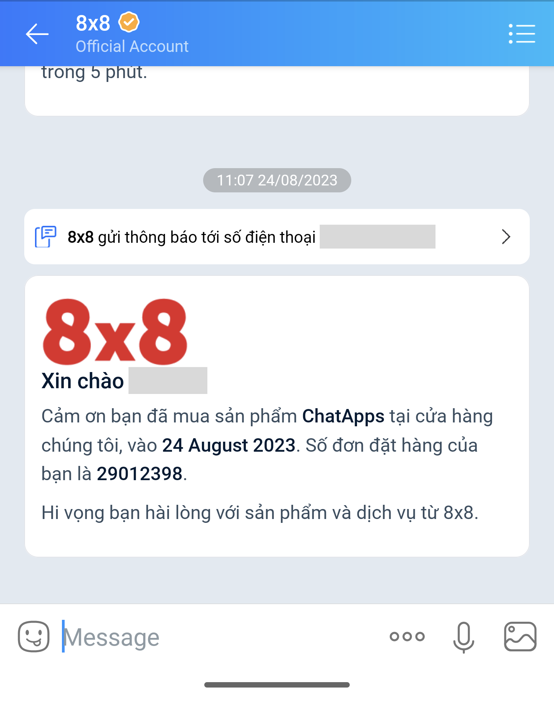
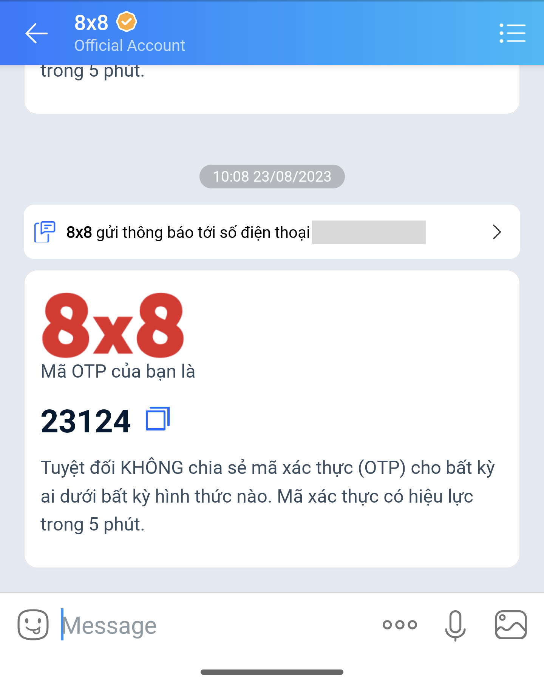

# Zalo Notification Service (ZNS)

> ❗️
>
> Zalo Notification Service requires **templates** to be approved by the Zalo team.  
>
> Contact [cpaas-support@8x8.com](mailto:cpaas-support@8x8.com) or your account manager to submit new templates.
>
>

> 👍Please see [Messaging API](/connect/reference/send-message) for the full API reference.
>
>

### Sending a notification message

If you want to send a notification  **text message** with custom parameters via ZNS, your request payload should look like this:

```json
{
  "user": {
    "msisdn": "+84123456789"
  },
  "clientMessageId": "\<optionalClientMessageId\>",
  "type": "template",
  "content": {
    "template": {
      "name": "\<insertTemplateId\>",
      "language":"en",
      "components":[
      {
        "type": "body",
        "parameters": [
          {
            "type": "text",
            "text": "Ana",
            "name":"customer"
          },
          {
            "type": "text",
            "text": "ChatApps",
            "name": "product"
          },
          {
            "type": "text",
            "text": "24 August 2023",
            "name": "date"
          },
          {
            "type": "text",
            "text": "29012398",
            "name": "order"
          }
          ]
      }]
    }
  },
  "channels": [ { "channel": "ZaloNotification" } ]
}

```

The corresponding message the user will receive:

Sample notification via ZNS

---

### Sending an OTP message

If you want to send an **OTP message** via ZNS, the request payload will look like the following:

```json
{
  "user": {
    "msisdn": "+84123456789"
  },
  "clientMessageId": "\<optionalClientMessageId\>",
  "type": "template",
  "content": {
    "template": {
      "name": "\<insertTemplateId\>",
      "language": "en",
      "components": [
        {
          "type": "body",
          "parameters": [
            {
              "type": "text",
              "name": "otp",
              "text": "23124"
            }
          ]
        }
      ]
    }
  },
  "channels": [
    {
      "channel": "ZaloNotification"
    }
  ]
}

```

The corresponding message the user will receive:

Sample OTP via ZNS

---

### Optional: Adding SMS Fallback

If you want to add a fallback to SMS, add the following fields to the "`content`" object in your existing JSON payload:

```json
{
  "fallbackText": "Đây là OTP của bạn: 23124. Đừng chia sẻ nó với bất cứ ai.",
  "sms": {
    "encoding": "AUTO",
    "source": "\<senderId\>"
  }
}

```

> 📘
>
> You may find out more about SenderID [here](/connect/docs/getting-started#1-source-sms-senderid)
>
>
