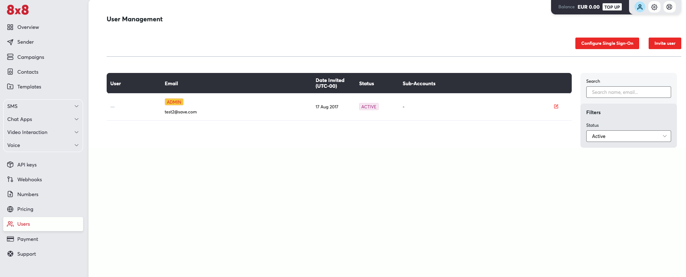
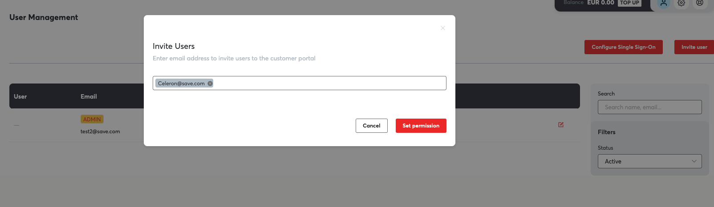
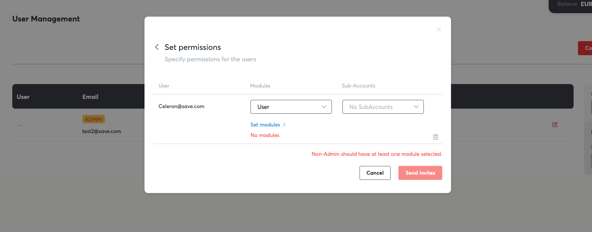
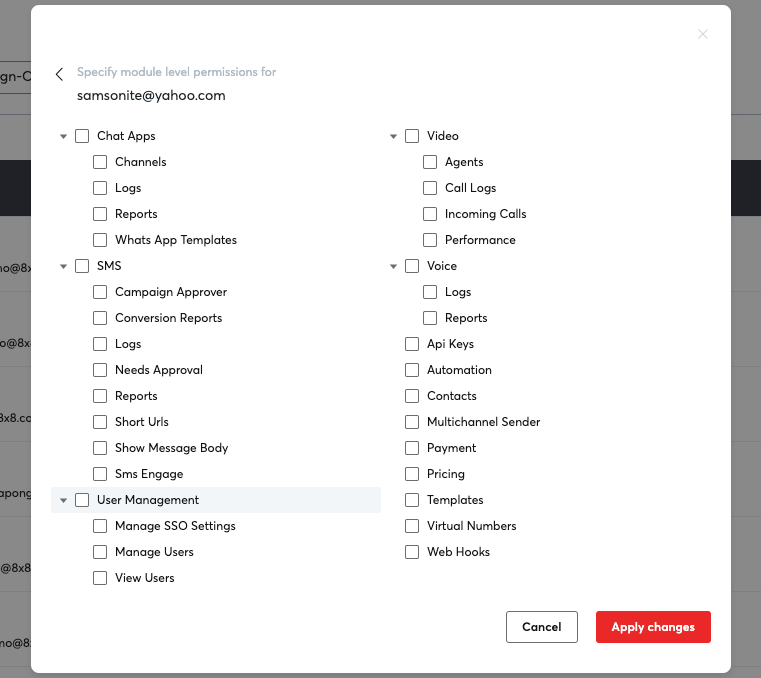
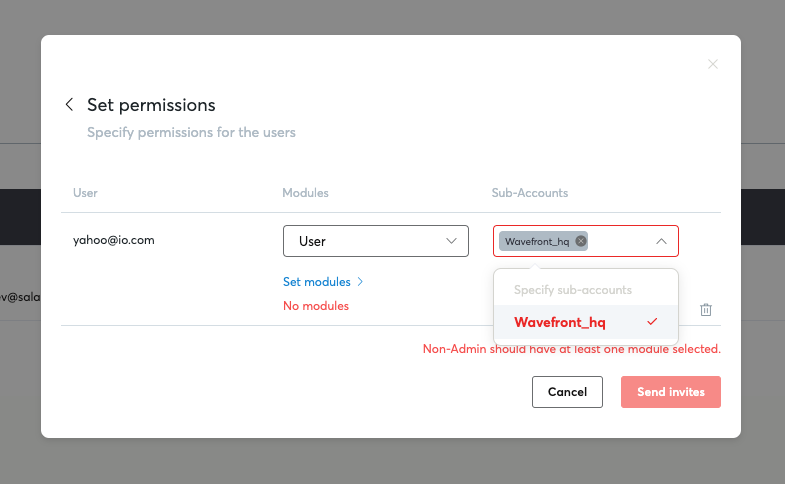
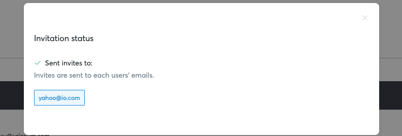

# User management

The user management feature allows you to manage users from adding, deleting, disabling and giving access to Connect menus and features.

## Inviting or adding a new user on Connect

*(This assumes the user is already logged in and has "user management" access or with admin level privileges)*

1. Go to the left navigation menu and click "Users". Alternatively, you can also click the "gear" icon on the top right menu just beside your profile icon and select "User management".

2. Click "Invite user" and start typing the new user's email on the field provided.

3. Click "Set permissions" then click "Set modules" so you can start selecting the menus or features you want to give to your new user.

4. Start selecting the menu or features you want to enable for your new user. Take note that some products like Chat Apps, Automation, Voice, Video are not enabled by default because these are premium products. If you are interested please contact your account manager or [cpaas-support@8x8.com](mailto:cpaas-support@8x8.com)

5. Alternatively, you can also select the sub-accounts(if you have several sub-accounts configured under your account). Click "Send invites" once you are done selecting the menus or sub-accounts.

6. A popup message will be shown confirming that the invite has been sent.

