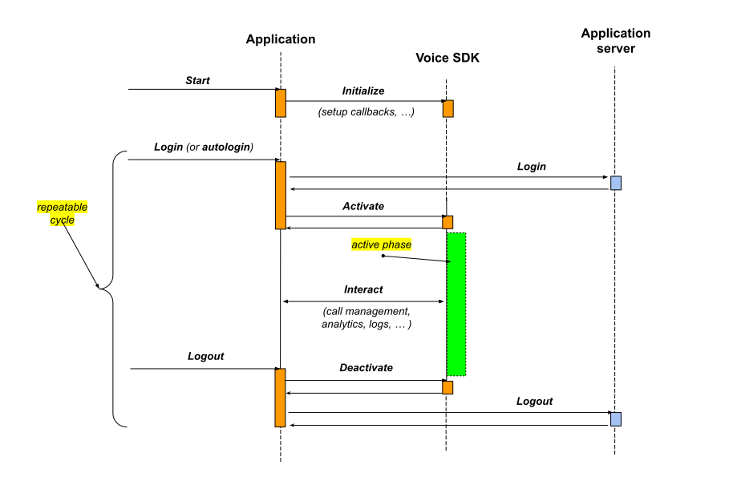

# Using the iOS SDK

* [Overview](#overview)
* [Lifecycle](#lifecycle)
* [Configuration](#configuration)
  * [User account](#user-account)
  * [CallKit](#callkit)
* [Authentication](#authentication)
* [Callbacks](#callbacks)
  * [Log message](#log-message)
  * [Contact resolution](#contact-resolution)
  * [Audio session](#audio-session)
* [Activation](#activation)
* [Deactivation](#deactivation)
* [Call](#call-features)
  * [Place an outgoing call](#place-an-outgoing-call)
  * [Receive an incoming call](#receive-an-incoming-call)
  * [Call observer protocols](#call-observer-protocols)
  * [Mute a call](#mute-a-call)
  * [Put a call on hold](#put-a-call-on-hold)
  * [Hang up a call](#hang-up-a-call)
* [Push notifications](#push-notifications)

## Overview

The **`VoiceSDK`** facade object is the starting point for all communications between the client and the Voice SDK.

## Lifecycle

The Voice SDK is designed to fit the concept of account based applications where the application has ***login*** (auto-login) and ***logout*** actions.  

The SDK client initializes the Voice SDK once and then may have multiple activation/deactivation cycles following user login or logout.



## Configuration

To configure the Voice SDK you assign the user account configuration (**`Configuration`**) as follows:

```swift
 let sdk = VoiceSDK.shared
 // …
 sdk.configuration = Configuration(...)

```

The configuration can be updated at any time after SDK initialization.

```swift
struct Configuration: Hashable {
   var accountId: String
   var userId: String
   // …  
   var displayName: String
   var phoneNumber: String?
   // …
   var callKit: CallKitOptions
}

```

## User account

The **`accountId`** and **`userId`** can only be changed when the SDK is in the **`.inactive`** state.

## CallKit

The SDK has a built-in integration with the CallKit framework.  

The SDK client can use `CallKitOptions` to customize the CallKit configuration.

```swift
struct CallKitOptions: Hashable {
   var localizedName: String
   // …  
   var ringtoneSound: String?
   // …
   var iconFileName: String?
}

```

The `callKit` property can only be changed when there are no active calls.

## Authentication

The SDK client passes the **`jwtToken`** to the SDK by setting (updating) the **`authenticationContext`** property of **`VoiceSDK`** object as follows:

```swift
sdk.authenticationContext.jwtToken = jwtToken
sdk.authenticationContext.callback = { [weak self] token in
   // token refresh is requested
   self?.refreshToken()
}

```

## Callbacks

You can modify certain aspects of SDK functionality by setting the following callbacks:

* [Log message](#log-message)
* [Contact resolution](#contact-resolution)
* [Audio session](#audio-session)

### Log message

If the **`logMessageCallback`** is set, the Voice SDK stops to print messages to the console and passes them to the client:

```swift
VoiceSDK.logMessageCallback = { module, message, level, context in
   // print log message to the console
}

```

The log message **`logMessageCallback`** can be set before Voice SDK initialization.

### Contact resolution

If the **`contactResolverCallback`** is set, the Voice SDK uses this callback to request the contact (caller) details when the incoming call notification (push) arrives on a device.

The Voice SDK uses the **`displayName`** property value (from contact details) as the caller name on an incoming call screen.

```swift
struct ContactInfo: Contact {
   var contactId: String
   var displayName: String?
   var avatarUrl: String?
   var phoneNumber: String?
   // …
}
…
VoiceSDK.contactResolverCallback = { context, completion in
   // …
   let contact = ContactInfo(contactId: context.callerId, 
                             displayName: context.callerName, 
                             avatarUrl: nil, phoneNumber: nil)
   completion?(contact)
}

```

The SDK client adopts the **`Contact`** protocol and returns the adjusted information in a **`completion`** handler.

### Audio session

The Voice SDK requests client to configure an Audio Session via **`audioSessionConfigurationCallback`**.

```swift
VoiceSDK.audioSessionConfigurationCallback = { session in
   do {
      let mode: AVAudioSession.Mode = .voiceChat
      try session.setCategory(.playAndRecord, mode: mode, options: [.allowBluetooth])
      try session.overrideOutputAudioPort(.none)
      try session.setPreferredIOBufferDuration(0.01)
   } catch let error {
      //…
   }
}

```

The Voice SDK has **`audioSessionActivated`** property which indicates if Audio Session is activated (or deactivated) by CallKit.

```swift
var audioSessionActivated: CurrentValueSubject<Bool, Never> { get }

```

## Activation

To activate the **`VoiceSDK`**, the client invokes the **`activate`** function:

```swift
func activate(completion: @escaping (_ result: Result<Void, ErrorType>) -> Void)

```

```swift
sdk.activate { result in
   switch result {
   case .success:
   //…
   case .failure:
   //…
   }
}

```

Upon a **`.success`** notification, the `VoiceSDK` object transitions to the **`.active`** state.

Otherwise, it comes back to the `.inactive` state.

```swift
enum State {
  case inactive, activating, active, deactivating
}
//…
sdk.state

```

The client can adopt the `VoiceSDKObserverProtocol` protocol and receive notifications on the `VoiceSDK` object state change:

```swift
func addObserver(_ observer: AnyObject)

```

```swift
sdk.addObserver(client)
//…

func handleStateChanged(_ state: VoiceSDK.State) {
   // …
}

```

## Deactivation

To deactivate the **`VoiceSDK`** client, invoke the **`deactivate`** function:

```swift
func deactivate(completion: @escaping (_ result: Result<Void, ErrorType>) -> Void)

```

```swift
sdk.deactivate { result in
   switch result {
   case .success:
   //…
   case .failure:
   //…
   }
}

```

Upon successful completion, the `VoiceSDK` object transitions to an **`.inactive`** state.

## Call features

* [Place an outgoing call](#place-an-outgoing-call)
* [Receive an incoming call](#receive-an-incoming-call)
* [Call observer protocol](#call-observer-protocols)
* [Mute a call](#mute-a-call)
* [Put a call on hold](#put-a-call-on-hold)
* [Hang up a call](#hang-up-a-call)

### Place an outgoing call

When an outgoing call is placed the following function is used:

```swift
func placeCall(callType: CallType, to callee: Contact,
               completion: @escaping (Result<VoiceCall, ErrorType>) -> Void)

```

```swift
//…
let completionBlock: (Result<VoiceCall, ErrorType>) -> Void = { result in
   switch result {
   case .success(let call):
   // present UI
   default: break
   }
   completion(result)
}
let parameters = OutgoingCallParameters(callType: .voip, callee: callee)
sdk.placeCall(with: parameters, completion: completionBlock)
//…

```

### Receive an incoming call

When you configure the SDK for incoming calls, the client adopts the **`CallSetObserverProtocol`** protocol and registers the observer with the `VoiceSDK` object:

```swift
class MyVoiceSDKClient: CallSetObserverProtocol {
//…
   func handleCallAdded(_ call: VoiceCall) {
      if call.direction == .inbound {
      // present UI
      }
   }
//…
}

```

```swift
let client = MyVoiceSDKClient(...)
//…
sdk.addObserver(client)

```

### Call observer protocols

The **`VoiceCall`** object is observable.

The SDK client can subscribe for changes by adopting the following protocols:

* **`VoiceCallStateObserverProtocol`**
* **`VoiceCallConnectionQualityObserverProtocol`**
* **`VoiceCallMutedStateObserverProtocol`**

and registering as an observer with the **`VoiceCall`** object:

```swift
//…
call.addObserver(client)
//…

```

### Mute a call

The **`VoiceCall`** object has the **`muted`** property which enables call muting as follows:

```swift
protocol VoiceCall: class {
//…
   var muted: CallMutedState { get set }
//…  
}

```

You can mute (or unmute) the call by assigning the corresponding value to the property:

```swift
call.muted = .on // .off

```

### Put a call on hold

Use the following **`hold`** function for call holding:

```swift
protocol VoiceCall: class {
//…
   func hold(_ completion: ((CallActionCompletionStatus) -> Void)?)
   func resume(_ completion: ((CallActionCompletionStatus) -> Void)?)
//…
}

```

```swift
call.hold { status in
   switch status {
   //
   case .done:
   //
   case .canceled:
   //
   case .failed:
   }
}

```

The execution of the **`hold (resume)`** operation implicitly triggers the call state change.

### Hang up a call

Use the **`hangup`** function to end the call:

```swift
protocol VoiceCall: class {
//…
   func hangup(_ completion: ((CallActionCompletionStatus) -> Void)?)
//…
}

```

```swift
call.hangup { status in
   switch status {
   case .done:
   //
   case .canceled:
   //
   case .failed:        
   }
}

```

On completion the call transitions to the **`disconnected`** state.  

Additionally, the Voice SDK removes the call from the **`calls`** list.

## Push Notifications

The Voice SDK handles **PushKit** notifications internally.

However, for debugging purpose, the SDK exposes the **`pushToken`** property as part of the **`VoiceSDK`** object.

Additionally, the client can monitor the push notification payload or observe the token change by using the **`PushNotificationObserverProtocol`** protocol.
