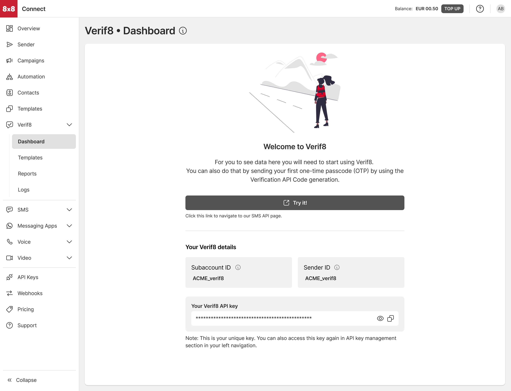

# Guide: Verif8

## Introduction

Verif8 is designed as a turnkey, self-service solution for sending One-Time Passwords (OTPs). It centralizes the entire OTP lifecycle - Sender ID management, OTP generation, multi-channel delivery, and validation - into a single platform with a simplified onboarding process.

### Core Attributes

* No documentation or registration required
* Pre-approved templates mean no moderation delays
* Shared Sender ID (no dedicated branding) by default
* Sign-up directly through 8x8 Connect portal

### Key Features

1. Out-of-the-box Localisation
  * Supports multiple languages
  * Pre-built templates ensure consistency and compliance
2. Multi-Channel OTP Delivery via SMS and Viber
3. Insightful Analytics: Dashboards for tracking delivery success, conversion rates, and performance
4. Analytics & Logs  

A dedicated dashboard (shown on page 14) includes:

* Conversion rate, delivery metrics
* Logs showing OTP status, costs, delivery channels

Verif8 subaccounts, which you can identify by their '_verif8' suffix, are purpose-built and can only be used with our Verification API. These subaccounts cannot interact with other APIs in the 8x8 Connect platform, including the SMS API, and are not compatible with Campaign Manager. This specialization allows us to optimize the verification experience by pre-configuring templates, sender IDs, and routing rules specifically for verification use cases.

For example, if your application needs to send both verification codes and marketing messages, you'll need to use separate subaccounts:

* Use your Verif8 subaccount (ending in '_verif8') for all verification-related communication
* Use your standard 8x8 Connect subaccount for marketing messages and other communication types

## Pricing

Each verification attempt through Verif8 involves two potential cost components:

### Message Fee

This is charged when your verification request is submitted and varies based on the destination country and channel used. For example, sending an SMS verification to the United States might have a different message fee than sending one to Singapore. This fee is charged regardless of whether the end user successfully completes the verification process.  

Think of this like postage - you pay to send the letter whether or not the recipient reads it.

### Conversion Fee

The conversion fee is what makes Verif8 unique - it's only charged when a verification is successful. Success means your end user correctly validated the OTP code they received. This success-based pricing model aligns our service with your verification goals. The conversion fee is standardised per successful verification, making it easy to forecast costs for successful verifications across all destinations.

For a complete breakdown of message fees for each country and channel, please visit the 8x8 Connect Pricing page in your dashboard.

## Prerequisites

* Command line interface compatible with CURL
* 8x8 CPaaS account
* apiKey (Bearer token)
* Verif8 subaccountid (you can find this in your account dashboard - it will end with '_verif8')
* Destination phone number

You'll notice that Message Body and Brand name (SMS SenderID) are no longer required. This is because Verif8 operates as a fully managed service, handling these aspects automatically on your behalf. When you send a verification request, our system selects pre-approved message templates and sender IDs that have been carefully optimized for each destination country. This approach ensures maximum deliverability and compliance with local regulations while simplifying the integration process for you.

---

## Account and credentials

*You will need to sign up to use the API. The following steps will guide you through this process and highlight the information to keep aside.*

### I. Signing-up for Connect

1. Head to [8x8 Connect sign-up page](https://connect.8x8.com/login/signup)
2. Enter your email and follow the instructions to define your password and finalise your account (by default, API password and account password are the same, you can modify this from your account settings)
3. Confirm your email address by clicking on the validation link you received in the activation email to activate your account.

### II. Sign up for Verif8

1. Click on "Verif8" in the main navigation list
2. Go through the guided onboarding to create your subaccount and corresponding API keys.

  
You will be able to find your API keys for your Verif8 sub-account from the "API Keys" post your Verif8 onboarding.

### Integrate the Verification API into your authentication flow

Verif8 requires you to use the [Verification API](/connect/reference/verification-api-get-started) instead of the standard SMS API.

To learn more about 8×8 Verif8, explore the [interactive demo](https://8x8.navattic.com/rbw0ovm?g=cm67kt2r9000u03jo57bwe9mo&s=0) or [sign up](https://connect.8x8.com/verif8/) for self-service onboarding.
