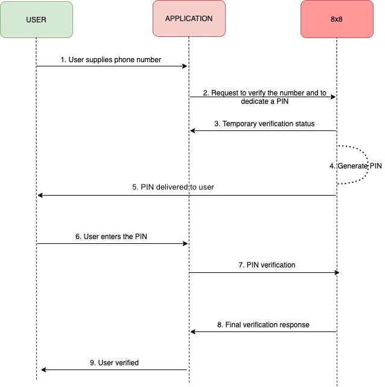

# Getting started with Verification API

The Verify API enables customers to implement 2FA (two-factor authentication) into their applications. It is often used to provide an extra layer of security for the user.

The most common use cases are:

- Phone number verification - usually, during the user registration process, service will ask customers to insert the phone number. To verify the provided number, a PIN is generated and sent to that phone number. By entering the PIN back into the application, the user can verify the ownership of the phone number.
- User Identity Confirmation - During the login process, after successfully entering username and password, the application sends out a PIN to the customer’s phone number.
- Fraud Prevention - Track malicious login attempts on your applications.

This API offers two different ways of PIN delivery, that can be set up in the &lt;channel&gt; parameter of the Verify API:

- SMS - PIN is sent in a text message to the end user’s phone
- Voice - PIN is delivered in a phone call to the end user’s phone
- WhatsApp - PIN is sent via WhatsApp to the end user

The general workflow is shown in the following sequence diagram:

#### Demo Video of 8x8 Verif8 Service and 8x8 Verification API

This video shows:

- The API Keys page on 8x8 Connect and how a user can get the API Key and Verif8 Subaccount details.
- The Verif8 dashboard upon onboarding can be shown using the Dry-run account.
- This shows  Verif8 Logs the delivery status (Delivered/Read) of the OTP and the Conversion status (Non-Converted / Converted)

<iframe
  src="https://www.youtube.com/embed/NZnieeEofBs?si=cav-R03QIuWqDKdD"
  height="500px"
  width="100%"
  allow="picture-in-picture; web-share"
  allowFullScreen>
</iframe>
  
This shows the API Keys page on getting the API Key and Verif8 Subaccount.  
The Verif8 dashboard upon onboarding can be shown using the Dry-run account.  
This shows  Verif8 Logs the delivery status (Delivered/Read) of the OTP and the Conversion status (Non-Converted / Converted)

## Server Regions

To ensure the use of the correct data center region, it is necessary to modify the base URL to correspond with the provisioned region of your account. Refer to the table below for the appropriate base URL associated with each data center region.

For more information on data center regions, please visit the following [page](/connect/docs/data-center-region#api-endpoints-and-data-center-region).

**List of server URLs:**

| API Region     | Base URL                                         |
|:---------------|:-------------------------------------------------|
| Asia (default) | [https://verify.8x8.com](https://verify.8x8.com) |
| Europe         | [https://verify.8x8.uk](https://verify.8x8.uk)   |
| Indonesia      | [https://verify.8x8.id](https://verify.8x8.id)   |
