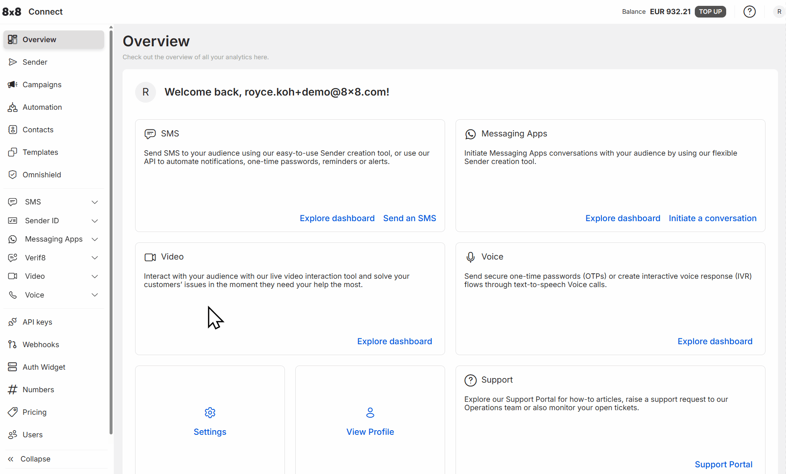
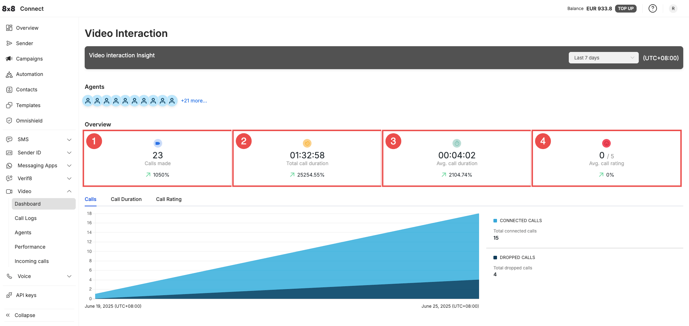
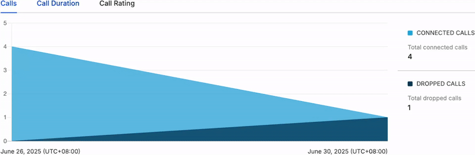
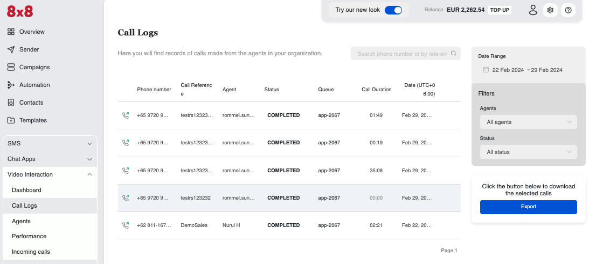
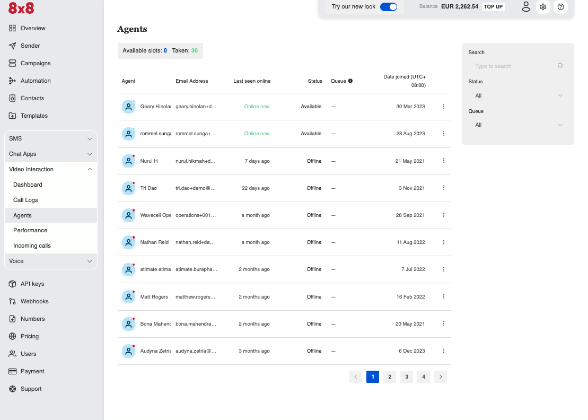
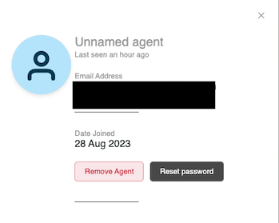
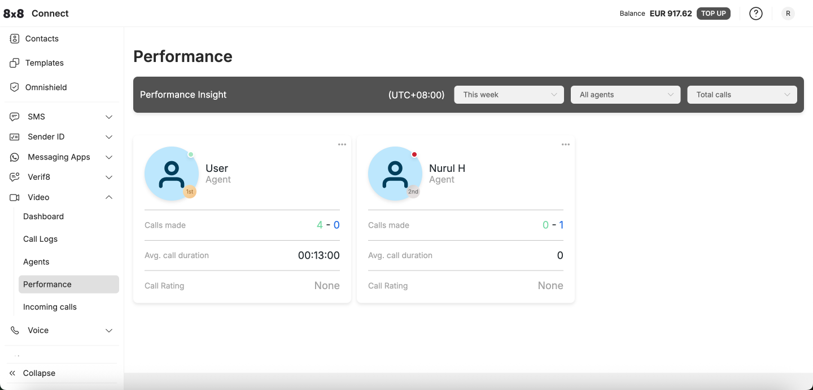
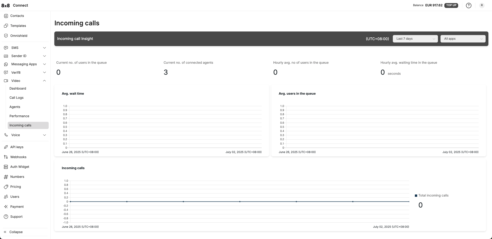

# Administrator Interface

## Accessing the Admin Panel

To access the administration panel for Video Interaction, log into 8x8 Connect.

You can access 8x8 Connect from [this](https://connect.8x8.com/video) link. When you are logged into 8x8 Connect, from the Side Bar menu select **"Video"**

## Dashboard

The Dashboard gives an overview of Video Interaction calls across all of your agents.

In the screen you can select a date range from the dropdown menu in the top-right corner to view its corresponding metrics such as:

1. **Calls Made:** # of calls made by agents over this date range.
2. **Total Call Duration:** Duration of calls across all agents in this date range.
3. **Average Call Duration:** How long on average each call lasted.
4. **Average Call Rating:** Refers to the rating the customer gave regarding the call.

The graphs also show the number of calls, call duration and call rating over time.

## Call Logs

The Call Logs screen displays a detailed breakdown of each agent's Video Interaction calls.

On the screen you will see information such as:

* **Phone Number**: Refers to the phone number of the customer.
* **Call Reference**: What call reference value was inputted by the agent or via the API.
* **Agent**: Which agent handled the call.
* **Status**: Whether the call is completed, ongoing or other status.
* **Queue**: What queue the call was assigned to.
* **Call Duration**: Length of the call.

There is also the option to export the call logs as a .csv file to download to your browser.

## Agents

The agents screen will show information regarding your agents.

It will have the following information for each agent:

* **Agent Name:** Display Name of the Agent
* **Email Address:** Login email address tied to the Agent
* **Last Seen Online:** When the Agent was last seen online
* **Status:** If Agent is Online/Offline
* **Queue:** What Queue the Agent is currently tied to
* **Date Joined:** When the Agent was added to the system

Clicking an agent's opens their details page, where you can either remove them or reset their password.

## Performance

Inside the performance screen, you will be able to see each agent's performance for a given date range. It contains the following statistics:

* **Calls Made:** Number of calls made, separated into **Connected Calls (Green)** and **Failed Calls (Blue)**.
* **Avg. Call Duration:** How long each connected call lasted.
* **Call Rating:** The call rating given to the agent by customers.

You can view all agents performance at a glance or filter by a specific agent to help measure performance.

## Incoming Calls

The incoming calls screen gives insights into the customer experience when it comes to waiting time in the queue for incoming calls. This includes measurements about the current status of the queue and the averaging wait for each customer over a given time period.

