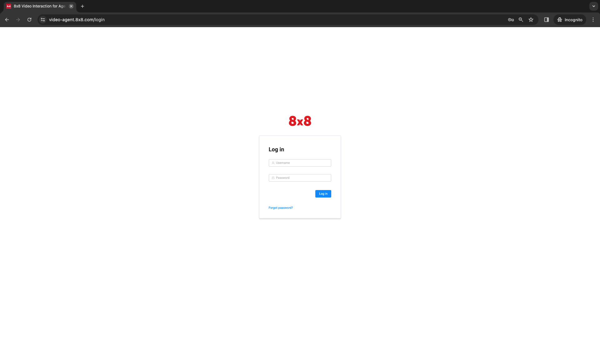
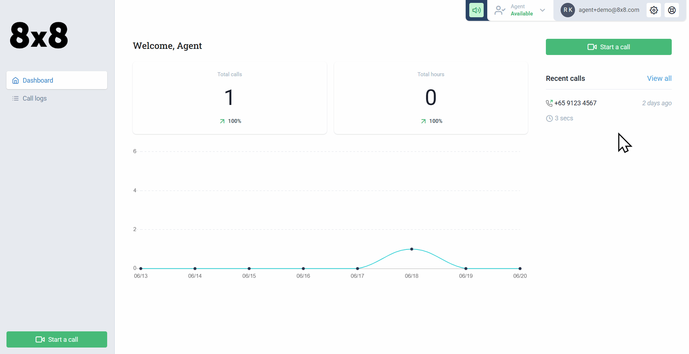
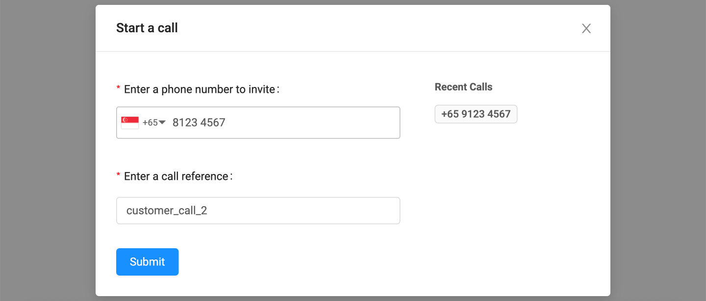
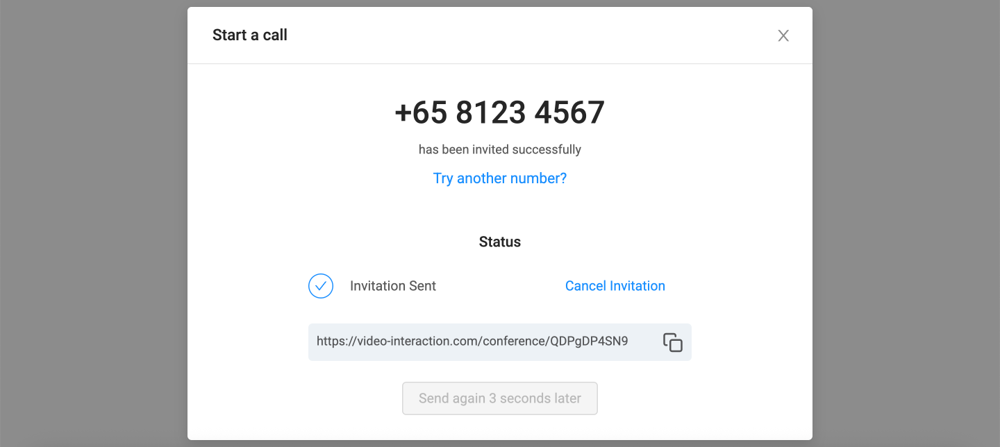
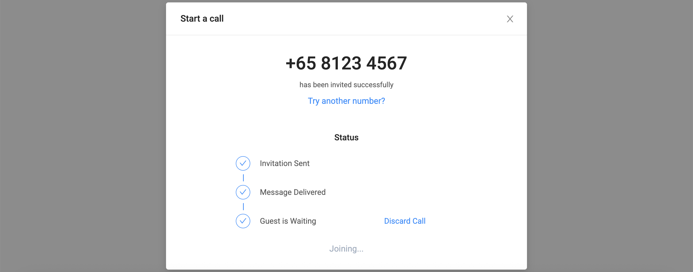
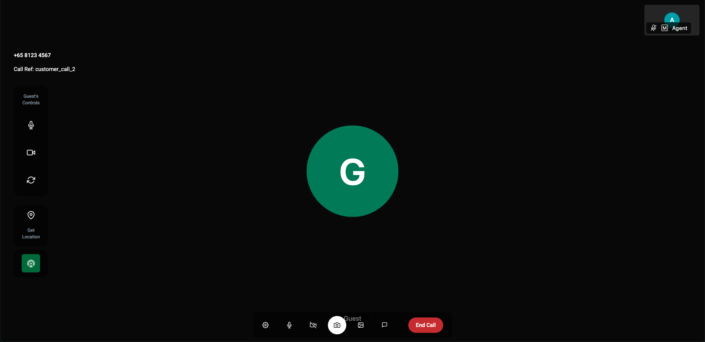
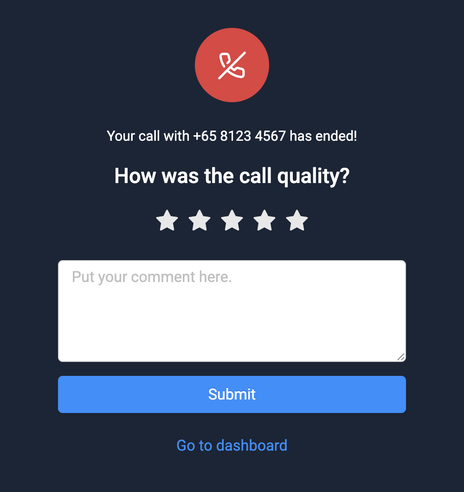
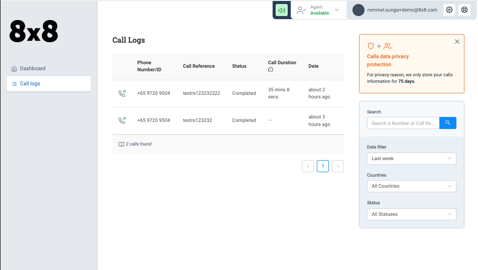
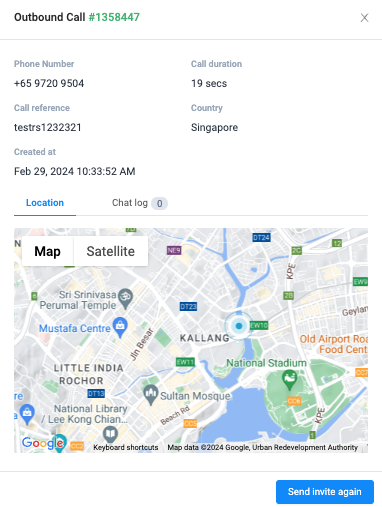

# Agent Interface

## Agent Login

To login, the agent can open the following URL:  

🌍 [https://video-agent.8x8.com/login](https://video-agent.8x8.com/login) (Only accessible after signing up for VI)

Video Interaction Login Screen

Each agent will receive an invite via email and have their own login details.  

In the case of facing issues logging in, please try “Forgot Password” and follow the onscreen instructions.

## Placing a Call

From the home screen, an agent can place a call by clicking on the **"Start a Call"** button.

This will open a dialog box with two fields:

- **Phone Number:** The customer phone number to send an SMS invite to.
- **Enter a Call Reference:** This is so you can enter a unique string (such as "customer_call_2") which would be associated with this call. This used not only in the VI User Interface Call Log but also in the API when you want to later refer to a call.

Once the invitation is placed, the agent will see this pop up screen while they wait for the customer to accept the call.

When the customer opens the invitation link to the call, the pop up screen will be updated and the agent will be automatically connected to the call.

## During a call

Once the customer joins the call, the agent will also join the call. The call interface is shown below with the key settings available to the agent explained.

**Mute Customer Audio:** Turn on/off the customer's microphone.

**Turn On/Off Customer Video:** Turn on/off the customer's camera.

**Flip from Back to Front Camera:** Forces the customer camera to either back or front cameras of their smartphone device.

**Obtain Customer Location:** This will open up a map to display a customers current location in a longitude/latitude format.

**Low Bandwidth Mode:** This will toggle the quality of video received by the agent.

**Agent Settings:** Control Various Settings related to the agent's UI.

**Mute Microphone:** Mute's the agent's microphone.

**Turn on/off Agent's Camera:** Enable/Disable the agent's camera.

**Take Screenshot:** Takes a screenshot of the agent's video view and allow annotation.

**Virtual Background Settings:** Change the Agent's Virtual Background Settings such as the image to use, blur, etc.

**Open Chat:** Open's the Chat Window Between the Agent and the Customer, supports text-only messaging.

**End Call:** Terminate and leave the call.

Here are the following options available to the agent:

1. **Mute Customer Audio:** Turn on/off the customer's microphone.
2. **Turn On/Off Customer Video:** Turn on/off the customer's camera.
3. **Flip from Back to Front Camera:** Forces the customer camera to either back or front cameras of their smartphone device.
4. **Obtain Customer Location:** This will open up a map to display a customers current location in a longitude/latitude format.
5. **Low Bandwidth Mode:** This will toggle the quality of video received by the agent.
6. **Agent Settings:** Control Various Settings related to the agent's UI.
7. **Mute Microphone:** Mute's the agent's microphone.
8. **Turn on/off Agent's Camera:** Enable/Disable the agent's camera.
9. **Take Screenshot:** Takes a screenshot of the agent's video view and allow annotation.
10. **Take Photo**: Takes photo using guest's camera.
1. The video stream will be paused as the guest's camera is required for photo taking.
2. Video stream will resume once the photo has been taken.
3. Annotation isn't available.
11. **Virtual Background Settings:** Change the Agent's Virtual Background Settings such as the image to use, blur, etc.
12. **Open Chat:** Open's the Chat Window Between the Agent and the Customer, supports text-only messaging.
13. **End Call:** Terminate and leave the call.

### Take Screenshot - Annotation

When using the **Take Screenshot** feature, it is possible for the agent and the customer to annotate a screenshot in real time.

In the image below, yellow markings are from the customer while blue/teal markings are from the agent.

Hover over the buttons in the image below for more details.

**Delete Screenshot:** Immediately deletes the screenshot and resumes the normal video call.

**Undo all:** Reverses either the customer or the agent's actions on the annotation.

**Undo Single:** Reverses the last annotation by the customer or agent

**Send Annotation:** Sends the current annotation image to the chat for either party to view.

The available commands for both the customer and agent are:

1. **Delete Screenshot:** Immediately deletes the screenshot and resumes the normal video call.
2. **Undo all:** Reverses either the customer or the agent's actions on the annotation.
3. **Undo Single:** Reverses the last annotation by the customer or agent
4. **Send Annotation:** Sends the current annotation image to the chat for either party to view.

## Call End

After a call ends, both the agent and the customer will be able to rate the call quality and add a comment. The agent will also be able to return to their Agent Dashboard.

## Call Logs

The agent can view details of previous calls in the call log menu including:

- **Phone Number** : Refers to the number of the customer
- **Call Reference**: What call reference value was inputted by the agent or via the API.
- **Status**: Whether the call is completed, ongoing or other status.
- **Call Duration**: Length of the call
- **Date**: When the call was placed

Opening each individual Call Log will reveal further detail about that call:

- **Location of the Customer**: Available only if gathered during the call
- **Chat Logs**: Messages sent in the chat window between the agent and customer.
- **Invite Again**: The option to send another invitation to the customer.

## Iframe Integration

This documentation refers to the agent interface that is embedded into the Video Interaction Dashboard. However there is the option to embed the calling experience into another system via iframe. More information on how to integrate the iframe is available [here](/connect/reference/iframe-integration).
