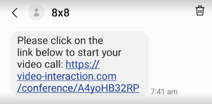
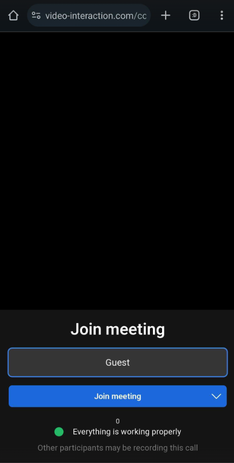
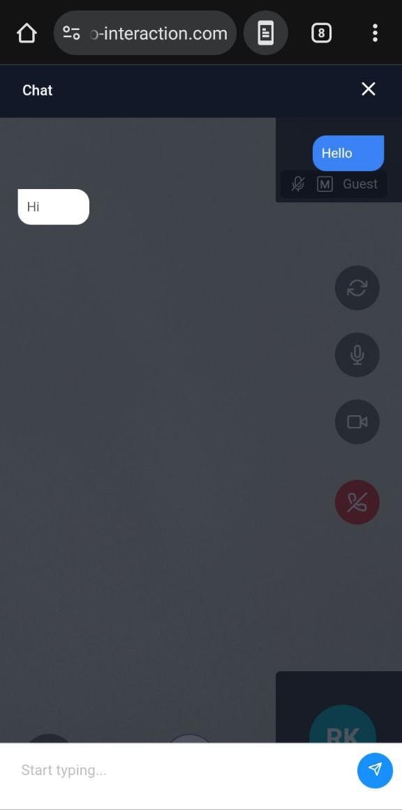

# Customer Interface

## Overview

When a customer is first invited by an agent to join a call, they will receive an SMS with a link to join a call. Upon clicking onto the link, it will launch their mobile browser where they can use the video conferencing solution to speak with an agent.

## SMS Link

Here is what the SMS Link will look like for the customer.

## Video Room

Upon clicking the link, the customer will first be taken to a room lobby where they can fill out their display name for the agent to see.

Here is what the call screen looks like once the customer joins and the relevant buttons explained below.

**Camera Flip:** Flip between front and back camera on the smartphone device.

**Mic On/Off:** Allows customer to mute/unmute.

**Camera On/Off:** Allows customer to turn on/off their camera.

**End Call:** Ends the call for both agent and customer.

**Chat:** Open Chat Window to allow the customer to chat.

**Take Screenshot:** Take a screenshot of the current screen.

The following options are available:

1. **Camera Flip:** Flip between front and back camera on the smartphone device.
2. **Mic On/Off:** Allows customer to mute/unmute.
3. **Camera On/Off:** Allows customer to turn on/off their camera.
4. **End Call:** Ends the call for both agent and customer.
5. **Chat:** Open Chat Window to allow the customer to chat.
6. **Take Screenshot:** Take a screenshot of the current screen.
7. **Take Photo**: Take photo using the device camera. A dialog will appear asking the guest to grant permission and proceed with the photo capture.

The image below shows the Chat window as it appears to a customer, which is used to exchange messages with an agent. The customer's messages are displayed in right-aligned blue bubbles, and the agent's messages are in left-aligned white bubbles.

### Take Screenshot - Annotation

When using the **Take Screenshot** feature, it is possible for the agent and the customer to annotate a screenshot in real time.

In the image below, yellow markings are from the customer while blue/teal markings are from the agent.

**Delete Screenshot:** Immediately deletes the screenshot and resumes the normal video call.

**Undo all:** Reverses either the customer or the agent's actions on the annotation.

**Undo Single:** Reverses the last annotation by the customer or agent

**Send Annotation:** Sends the current annotation image to the chat for either party to view.

The available commands for both the customer and agent are:

- **Delete Screenshot:** Immediately deletes the screenshot and resumes the normal video call.
- **Undo all:** Reverses either the customer or the agent's actions on the annotation.
- **Undo Single:** Reverses the last annotation by the customer or agent
- **Send Annotation:** Sends the current annotation image to the chat for either party to view.
