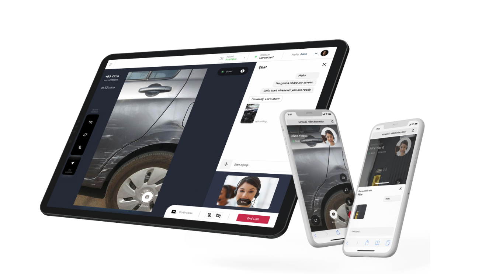

# Overview

## Introduction

Video Interaction simplifies the process of initiating video calls between customers and agents with minimal setup required. Most importantly, it eliminates the need for customers to download any additional apps; they can access the service directly from their smartphones. Here's how it works:

1. An invitation is sent to the customer via SMS.
2. The customer clicks on the invitation link.
3. The link initiates a video call directly in the customer's mobile browser, without requiring any app downloads.
4. The agent is able to join the call from their browser, connecting to the customer within seconds.

## Video Overview

For a overview of video interaction, please see this video which will take you through the major features of Video Interaction and an example of an outbound call to a customer.

<iframe
  src="https://www.youtube.com/embed/HvAA5xkh0mI?si=v-3wZH8Myws1YZhz"
  height="500px"
  width="100%"
  allow="picture-in-picture; web-share"
  allowFullScreen>
</iframe>
  
## API Docs

For detailed information on Video Interaction's supporting API, please refer to this [link](https://8x8-enterprise-group.readme.io/connect/reference/vi-introduction).
