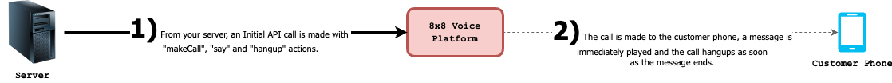

# Voice Messaging Guide

Guide on the voice messaging use case using our callflows API

Below is a sample of a Voice Message call scenario. When the API call is made, the 8x8 Voice Platform will send an outbound TTS (Text-To-Speech) to the MSISDN +6512345678 and hangs up when the playback is done.

## Description of Callflow

1. Outbound Call is made to a user by making an API request to the Callflows API
2. Customer picks up the call and is played a test message.
3. Call immediately hangs up as soon as the message played.

## Diagram of Callflow



***

**Callflow Actions used in a successful Voice Messaging call scenario**

- [x] [`makecall`](/connect/docs/makecall)
- [x] [`say`](/connect/reference/call-flow-actions-say)  [`playFile`](/connect/reference/call-flow-actions-playfile)
- [x] [`hangup`](/connect/docs/hangup)

`POST voice.8x8.com/api/v1/subaccounts/{sub-account-id}/callflows`

```json Sample Voice Messaging Request \[TTS]
{
  "validUntil": "<utc_timestamp>", 
  "callflow": [
          {
          "action": "makeCall",
          "params": {
            "source": "6512341234",
            "destination": "6512345678"
            }
        },
        {
        "action": "say",
        "params": {
            "text": "Hello, this is a test Voice Message.",
            "voiceProfile": "en-IE-EmilyNeural",
            "repetition": 1,
            "speed": 1
            }
        },
        {
          "action": "hangup"
        }
    ]
}
```

```json Sample Voice Messaging Request \[Playfile]
{
  "validUntil": "<utc_timestamp>",
  "callflow": [
          {
          "action": "makeCall",
          "params": {
            "source": "6512341234",
            "destination": "6512345678"
            }
        },
        {
        "action": "playFile",
        "params": {
            "fileUrl": "https://sample-videos.com/audio/mp3/wave.mp3",
            "repetition": 2,
            }
        },
        {
          "action": "hangup"
        }
    ]
}
```

#### Make Call

- Creates an outbound voice call to the specified destination with the caller id specified as source. source and destination values must be valid MSISDNs in E.164 standard (+ prefix is accepted). Once the call is answered by the receiving party, the rest of the callflow actions will be executed in sequence. If two makeCall actions are used in the same call, the 2nd call will be bridged to the 1st call once answered. Current we do not support call conferencing, so maximum allowed makeCall actions in a callflow is 2.
- The subsequent actions in the callflow will be executed on the call(s) created by the makeCall action. Hence the makeCall action must be the first action in a callflow.
- Allowed destinations to dial depend on the customer account’s coverage (Please contact your account manager for any change in coverage)
- In order to create an outbound call to a destination using a source that is in the same country (local outbound), we need the source(caller id) to be a registered MSISDN under the account). If using a source MSISDN that does not belong in the same country as destination MSISDN (international outbound). Due to the complexity of the carrier regulations, the calls can be rejected if these rules are not respected

```json makeCall Sample
{
  "action": "makeCall",
  "params": {
    "source": "+6512345678", // mandatory
    "destination": "+6587654321" // mandatory
    }
}
```

#### Say

- This action converts the given text in to a speech and plays it in the currently active call.
- voiceProfile defines the characterises of the generated speech. A non-comprehensive list of supported voice profiles can be found [here](/connect/reference/vm-voice-languages-and-profiles).
- repetition controls how many times the speech is played back, and speed controls the speed of the speech.

```json
{  
    "action": "say",  
    "params": {  
        "text": "Hello, this is a Voice Message.", //mandatory  
        "voiceProfile": "en-US-ZiraRUS", //mandatory  
        "repetition": 1, //optional  
        "speed": 1 //optional  
    }  
}
```

#### playFile

- Downloads the sound/voice file give and plays it back in the currently active call. Supported file types are wavand mp3. API only accepts file that are smaller than 5MB.
- Downloaded voice files are cached for 1 hour for faster access, if used in consequent requests. If the file content is changed within 1 hour after the first request, make sure to change the file name for the changes to be reflected in the calls afterwards.
- repetition controls how many times the file will be played. Default is 1

```json Sample of playFile
{  
"action": "playFile",  
"params": {  
    "fileUrl": "<https://sample-videos.com/audio/mp3/wave.mp3">,    // mandatory  
    "repetition": 1     //optional  
    }  
} 
```

#### Hangup

- Disconnects the active call. If there are two calls in the session, both will be disconnected. This will terminate the session, triggering the session summary webhook.

```json
{  
"action": "hangup"  
}
```

***

### Example of initial API call to place outbound call

This is the URL to send a the API request to.

`/POST voice.8x8.com/api/v1/subaccounts/{sub-account-id}/callflows`

This is the request body to send the API request to as well.

```json Sample Voice Messaging Request \[TTS]
{
  "validUntil": "2024-07-03T05:59:32.226Z",  
  "callflow": [
          {
          "action": "makeCall",
          "params": {
            "source": "6512341234",
            "destination": "6512345678"
            }
        },
        {
        "action": "say",
        "params": {
            "text": "Hello, this is a test Voice Message.",
            "voiceProfile": "en-IE-EmilyNeural",
            "repetition": 1,
            "speed": 1
            }
        },
        {
          "action": "hangup"
        }
    ]
}
```

```json Sample Voice Messaging Request \[Playfile]
{
  "validUntil": "2024-07-03T05:59:32.226Z",  
  "callflow": [
          {
          "action": "makeCall",
          "params": {
            "source": "6512341234",
            "destination": "6512345678"
            }
        },
        {
        "action": "playFile",
        "params": {
            "fileUrl": "https://sample-videos.com/audio/mp3/wave.mp3",
            "repetition": 2,
            }
        },
        {
          "action": "hangup"
        }
    ]
}
```

***

### Response

**Success**

```json
{
    "sessionId": "d9874358-89ac-4c50-bbab-1eb634482a94",
    "sessionStatus": "CREATED",
    "callFlowRequestId": "89b545a5-0676-11ee-8100-d500c0d203fc",
    "statusCode": 1,
    "statusMessage": "Created"
}
```

**Failure**

```json
{
    "sessionStatus": "NOT_CREATED",
    "callFlowRequestId": "0564e804-0a7e-11ee-9c83-6df9c048a122",
    "statusCode": -1002,
    "statusMessage": "Speech profile or language parameter invalid"
}
```

***

### Explaining Session Status

Session status indicates if a call is successfully accepted & created or not created on the 8x8 platform. 8x8 returns two status:

- `CREATED`- call is successfully created on the platform.
- `NOT CREATED`- call is not successfully created on the platform and 8x8 returns `statusCode` and `statusMessage`to understand why the call was not accepted on the platform

***

### Status Code  and Status Message

| Status Code | Message |
| --- | --- |
| 1 | Created  |
| -1001 | Invalid JSON request body |
| -1002 | Speech profile or language parameter invalid |
| -1003 | Valid maxDigits required when minDigits provided |
| -1004 | DTMF callback url not provided |
| -1005 | Valid overallTimeout is required when digitTimeout provided |
| -1006 | OverallTimeout should be greater than digitTimeout |
| -1007 | Invalid action type was used. Accepted action type is [say, sayAndcapture, makeCall, hangup, playFile] |
| -1008 | Valid maxDigits is required when completeOnHash is false |
| -1009 | Invalid call flow entry provided. [Additional error details here].<br>Eg: Invalid call flow entry provided. $.callflow[0].params.text: is missing but it is required |
| -1010 | Some actions are provided beyond the allowed count |
| -1011 | Multiple destination phone numbers found in the request |
| -1012 | Invalid Callflow : Incorrect use of action Hangup |
| -1013 | Invalid Callflow : First action should be a MakeCall action |
| -1014 | Source or caller ID is not allowed |
| -1015 | The validity period of the call flow request has expired |
| -1016 | Invalid Callflow Content: Some special characters are invalid/unaccepted |
| -1017 | Invalid MSISDN format in Destination |
| -1018 | "Invalid Callflow: " or<br>"Execute Scenario cannot be processed together with other actions |
| -1019 | Invalid Callflow Content: scenarioName is null or empty |
| -9999 | An unknown error has occurred. |

***

### Session Summary Upon Termination of Call Scenario

Upon terminate of the session the session summary([VSS](/connect/reference/session-status)) will be returned via webhook. To learn more about the Voice Session Summary, please [click here](/connect/reference/session-status).
