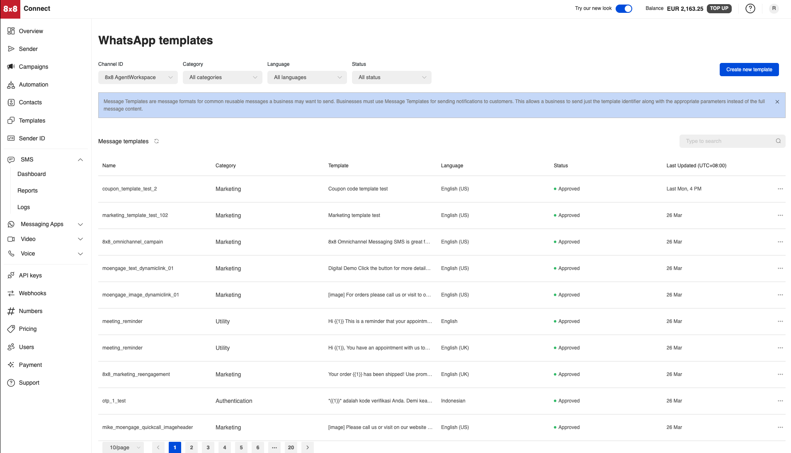
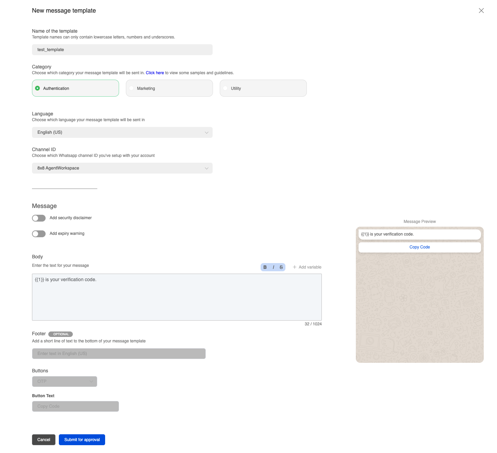
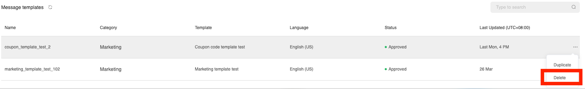

# WhatsApp Templates Management

This page will cover the options available within 8x8 Connect to manage your WhatsApp templates.

## Video Guide

This is a quick video guide that goes over the WhatsApp Template Page.

<iframe
  src="https://www.youtube.com/embed/MmshpMjE1rg?si=MQ62RQewQYGwz4rz"
  height="500px"
  width="100%"
  allow="picture-in-picture; web-share"
  allowFullScreen>
</iframe>

## Viewing Templates

To view your existing WhatsApp Templates, you can navigate to the following [page](https://connect.8x8.com/chat/templates) in 8x8 Connect which is under **Messaging Apps > WhatsApp Templates**

The page has the ability to filter by the following options:

| Column | Description |
| --- | --- |
| Channel ID | Refers to the WhatsApp Sender that the template is associated with |
| Category | Refers to the WhatsApp Conversation [Category](https://developers.facebook.com/docs/whatsapp/business-management-api/message-templates#template-categories) which can be Authentication, Marketing or Utility |
| Language | The language of the template |
| Status | The [status](https://developers.facebook.com/docs/whatsapp/message-templates/guidelines/#statuses) of the template which can be a number of status depending on if WhatsApp has approved the template, rejected the template or approved the template |

When focusing on the Message Templates themselves, they will contain the following information:

| Column | Description |
| --- | --- |
| Name | The name of the WhatsApp Template that can be used to identify it further in logs |
| Category | Refers to the WhatsApp Conversation [Category](https://developers.facebook.com/docs/whatsapp/business-management-api/message-templates#template-categories) which can be Authentication, Marketing or Utility |
| Template | The text of the template, can include parameter placeholders (i.e. `{{1}}`) that represent where you can substitute dynamic content into the text |
| Language | The language of the template |
| Status | The [status](https://developers.facebook.com/docs/whatsapp/message-templates/guidelines/#statuses) of the template which can be a number of status depending on if WhatsApp has approved the template, rejected the template or approved the template |
| Last Updated | When the template was last modified. |

## Creating Templates

WhatsApp Templates can be created using the **Create new template** button in the WhatsApp templates page above. The button will generate this pop up which will ask you to fill in details about the type of WhatsApp template that you would like to submit to WhatsApp for approval.

> 📘WhatsApp ultimately approves these templates and will reject any templates that violate their policies. Please see WhatsApp's Business Messaging Policy [page](https://business.whatsapp.com/policy) for details.
>
>

The fields that are available are:

| Field | Description |
| --- | --- |
| Name of the Template | The name that will be used to identify the template |
| Category | The [conversation category](https://developers.facebook.com/docs/whatsapp/pricing#conversation-categories) the template falls under. Either Authentication, Marketing or Utility. |
| Language | The language of the template |
| Channel ID | Refers to the WhatsApp Sender ID that is associated with the template. |
| Add Security Disclaimer | Adds a short disclaimer to the end of the message stating: "For your security, do not share this code." |
| Add Expiry Warning (For Authentication Only) | Adds a notice to the message stating when the message expires, typically for OTP codes: "This code expires in X minutes" The number of minutes can be controlled in the same interface. |
| Header | Message Header which can be appended before the body of the message.  |
| Body | The body of the message. By default the message is sent as is with the content provided. For example if the body is "Hello Customer" then the message will be sent exactly as written. For dynamic content, you can use bracketed numbers such as `{{1}}` `{{2}}` to represent dynamic content that can be substituted into the message template. This is useful when using the message template as a part of an API call so that you can dynamically substitute. For example you may have a template such as "Hello `{{1}}`, Your code is `{{2}}`" where in your API call you can provide "Chris" for `{{1}}` and "100" for `{{2}}` so the final message will be "Hello Chris, Your code is 100". |
| Footer | Small text appended to the bottom of a message. |
| Buttons | Used in certain types of message to specify two message types: - Call to Action - Quick Reply - OTP |

Once you submit the message for approval, you can use the existing template page to check on it's status and whether it is approved an able to be used with your WhatsApp Sender ID through 8x8.

## Deleting Templates

Templates can be deleted via the delete option that pops up when mousing over the row of an individual template.

## Editing Templates

It is not possible to edit WhatsApp Templates. You can create new templates to submit for approval from WhatsApp and use those instead.

## Managing Templates via API

WhatsApp Templates can be [Added](/connect/reference/add-whatsapp-template), [Deleted](/connect/reference/remove-wa-template) and [Retrieved](/connect/reference/get-whatsapp-templates) via an API. Please see the links for details.
