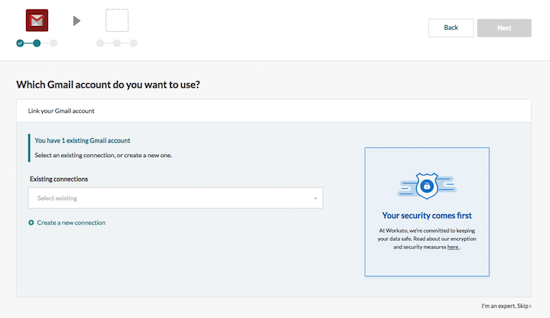
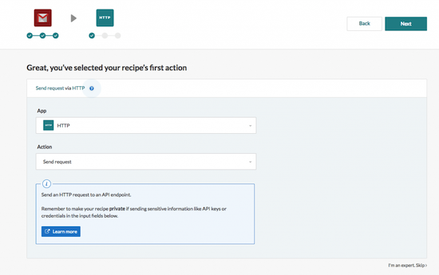
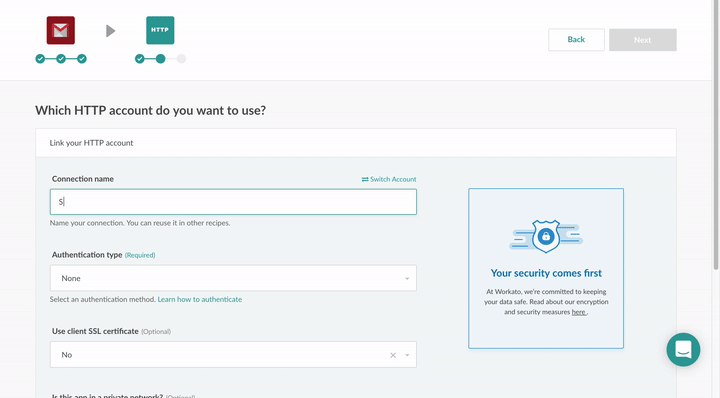
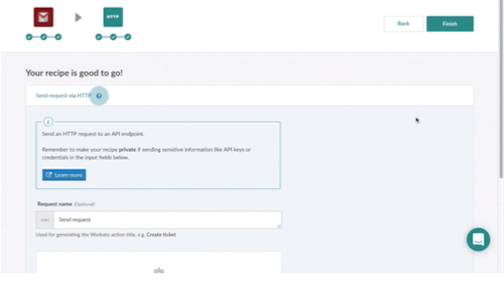
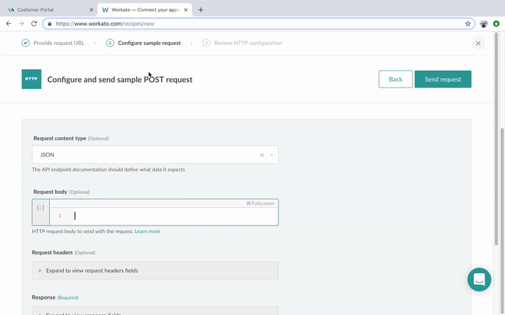

# Workato

[Workato](https://www.workato.com/) is an integrations platform that helps you connect and create automated workflows that connect apps to complete tasks composed of you based on a combination of apps, triggers, and actions.

It is often used by B2B enterprises to connect or integrate different cloud services without requiring any programming skills.

## Some use cases

* Send an SMS message when you receive a specific email.
* Send an SMS blast to customers when there's a new post on Instagram.
* Send an SMS when an invoice in Xero is marked as paid.

## Product scope

* 8x8 SMS
* All of Workato's Apps

## What you'll need

* A Workato account (Paid or Trial)
* 8x8 Connect account

## Get SMS messages for new email messages

* Create or use a Gmail account or any [apps](https://www.workato.com/integrations) supported email service by Workato

## Setup your Gmail trigger

1. Log into your Workato account. Once you are at the dashboard, click Recipes on the menu, and create a new recipe. Select an app and trigger event. The app in our case is Gmail, and our trigger event is “New email” since we want an SMS to be sent with every new email.



2. Next, you will need to link the trigger to a Gmail account. Either choose your account from the drop-down menu or link a new account. After creating the trigger, you may label it for future use.

## Setup your 8x8 SMS API



1. On the next page, type and select “HTTP” in the field under App. Then, select “Send request” as your action and click **Next**.



2. You will be asked to create a new connection and the authentication type. Name your connection, and select “Header auth” as your authentication type.
3. Enter the following header details in the space provided under “Header authorization”:

```text
 Authorization: Bearer <Your API key*>
 Content-Type: application/JSON

```

You can find your API Key on your [8x8 Connect](https://connect.8x8.com/messaging/api-keys) Create an API key if empty and then keep the API Key value, here: 5DhZxZRILVPKjXuFWsd7QGZ****\*\*****31n19pYmgAPI  


## Configure action



1. **Before clicking Finish**, you will first need to configure your action by clicking on “Configure action”.
2. Select “POST” as your method and enter the request URL. The request URL can be found at the Customer Portal under Configuration > API Keys.



3. Using the default request content type, JSON copies the JSON text, again from your API Keys. You can use your mobile number as a test. Now click Send request, and Apply configuration, and you should receive a text message

If everything went well, just click finish, and you’ve made your first integration recipe!

Test your recipe. Your recipe will check for new email and send you an SMS message when you receive any.
