# Tutorial: Google Sheets and SMS

## Requirements

* An 8x8 Connect account
* Zapier account
* Google Sheets account

## Video Guide

Please see this accompanying Video Guide for Zapier to see this integration in action.

<iframe
  src="https://www.youtube.com/embed/PURTm8coTKU?si=HNCJLA5Kl-mnDiHO"
  height="500px"
  width="100%"
  allow="picture-in-picture; web-share"
  allowFullScreen>
</iframe>
  
## Tutorial

### Google Sheet Setup

This tutorial will show you how to integrate Google Sheets with 8x8's SMS API. When a record is added to the Google Sheet spreadsheet, it will trigger a corresponding SMS which can use data from the record as part of the destination and message that sent.

Before we start on Zapier, create a new Google Sheet in your Google Account that you can access with the following format. This will be used later to add new rows and trigger the Zap.

The sheet should have **Phone Number** in Cell A1 and **Message** in Cell B1 to serve as headers.

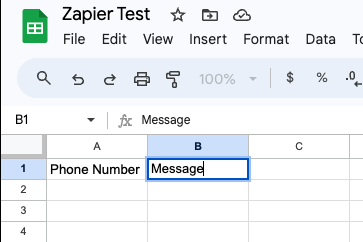

### Create a new Zap

From your Zapier dashboard, create a new Zap. The name of the Zap can be configured to any value.

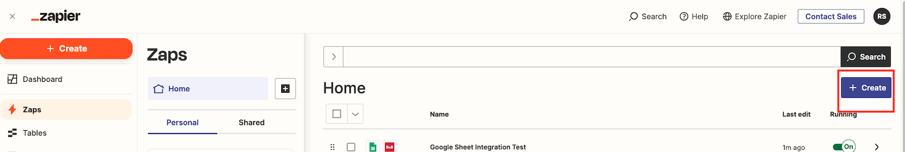

### Add new trigger

Add a new trigger for a new spreadsheet row.

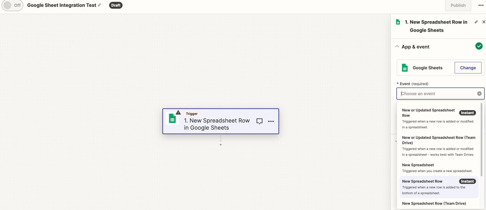
You will be asked to connect your Google Sheets account to Zapier.

### Test Trigger

You will need to add a new row to your Google Sheet and then click **"Test Trigger"**

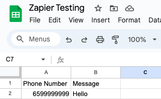

This should result in a successful test where it finds the spreadsheet row.

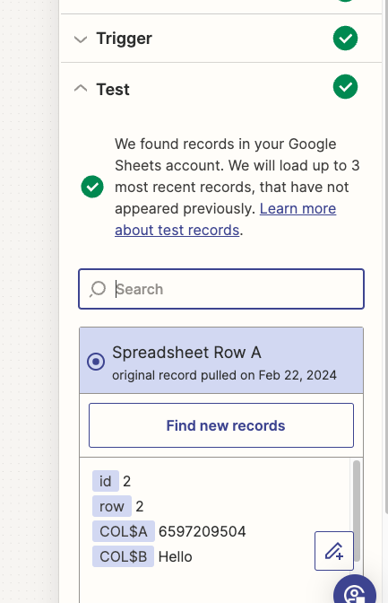

### Send Single SMS

Now create a new step using the 8x8 action.

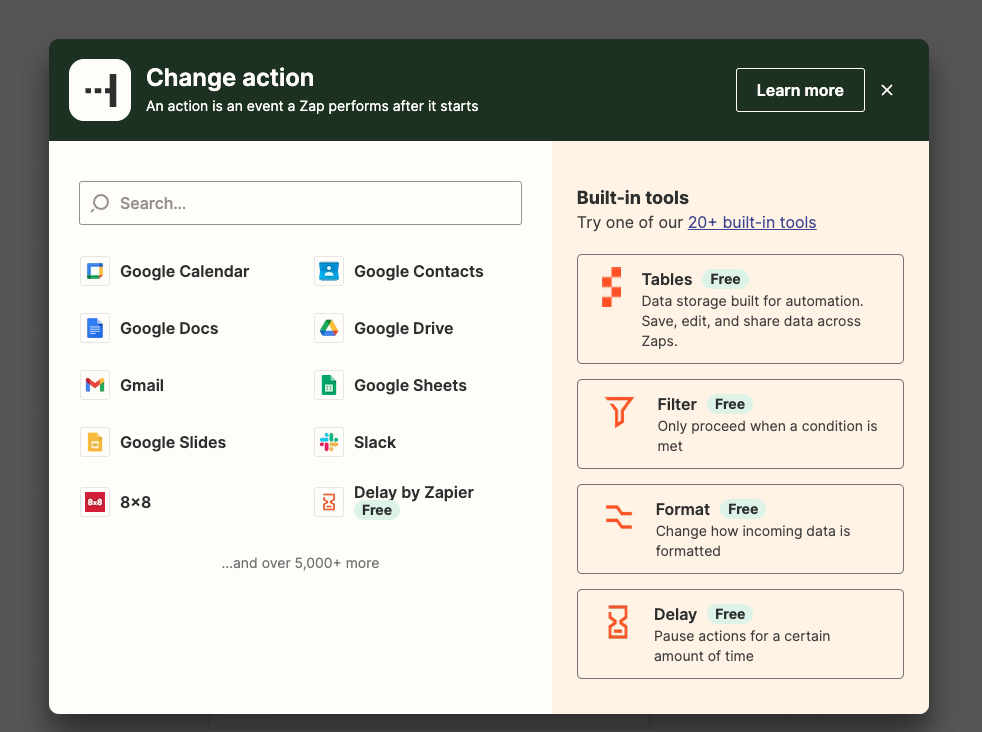

Afterwards, tie it to the **"Send Single SMS in 8x8"** event.

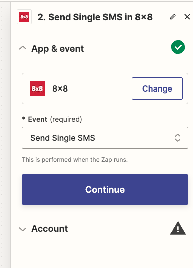

Choose an 8x8 account to link to.

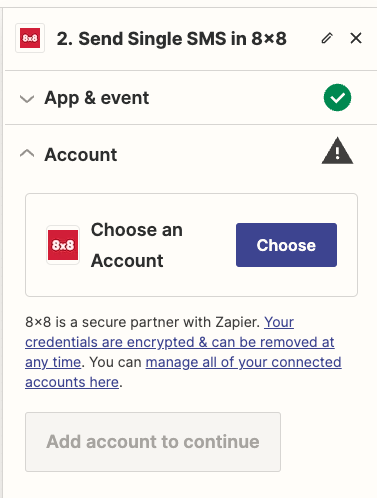

Now when selecting the Action, you should be able to select Google Sheets-related values for the fields. Select **"Phone Number"** for the Destination Number and **"Message"** for the Message in the action.

The Sender ID can be your registered Sender ID for SMS.

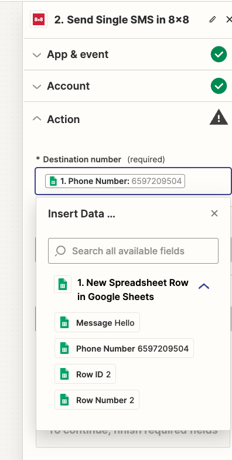
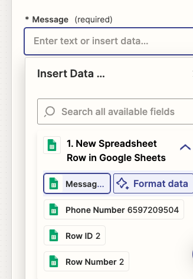
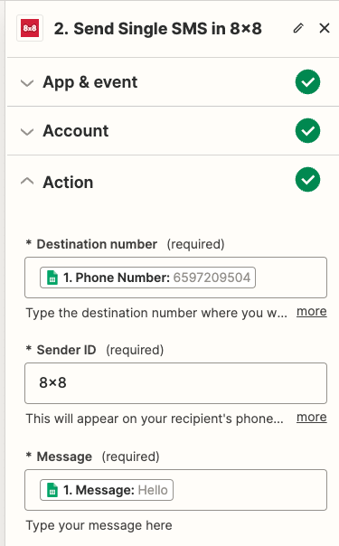

Now with the action configured, proceed to test the step.

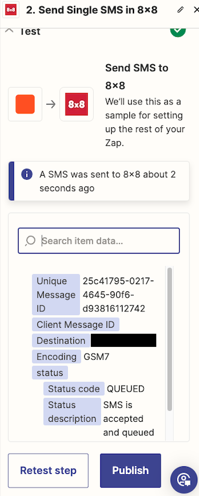

If you see the screen above the test is successful, you should have received an SMS to your number. You can now publish the Zap. Once published it will continue to monitor the same Google Sheet and then send a SMS whenever a new record is added.
