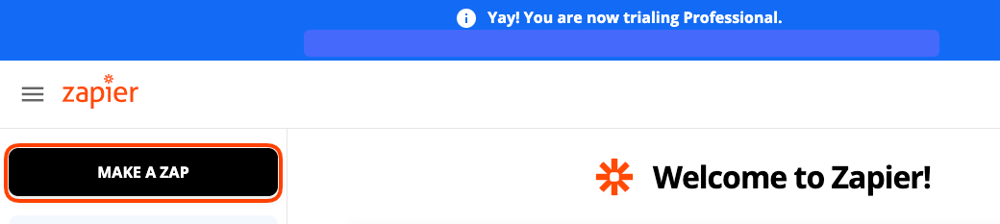
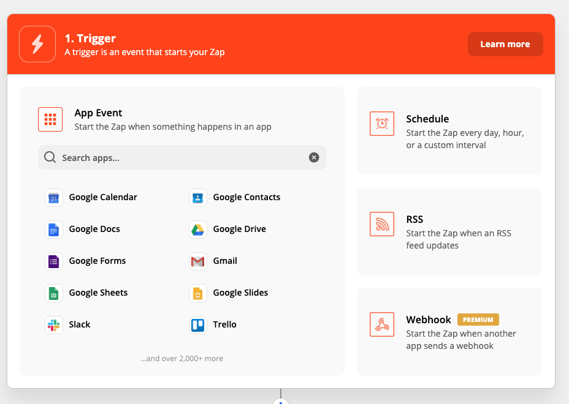
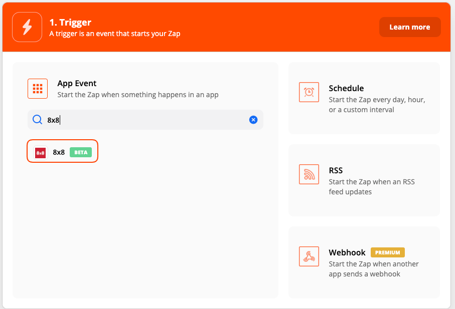
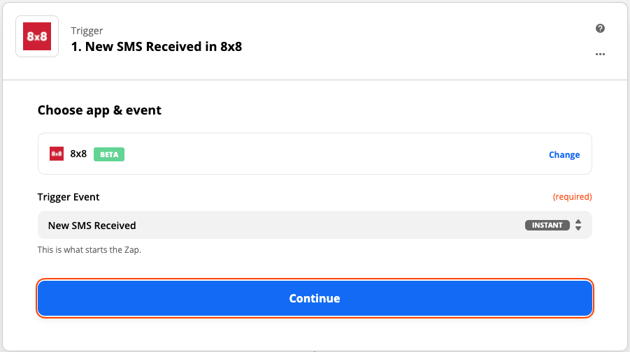
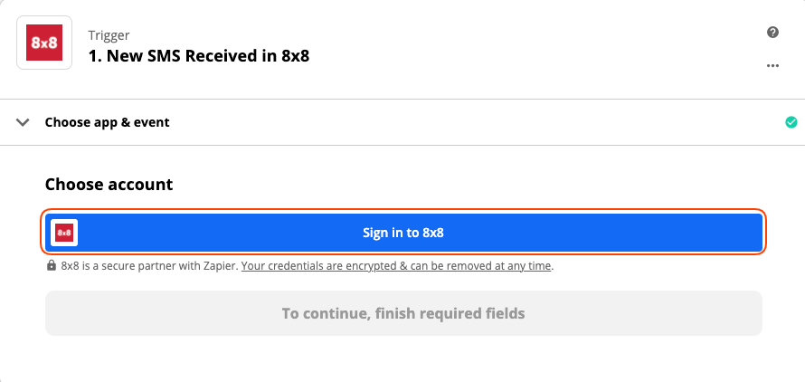

# Zapier

[Zapier](https://zapier.com/apps/8x8/integrations) is a service that helps you automate workflows between different apps automatically.

Zapier allows you to instantly connect 8x8 with 5,000+ apps to automate your work and find productivity superpowers.

## Some use cases

* Send an SMS message when you receive a specific email.
* Send an SMS blast to customers when there's a new post on Instagram.
* Send an SMS/Whatsapp template message when an invoice in Xero is marked as paid.
* Send an SMS/Whatsapp template message when an invoice in Xero is due.

## Product scope

* All of Zapier's Apps

## What you'll need

* An 8x8 Connect account
* Paid or trial professional Zapier account

**Creating a zap with your Zapier account and 8x8 app**

1. Login to your Zapier Account and create a new Zap by clicking "Make a Zap".

2. Whether you want to use 8x8 app as a trigger or action, search "8x8" from the list of apps.

3. Click **continue**.

4. You will be prompted to `Choose account`, click **Sign in to 8x8**.

5. You will be asked to enter your 8x8 **apiKey** and **subaccountID**. Assuming you have successfully logged into [8x8's Connect Portal](https://connect.8x8.com/)
6. If you entered them correctly, you’ll get sent back to your Zap where you will now have your 8x8 Connect account successfully connected!

## Supported Triggers

* **New Chat Apps message received** : Triggers when a new Chat app message is received.
* **New SMS message received** : Triggers when a new SMS message is received.
* **New Delivery receipt** : Triggers when an SMS message has been rejected or delivered.

## Supported Actions

* **Send Single SMS** : Sends an SMS to a given phone number.
* **Send Bulk SMS** : Sends an SMS to multiple phone numbers at the same time.
* **Send Single Chat app message** : Sends a single chat app message whether it is a Whatsapp, Viber, or ZNS message.

4. Once you've connected 8x8 you can start connecting it with other applications supported by Zapier.

**Click [here](https://zapier.com/apps/8x8/integrations) to see some popular Zaps/Integrations that use 8x8.**
