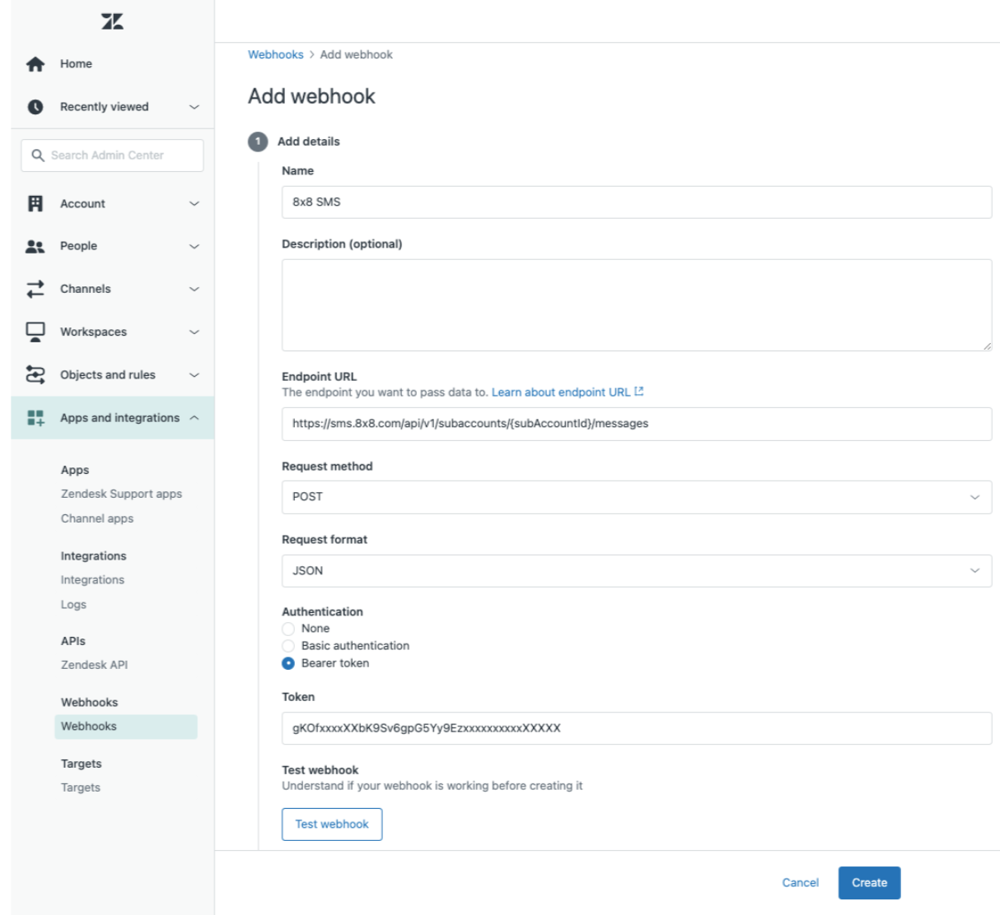

# Zendesk - Notifications Webhook

Learn how to send Zendesk notifications via SMS or Messaging Apps from 8x8

You can send **SMS** or **Messaging Apps** notifications automatically from **Zendesk** using **Webhooks** + **Triggers**. This guide outlines precisely how you can achieve this.

***

## What you’ll build

Turn Zendesk into an **auto-notify engine** that keeps customers updated without agent busywork.

**Business outcomes**

- **Fewer “any update?” tickets** via proactive SMS/WhatsApp.
- **Faster resolutions** with clear, timely status pings.
- **Consistent, compliant messaging** using templates + placeholders.
- **Low effort for agents** (tag/macro triggers do the sending).

**How it works**

1. Define the **moments that matter** (status change, public comment, or a “notify” tag).
2. A Zendesk **Trigger** calls a **Zendesk Webhook** that posts to the **8x8 SMS or Messaging API** endpoint.
3. Zendesk renders the **message template** and 8x8 delivers it.

- A **Zendesk Webhook** that posts JSON to 8x8 CPaaS.
- A **Trigger** that calls the webhook when ticket conditions are met (e.g., status change, public comment, or tag added).
- A JSON **payload** that Zendesk renders with placeholders (like `{{ticket.id}}`) before sending to 8x8.

***

## Prerequisites

1. **8x8 Connect**
    - **Subaccount ID** with **SMS API** enabled for SMS use along with registered Sender ID/Virtual Number for the destination countries you intend to send SMS to.
    - **Subaccount ID** with a WhatsApp channel onboarded + pre-approved templates that you intend to use
    - **API Key**

2. **Zendesk**
    - Admin access to **Admin Center** (to create Webhooks and Triggers).
    - *Optional*: Help Center enabled if you plan to use `{{ticket.link}}` for end-user links.

***

## Choose the correct 8x8 endpoint

8x8 provides **region-specific** base URLs. If your tenant is bound to a region, use that region’s host. When in doubt, start with the global host and consult your 8x8 representative.

| Channel        | Base URL (regional)        | Send endpoint (append to base)                |
| -------------- | -------------------------- | --------------------------------------------- |
| **SMS**        | `https://sms.8x8.com`      | `/api/v1/subaccounts/{subAccountId}/messages` |
| **Messaging** | `https://chatapps.8x8.com` | `/api/v1/subaccounts/{subAccountId}/messages` |

>
> Examples (final URL):
>
> - SMS: `https://sms.8x8.com/api/v1/subaccounts/{subAccountId}/messages`
> - Messaging: `https://chatapps.8x8.com/api/v1/subaccounts/{subAccountId}/messages`
>
>
> 📘 Ensure your endpoint base url is accurate
>
> **Platform Deployment Regions:** [/connect/docs/data-center-region](/connect/docs/data-center-region)
>

***

## Step 1: Create the Zendesk Webhook

Create **one webhook per channel** (one for SMS, one for WhatsApp).

1. In **Zendesk Admin Center** → **Apps and integrations** → **Webhooks** → **Create webhook**.
2. **Name**: `8x8 SMS Send` (and/or `8x8 WhatsApp Send`).
3. **Endpoint URL**:
    - SMS: `https://sms.8x8.com/api/v1/subaccounts/{subAccountId}/messages`
    - WhatsApp: `https://chatapps.8x8.com/api/v1/subaccounts/{subAccountId}/messages`
4. **Request method**: `POST`
5. **Request format**: `JSON`
6. **Authentication**: choose **Bearer token** and paste your **8x8 API key** (Zendesk will send `Authorization: Bearer <token>`).
7. (Optional) **Custom headers**:
    - `Accept: application/json`  
      *(Zendesk sets `Content-Type: application/json` automatically for JSON format.)*
8. Click **Create** (and you may **Test** with a sample body later).



Repeat for the WhatsApp webhook, and ensure you replace the subAccountId placeholder with actual values.

***

## Step 2: Create a Trigger that calls the webhook

1. In **Zendesk Admin Center** → **Objects and rules** → **Business rules** → **Triggers** → **Add trigger**.
2. **Name**: e.g. `Notify via SMS when ticket is solved` or `Notify via WhatsApp on public comment`.
3. **Conditions** (example – adjust to taste):
    - **ALL**:
        - **Ticket** \| **Is** \| `Updated`
        - **Comment** \| **Is** \| `Public`
        - (**Optional**) **Requester** \| **Phone number** \| `Present` (for SMS)
4. **Actions**:
    - **Notify active webhook** → Select **your 8x8 webhook**.
    - **JSON body** → paste one of the payloads below (SMS or WhatsApp).

> Zendesk will render placeholders (like `{{ticket.id}}`) before sending, so 8x8 receives concrete values.

***

## Payloads

### Option A: SMS (8x8 SMS API)

**Use when you want a plain text SMS to the ticket requester’s phone.**

**Webhook**: `8x8 SMS Send`  
**JSON body**:

```json
{
  "source": "<Your Approved Sender ID or Number>",
  "destination": "{{ticket.requester.phone}}",
  "text": "Update for ticket #{{ticket.id}} ({{ticket.status}}). View: {{ticket.link}}"
}
```

**Notes**

- `source`: use an **approved sender ID**/number for the destination country. If country rules prevent alphanumeric sender IDs, use a numeric source.
- `destination`: prefer international format (e.g., `+12025550123`). If you store national format in Zendesk, ensure your 8x8 route/country settings are configured accordingly.
- Keep messages concise to avoid multi-part SMS billing.

***

### Option B: WhatsApp (8x8 Messaging API)

**Use when you want to send a WhatsApp message (template, or freeform within the customer service window).**

**Webhook**: `8x8 WhatsApp Send`  
**JSON body : Example template message with a single text parameter**  
*(Replace `<Template Name>` and set the language, e.g., `en_GB` and any other content you may have)*. Refer to [this page](/connect/docs/usage-samples-whatsapp) for other sample JSON body for template messages. Ensure the JSON body is as per the approved template.

```json
{
  "user": {
    "msisdn": "{{ticket.requester.phone}}"
  },
  "type": "template",
  "content": {
    "template": {
      "language": "en_GB",
      "name": "<Template Name>",
      "components": [
        {
          "type": "body",
          "parameters": [
            {
              "type": "text",
              "text": "{{ticket.id}}"
            }
          ]
        }
      ]
    }
  }
}
```

**Alternate freeform (inside WhatsApp’s customer service window)**

```json
{
  "user": {
    "msisdn": "{{ticket.requester.phone}}"
  },
  "type": "text",
  "content": {
    "text": "We updated your ticket #{{ticket.id}} ({{ticket.status}}). View: {{ticket.link}}"
  }
}
```

**Notes**

- **Templates** are required **outside** the WhatsApp customer service window. Ensure your [WhatsApp templates are approved](/connect/docs/whatsapp-templates-management).
- `msisdn`: use the customer’s phone number in international format.
- You can enrich templates (images, documents, CTA buttons) by adding header/body/button components as per the Messaging API capabilities. Learn more [here](/connect/docs/usage-samples-whatsapp).

***

## Testing

- In **Webhooks**, open your webhook and use **Test webhook** with a **sample payload** (hardcode a test number).
- In **Triggers**, temporarily loosen conditions so it’s easy to fire the trigger, then revert.
- Check **Webhook Activity** in Zendesk if calls are failing.
- Check **8x8 API response** codes in the webhook logs (2xx = success). If you enabled 8x8 delivery callbacks/logs, verify downstream delivery there.

***

## Troubleshooting

- **401/403 from 8x8**: wrong/missing API key or subaccount; ensure the webhook auth uses **Bearer token** and the endpoint URL has the **correct subaccountId**.
- **400 from 8x8**: invalid phone format, missing required field (e.g., `text` for SMS, or template name for WhatsApp template). Validate your JSON and field names exactly.
- **No phone on requester**: add a trigger condition such as **Requester → Phone number → Present** or add a fallback (e.g., email) via a separate trigger.
- **`{{ticket.link}}` doesn’t render**: Help Center may be disabled. Use a different placeholder or craft your own URL pattern if needed.
- **WhatsApp message rejected**: using **freeform** outside the service window, or the **template** is unapproved / mis-named / wrong language. Switch to a valid **template** and resend.

***

## FAQ

**Do I need two webhooks?**  
Yes. Create **one** for **SMS** and **one** for **WhatsApp**. Point your triggers to the right one.

**Which placeholders are safe?**  
Conservative defaults: `{{ticket.id}}`, `{{ticket.status}}`, `{{ticket.requester.name}}`, `{{ticket.requester.phone}}`, `{{ticket.assignee.name}}`, `{{ticket.link}}`. If a field is blank in Zendesk, the rendered value will be blank.

***

## Appendix: Example end-to-end flows

### A. Notify by SMS when ticket is solved

- **Trigger conditions**: Ticket → Status → Changed to → `Solved`
- **Action**: Notify active webhook → `8x8 SMS Send`
- **Body**: use the SMS payload above

### B. Notify by WhatsApp when a public comment is added

- **Trigger conditions**: Ticket → Is → `Updated`; Comment → Is → `Public`
- **Action**: Notify active webhook → `8x8 WhatsApp Send`
- **Body**: use the WhatsApp **template** payload above

### C. Notify when a specific tag is added (fires once)

Use this when you want Zendesk to notify via 8x8 the **first time** a tag appears on a ticket (e.g., `notify_customer_sms` or `notify_customer_wa`).  
We’ll guard against re-firing by adding a **sent tag** after we send.

**Example tags**

- Business tag you add to a ticket (manually or via another rule): `notify_customer_sms`
- Sent tag that this trigger will add after notification is sent: `notify_customer_sms__sent`

**Trigger conditions**

- **ALL**

  - **Ticket** \| **Is** \| `Updated`
  - **Tags** \| **Contains at least one of the following** \| `notify_customer_sms`
  - **Tags** \| **Contains none of the following** \| `notify_customer_sms__sent`
  - (**Optional**) **Requester** \| **Phone number** \| `Present`  ← prevents attempts without a number

**Trigger actions**

- **Notify active webhook** → select your **8x8 SMS Send** webhook  
  **JSON body** (SMS example):

  ```json
  {
    "source": "<Your Approved Sender ID or Number>",
    "destination": "{{ticket.requester.phone}}",
    "text": "Update for ticket #{{ticket.id}} ({{ticket.status}}). View: {{ticket.link}}"
  }
  ```

  *(If you are using WhatsApp, select your **8x8 WhatsApp Send** webhook and use the WhatsApp payload from Option B.)*

- **Add tags** → `notify_customer_sms__sent`  
  *(ensures this trigger won’t fire again for the same ticket/tag)*

- (**Optional**) **Remove tags** → `notify_customer_sms`  
  *(use this if you want the “business tag” cleared after the notification is sent)*

**Notes**

- To run **WhatsApp** on tag instead, replace the business tag names accordingly (e.g., `notify_customer_wa` / `notify_customer_wa__sent`) and use the WhatsApp **template** payload
- If you have the need to send the same notification to your users multiple times across a long lifecycle, **omit** the sent tag/condition or use **versioned sent tags** (e.g., `notify_customer_sms__sent_v2`), then update the trigger conditions accordingly.
